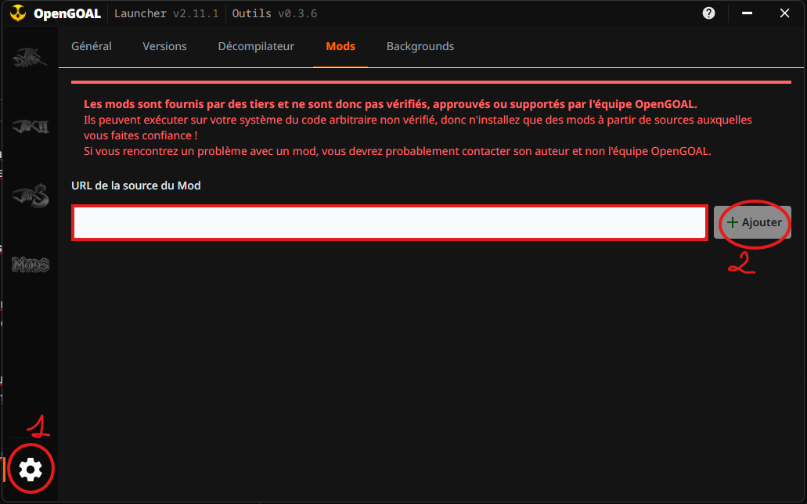
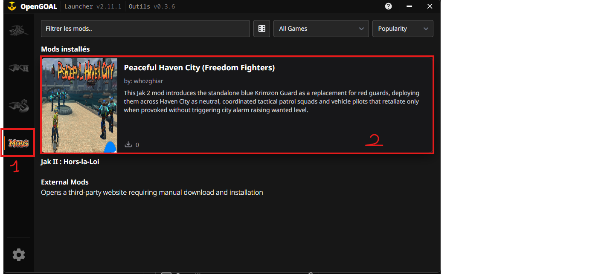
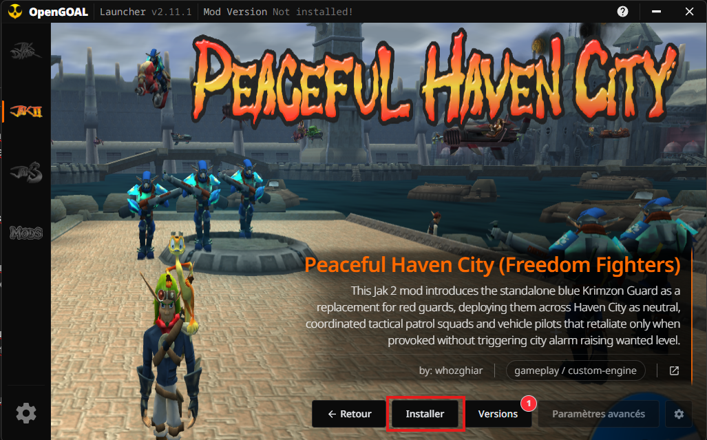
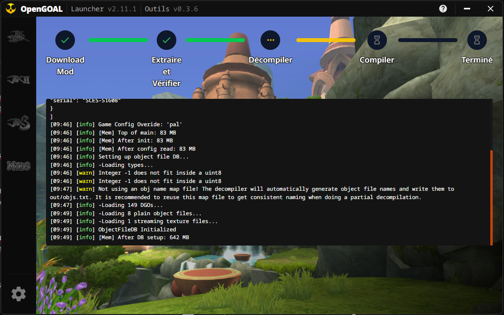
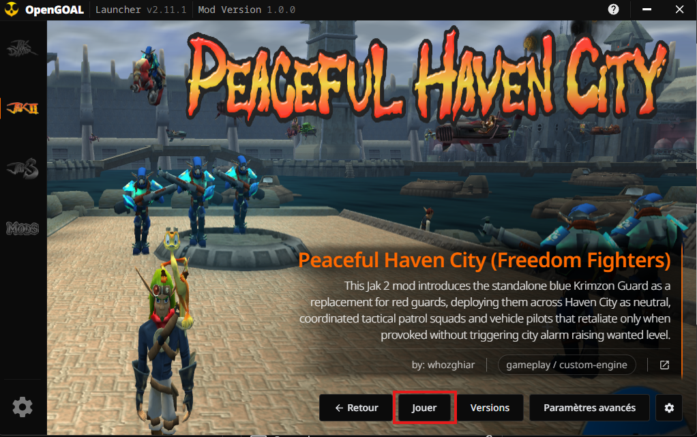
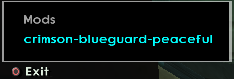

<p align="center">
  
</p>

<p align="center">
  
  
  
  
</p>

## Contents

- [Purpose and Approach](#purpose-and-approach)
- [Installing a Mod (Players)](#installing-a-mod-players)
- [Creating a Mod (Developers)](#creating-a-mod-developers)
- [Git Architecture & CI/CD Workflows](#git-architecture--cicd-workflows)
- [Upstream Sync Status](#upstream-sync-status)
- [Directory Overview](#directory-overview)
- [Task Command Reference](#task-command-reference)

---

## Purpose and Approach

This project is an unofficial fork of [OpenGOAL](https://github.com/open-goal/jak-project), with no direct affiliation with the original OpenGOAL team or Naughty Dog. For the original technical documentation and build instructions of the native port, see the [original OpenGOAL README](https://github.com/open-goal/jak-project#readme).

### Objectives

The goal of this repository is to explore the use of AI to create mods for the Jak trilogy (*Jak and Daxter: The Precursor Legacy*, *Jak II*, *Jak 3*).

### Code reliability and approach

- **Modifications to compiler & decompiler:** some liberties were taken with the GOAL compiler (`goalc`), the C++ runtime (`game`), and the extraction tools (`decompiler`) to change default behaviors and facilitate AI-assisted modding.
- **Code reliability:** the code is not guaranteed to be 100% reliable. The focus is reaching the intended objective for each mod. Most commits created with agent assistance carry the `(AI-assisted)` tag.
- **Documentation for developers:** the verified OpenGOAL Lisp wiki lives in the knowledge base, [`whozghiar/opengoal-modding-kb`](https://github.com/whozghiar/opengoal-modding-kb), mounted at `.agents/skills/`: `goal-lisp/wiki/common.md` for patterns and the engine model shared by the three games, `jak1.md`, `jak2.md` and `jak3.md` for per-game specifics. It's the only place GOAL code examples live. Agents consult it before coding and never hallucinate an instruction. Mod-specific notes live in each mod's own root `README.md`.
- **Two golden rules:** (1) **native non-regression** — a mod never changes default behavior unless its spec requires it; changes ship off by default; (2) **in-game Mods toggle** — every mod is switchable at runtime from the in-game Mods menu (L3 + SELECT), which works in a normal launcher boot.
- **Dedicated mod README:** each mod repository has its own `README.md` at its root, including an installation guide, feature list, usage instructions, and a demo video.
- **Contributions & feedback:** constructive feedback and contributions are welcome.

---

## Installing a Mod (Players)

This is the generic install flow for any mod published from this repository, using the official OpenGOAL Launcher.

1. **Add the mod source.** Open the OpenGOAL Launcher, go to Settings (gear icon, bottom-left), click the "Mods" tab, and paste a catalog URL into the input field. The master catalog gives access to every published mod in one source:
   ```text
   https://raw.githubusercontent.com/whozghiar/jak-project/master-dev/index.json
   ```
   Or add an individual mod's own catalog URL instead (`https://raw.githubusercontent.com/whozghiar/<mod repository>/main/index.json`). Click Add.

   

2. **Open the mod page.** Go to the Mods tab in the left-hand panel and click the mod you just added.

   

3. **Choose a version and install.** Select a version (the latest is recommended) and click Install.

   

4. **Wait for installation.** The Launcher downloads the release archive, extracts it, then runs the mod's own `extractor` and `goalc` to decompile and compile the assets. This can take a few minutes depending on the mod.

   

5. **Launch the game.** Click Play.

   

6. **Activate the mod in-game.** Press L3 + SELECT to open the Mods menu, and toggle the mod on (and adjust its configuration, if it exposes one).

   

> [!NOTE]
> Every mod in this repository ships disabled by default and is toggled on manually from this menu — see [`docs/modding/guides/mods_menu.md`](docs/modding/guides/mods_menu.md) for the underlying mechanism.

---

## Creating a Mod (Developers)

Every mod lives in its own repository, named `<game>-mod-<name>` and created from this one with `task modding-new-mod`, which asks for the game, the mod name, a description and the visibility. To mod under your own GitHub account, fork this repository: the tooling reads the owner from your clone, so the fork works without edits. The full procedure, from the fork and the first build to the release, with the resources to read, the AI-agent workflow and how to feed the shared knowledge base: [How to Create a Mod](docs/modding/guides/how_to_create_a_mod.md).

---

## Git Architecture & CI/CD Workflows

`master` mirrors `open-goal/jak-project`, `master-dev` is the modding base, and every mod lives in its own repository created from `master-dev`, with the knowledge base mounted as a submodule. How it all works day to day (switching between mods in one working directory, syncing, releasing, recording knowledge): [Repository Workflow Guide](docs/modding/guides/repository_workflow.md). 8 GitHub Actions workflows automate this pipeline — see the [GitHub Actions Workflows Guide](docs/modding/guides/github_workflows.md) for every trigger and access rule.

---

## Upstream Sync Status

[](https://github.com/whozghiar/jak-project/actions/workflows/sync-upstream.yaml)

This badge indicates the state of the automated daily synchronization workflow (`sync-upstream.yaml`) running at 10:00 UTC, which fast-forwards `master` from upstream `open-goal/jak-project` and merges that into `master-dev`:

- **Green:** the latest sync (upstream -> `master` -> `master-dev`) completed successfully.
- **Red:** a conflict or failure occurred during the synchronization.

Mods are **not** synced automatically by this workflow. `task modding-sync-all` merges the latest `master-dev` into every mod repository and pushes them; `task modding-sync-branch -- --push` does it for the mod you are on. The mods that still live on a branch of this repository use the same task, or the owner-only `sync-branch-with-master-dev.yml` workflow.

---

## Directory Overview

| Directory / File | Description |
| :--- | :--- |
| [`AGENTS.md`](AGENTS.md) | Instructions for every AI agent: compile but never launch the game, golden rules for mods, knowledge base, documentation standards, commands and Git. |
| [`.agents/skills/`](.agents/skills/) | Knowledge base submodule ([`opengoal-modding-kb`](https://github.com/whozghiar/opengoal-modding-kb)): agent skills and the verified Lisp wiki (`goal-lisp/wiki/`), shared by every mod repository. |
| [`index.json`](index.json) | Consolidated OpenGOAL Launcher mod catalog (all published mods and releases across Jak 1-3). |
| [`docs/`](docs/README.md) | Documentation index: setup guides for each system and editor, modding guides, engine notes. |
| [`docs/modding/guides/how_to_create_a_mod.md`](docs/modding/guides/how_to_create_a_mod.md) | Step-by-step guide: create, build, test, document, record knowledge and release a mod. |
| [`docs/modding/guides/repository_workflow.md`](docs/modding/guides/repository_workflow.md) | How the mother repository, the mod repositories and the knowledge base fit together; day-to-day commands. |
| [`docs/modding/guides/github_workflows.md`](docs/modding/guides/github_workflows.md) | Guide to every GitHub Actions workflow: triggers, access control and the mother-repository guard. |
| [`docs/modding/guides/task_scripts_reference.md`](docs/modding/guides/task_scripts_reference.md) | Reference for every `task` command and modding automation script. |
| [`docs/modding/guides/mod_distribution_guide.md`](docs/modding/guides/mod_distribution_guide.md) | Multi-platform binary release pipeline and launcher catalog architecture (`index.json`). |
| [`docs/modding/guides/mods_menu.md`](docs/modding/guides/mods_menu.md) | Unified in-game Mods menu architecture. |
| [`docs/modding/templates/`](docs/modding/templates/) | [`MOD_README.template.md`](docs/modding/templates/MOD_README.template.md), [`mod_menu.template.gc`](docs/modding/templates/mod_menu.template.gc). |
| [`scripts/modding/`](scripts/modding/) | Python automation (mod repository creation, mod sync, global catalog, texture packs). |
| [`scripts/ai/`](scripts/ai/) | AI agent tooling: knowledge-base submodule update and skill links for Claude Code. |
| [`goal_src/`](goal_src/) | Decompiled and modified GOAL source code by game (`jak1/`, `jak2/`, `jak3/`). |
| [`goalc/`](goalc/) | OpenGOAL compiler with modding adjustments. |
| [`game/`](game/) | C++ runtime simulating the Emotion Engine memory on PC. |
| [`decompiler/`](decompiler/) | Asset extraction and decompiler tools. |
| [`custom_assets/`](custom_assets/) | Custom texture replacements and models. |

---

## Task Command Reference

Automation and builds are driven by [Taskfile](https://taskfile.dev/): `task --list` shows every task, and pass script arguments after `--`. Every task, with when and why to use it, is in the [Task Reference](docs/modding/guides/task_scripts_reference.md).

---

*(AI-assisted)*
