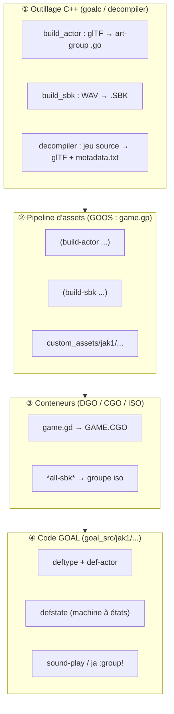

# Injecter une entité personnalisée dans un jeu OpenGOAL

**Guide d'ingénierie — modèles, animations et sons custom, avec `og-j1-board` comme fil conducteur**

---

## Table des matières

1. [Introduction et modèle mental](#1-introduction-et-modèle-mental)
2. [Architecture et outillage (compilateur / décompilateur)](#2-architecture-et-outillage-compilateur--décompilateur)
3. [Pipeline d'ingestion des assets (modèles, animations, sons)](#3-pipeline-dingestion-des-assets)
4. [Implémentation en OpenGOAL LISP](#4-implémentation-en-opengoal-lisp)
5. [Principes d'abstraction pour d'autres projets & jeux](#5-principes-dabstraction-pour-dautres-projets--jeux)
6. [Annexe — checklist de portage](#6-annexe--checklist-de-portage)

---

## 1. Introduction et modèle mental

### 1.1 Objectif

On veut une **démarche réutilisable** pour ajouter à n'importe quel jeu de l'écosystème OpenGOAL (Jak 1, Jak II, Jak 3) une entité qui n'existe pas dans le jeu cible, avec :

- un **acteur personnalisé** (*custom actor*) — un type GOAL, un modèle 3D, une machine à états ;
- des **animations personnalisées** (*custom animations*) — soit sur le modèle de l'entité, soit greffées sur un modèle existant (Jak, Daxter) ;
- de **nouveaux effets sonores** (*custom sounds*) — une banque de sons (SBK) dédiée.

Le cas d'étude est **`og-j1-board`** : le portage du Jetboard de *Jak 3* dans *Jak 1*. C'est un cas volontairement difficile — l'entité n'est pas autonome, elle **se greffe sur le joueur** (elle échange le squelette de Jak, pilote sa vélocité via les animations, ajoute un pipeline audio temps réel). Tout ce qui est plus simple qu'un board (un ennemi, un objet ramassable, une plateforme) est un sous-ensemble de cette démarche.

### 1.2 Les quatre couches à franchir

Chaque asset exogène doit traverser quatre couches. C'est la grille de lecture de tout le guide.



| Couche | Rôle | Où ça vit | Modifiable sans toucher le C++ ? |
|---|---|---|---|
| ① Outillage | Convertir des formats exogènes en formats moteur | `goalc/`, `decompiler/`, `common/` | Non — recompilation C++ |
| ② Pipeline | Décrire *quoi* construire et *comment* | `goal_src/jak1/game.gp` (langage GOOS) | Oui |
| ③ Conteneurs | Empaqueter `.o`/`.go`/`.SBK` pour le chargement | `goal_src/jak1/dgos/*.gd`, `game.gp` | Oui |
| ④ Code GOAL | Logique de l'entité | `goal_src/jak1/engine/target/board/` | Oui (hot-reload REPL) |

### 1.3 Répartition par type d'asset

| Asset | Outil qui l'ingère | Format moteur produit | Conteneur | Fichier(s) `og-j1-board` |
|---|---|---|---|---|
| Modèle 3D | `build-actor` | `art-group` (`art-joint-geo` + `merc-ctrl`) dans un `.go` | `GAME.CGO` | [`custom_assets/jak1/models/custom_levels/board.glb`](custom_assets/jak1/models/custom_levels/board.glb) |
| Animations | `build-actor` (+ `master-ag-map`) / `decompiler` (export) | `art-joint-anim` compressées | `GAME.CGO` (dans l'art-group) | [`eichar-board+0.glb`](custom_assets/jak1/models/custom_levels/eichar-board+0.glb), [`sidekick-board+0.glb`](custom_assets/jak1/models/custom_levels/sidekick-board+0.glb) |
| Sons | `build-sbk` / `decompiler` (`rip_sound_banks`) | `.SBK` (SBlk v1 + FileAttributes) | ISO (`*all-sbk*`) | [`custom_assets/jak1/sounds/sfx/BOARD/`](custom_assets/jak1/sounds/sfx/BOARD/) |

---

## 2. Architecture et outillage (compilateur / décompilateur)

### 2.1 Les binaires de l'écosystème

`OpenGOAL` se compose de quatre exécutables ([docs/project-overview.md](docs/project-overview.md)) :

| Binaire | Rôle | Impacté par le board ? |
|---|---|---|
| `goalc` | Compilateur GOAL x86-64 + **système de build des données** (les *tools* `dgo`, `build-level`, `build-actor`, `build-sbk`…) | **Oui** — nouveau tool `build-sbk`, extension de `build-actor` |
| `decompiler` | Décompilateur (extraction des assets du jeu original) | **Oui** — nouveaux extracteurs `extract_sbk`, `extract_anim`, export d'animations glTF |
| `game` (runtime) | Le PS2 émulé : GOAL VM, renderers, `overlord` (moteur audio) | **Oui** — `srpc.cpp` : passage du champ `reg` aux grains SFX |
| `gk` / REPL | Lance le jeu + REPL de dev connecté | Non (mais indispensable à l'itération) |

> **Règle générale.** Tout ce qui **produit** ou **consomme** un format binaire (modèle, anim, son) est du C++ dans `goalc`/`decompiler`/`common`. Tout ce qui **orchestre** (quoi construire, dans quel ordre) est du GOOS dans `game.gp`. Tout ce qui est **logique de jeu** est du GOAL dans `goal_src/`.

### 2.2 Modifications de l'outillage — acteur personnalisé

Le tool `build-actor` existait déjà pour les niveaux custom (il produisait un `art-group` sans animations utiles). Le board l'a étendu pour supporter des **squelettes réels + animations**.

**Fichiers modifiés :**

| Fichier | Changement |
|---|---|
| [`goalc/build_actor/common/build_actor.h`](goalc/build_actor/common/build_actor.h) | `struct BuildActorParams` : ajout de `master_art_group`, `master_ag_map` (`ja name → slot`), `framerate`, `joint_channel` |
| [`goalc/build_actor/common/build_actor.cpp`](goalc/build_actor/common/build_actor.cpp) | `process_anim()` : parcourt les animations glTF, résout `master_ag_map[anim.name] → index`, compresse |
| [`goalc/build_actor/common/animation_processing.cpp`](goalc/build_actor/common/animation_processing.cpp) | glTF → `art-joint-anim` : ré-échantillonnage en keyframes, détection *constant vs animé* par canal (trans/quat/scale), mode `big_trans_mode`, `control-bits` |
| [`goalc/build_actor/jak1/build_actor.cpp`](goalc/build_actor/jak1/build_actor.cpp) | Sérialisation `art-joint-anim` au format Jak 1, détection du bone `align`, `merc_joint_offset` (0 si `align` présent dans le glTF, 2 sinon) |
| [`goalc/build_actor/jak2/build_actor.cpp`](goalc/build_actor/jak2/build_actor.cpp), [`jak3/build_actor.cpp`](goalc/build_actor/jak3/build_actor.cpp) | **Mêmes paramètres** ajoutés (`BuildActorParams2`, `BuildActorParams3`) — l'outillage est déjà tri-jeu |
| [`common/util/gltf_util.cpp`](common/util/gltf_util.cpp) | `convert_per_vertex_data(..., int joint_offset)` : décale les indices de joints selon que le glТF inclut `align`/`prejoint` ou non |
| [`goalc/make/Tools.cpp`](goalc/make/Tools.cpp) | `BuildActorTool` : passe de 4 à **8 entrées**. Parse les listes GOOS (`master-ag-map`) avec un `goos::Reader` |
| [`goalc/make/MakeSystem.cpp`](goalc/make/MakeSystem.cpp) | `handle_defstep` : accepte des entrées `defstep` non-string (listes, symboles) via `o.print()` |

**Point clé — le bone `align`.** Dans les jeux Jak, l'articulation racine `align` n'est pas un os d'affichage : chaque frame, le moteur lit son déplacement et l'**ajoute à la vélocité et à la rotation** du personnage (`compute-alignment!`). C'est ce qui fait qu'un *kickflip* propulse Jak vers l'avant au lieu de le laisser sur place. `build_actor` détecte un bone nommé `align` dans le skin glTF et bascule en mode « joints directs » (index glTF == index moteur) au lieu d'insérer un `align`/`prejoint` synthétiques.

### 2.3 Modifications de l'outillage — animation personnalisée

C'est **le** verrou historique du projet (levé en avril 2026, cf. [`README.md`](README.md)). Deux sens :

**Sens 1 — export : extraire les animations d'un jeu Jak vers glTF.**

| Fichier | Changement |
|---|---|
| [`decompiler/level_extractor/extract_anim.cpp`](decompiler/level_extractor/extract_anim.cpp) | `extract_animations()` : trouve tous les objets `art-joint-anim` dans un art-group décompilé, lit l'en-tête `joint-anim-compressed-control` (`fixed` + `frame[]`), gère la décompression **LZO** (Jak 2/3) |
| [`decompiler/level_extractor/fr3_to_gltf.cpp`](decompiler/level_extractor/fr3_to_gltf.cpp) | **+428 lignes.** `decompress_anim()` : reconstitue trans/quat/scale par joint depuis les blocs `data16/data32/data64` ; `decompose_matrix_frame()` : décompose une matrice TRS (méthode de Shepperd) pour les joints `align`/`prejoint` ; génère les accessors glTF (`make_anim_*_accessor`) |
| [`decompiler/level_extractor/extract_level.cpp`](decompiler/level_extractor/extract_level.cpp) | Appelle `extract_animations()` pendant l'extraction des art-groups |

Résultat : `decompiler_out/jak3/glb/eichar-board+0-ag.glb` contient le modèle **et** ses `art-joint-anim` sous forme d'`animation` glTF standard, éditables dans Blender.

**Sens 2 — import : glTF → format moteur.** Voir §2.2 (`animation_processing.cpp`). Les constantes de quantification y sont explicites :

```cpp
constexpr float kQuatScale  = 0.000030517578125f;   // 1 / 2^15
constexpr float kScaleScale = 0.000244140625f;      // 1 / 2^12
constexpr float kTransScale = 4.f / 4096.f;         // trans « petit » : s16
// trans « grand » (big_trans_mode) : f32 sur data64/data32
```

### 2.4 Modifications de l'outillage — son personnalisé

**Nouveau composant : [`goalc/build_sbk/`](goalc/build_sbk/)** (~1100 lignes, [`build_sbk.cpp`](goalc/build_sbk/build_sbk.cpp)).

| Étape | Détail |
|---|---|
| Lecture WAV | [`read_wav()`](goalc/build_sbk/build_sbk.cpp) — **PCM 16 bits obligatoire**, tout sample-rate accepté, downmix mono automatique |
| Encodage | `encode_spu_adpcm()` — encodeur SPU-ADPCM (blocs de 16 octets = 28 échantillons), recherche exhaustive filtre×shift pour minimiser l'erreur ; gère les points de boucle (`LoopStart`/`LoopEnd`/`LoopRepeat`) |
| Pitch | `note_to_hz()` / `hz_to_note()` — table de pitch copiée de `game/sound/989snd/util.cpp`. Le sample-rate du WAV est encodé en `center_note` (le SPU n'a pas de notion de Hz) |
| En-tête | `build_sblk()` — `SBlk` **version 1** (l'outil *downgrade* le format Jak 2/3 → Jak 1) : `num_sounds`, `num_grains`, offsets, `BankID` |
| Entrées | `build_sblk_entries()` — 12 octets/son + 40 octets/grain (TONE, LFO_SETTINGS, RAND_PLAY, STARTCHILDSOUND, SET_REGISTER, KEY_OFF_VOICES…) |
| Emballage | `wrap_fa()` — conteneur `FileAttributes` (type 3 = banque SFX, 2 chunks : bank + samples) |
| Table de noms | `build_name_table()` — **préfixe de 2048 octets** propre à Jak 1 (`--jak1` / `jak1_format`). Sans elle, la banque se charge mais les sons ne sont pas résolus par nom |

**Extraction (round-trip) :**

| Fichier | Changement |
|---|---|
| [`decompiler/data/extract_sbk.cpp`](decompiler/data/extract_sbk.cpp) | `extract_sbk_files()` — SBK → un `.wav` par son nommé + un **`metadata.txt`** lisible (bank v3 → grains détaillés). Les banques musicales (SBv2) sortent un WAV par tone |
| [`decompiler/config.cpp`](decompiler/config.cpp), [`config.h`](decompiler/config.h) | Option `rip_sound_banks` |
| [`decompiler/config/jak1/jak1_config.jsonc`](decompiler/config/jak1/jak1_config.jsonc) (+ jak2, jak3) | `"rip_sound_banks": true` ; sortie dans `decompiler_out/<jeu>/audio/sfx/` |
| [`decompiler/decompilation_process.cpp`](decompiler/decompilation_process.cpp) | Appelle `extract_sbk_files(in_folder / "SBK", …)` |

**Runtime audio — le champ `reg` :**

| Fichier | Changement |
|---|---|
| [`game/overlord/jak1/srpc.cpp`](game/overlord/jak1/srpc.cpp) | À la lecture d'un son : si `mask & 0x800/0x1000/0x2000`, appelle `snd_SetSoundReg(handle, i, reg[i])` — permet à GOAL de piloter les registres d'un grain (`SET_REGISTER`) au déclenchement |
| [`goal_src/jak1/engine/sound/gsound-h.gc`](goal_src/jak1/engine/sound/gsound-h.gc) | `sound-play-parms` : champ `(reg uint8 3)` + overlay `(group-and-reg uint32 :overlay-at group)` |
| [`goal_src/jak1/engine/sound/gsound.gc`](goal_src/jak1/engine/sound/gsound.gc) | `sound-play-*` recopie `group-and-reg` (donc `reg`) dans la commande RPC |

### 2.5 Compiler l'outillage modifié

```bash
# Générer et compiler (Release) — obligatoire après toute modif C++
task gen-cmake-release
task build-release

# Ou une cible précise
cmake --build out/build/Release --target build_sbk build_actor goalc decompiler
```

Les binaires atterrissent dans `out/build/Release/bin/` (ou `.../Debug/`).

### 2.6 Commandes de build & pipeline d'assets

**a) Extraire les assets d'un jeu source** (ici Jak 3 pour récupérer le board) :

```bash
# place l'ISO/dossier dans iso_data/jak3, puis :
task set-decomp-ntscv1                       # sélectionne la config
./out/build/Release/bin/decompiler \
    ./decompiler/config/jak3/jak3_config.jsonc ./iso_data ./decompiler_out \
    --version ntscv2 \
    --config-override '{"decompile_code": false, "levels_extract": true, "rip_sound_banks": true, "save_texture_pngs": true}'
```

Sorties utiles :
- `decompiler_out/jak3/glb/*-ag.glb` — modèles + animations (via `fr3_to_gltf`)
- `decompiler_out/jak3/audio/sfx/MODEBORD/` — `metadata.txt` + WAVs

**b) Compiler le jeu cible + construire les assets** (REPL `goalc`) :

```bash
task repl                     # lance goalc, se connecte au gk si présent
```

```lisp
(mi)          ;; "make iso" : exécute game.gp → construit tous les .DGO/.CGO/.SBK/l'ISO
(blg)         ;; "build linked game" : recompile tout le code GOAL
(build-game)  ;; recompile le code (sans l'ISO)
(ml "goal_src/jak1/engine/target/board/board-states.gc")  ;; recompile UN fichier (hot-reload)
```

**c) Lancer le jeu :**

```bash
task boot-game        # gk -boot -fakeiso -debug   (build debug, REPL attachable)
task run-game         # -fakeiso -debug            (sans -boot : plus rapide)
```

**Le langage du pipeline : `game.gp`.** C'est un script GOOS. Primitive centrale :

```lisp
(defstep :in  '(<entrées>)      ;; fichiers sources OU littéraux (nombres, listes)
         :tool 'build-sbk        ;; nom d'un Tool C++ enregistré dans MakeSystem.cpp
         :out '("$OUT/iso/BOARD.SBK"))
```

Le board définit deux macros par-dessus (`build-actor` était déjà là, `build-sbk` est nouvelle) — voir §3.

### 2.7 Ce qui est spécifique à Jak 1 vs réutilisable

| Élément | Jak 1 | Jak 2 / Jak 3 | Réutilisable tel quel ? |
|---|---|---|---|
| `build_actor` (C++) | `BuildActorParams1` | `BuildActorParams2/3`, **déjà patchés** à l'identique | ✅ Oui |
| `animation_processing` (C++) | commun | commun | ✅ Oui |
| `extract_anim` : mot d'en-tête | `num-frames` seul | `num-frames + flags` (bit LZO) — **géré** par `has_flags` | ✅ Oui |
| Compression d'anim | non compressée | **LZO** — décompressée par `extract_anim.cpp` | ✅ Oui |
| Format SBK produit | `SBlk` **v1** + table de noms 2048 o (`--jak1`) | banques v2/v3, **pas** de table 2048 o, noms différents | ⚠️ `build_sbk` écrit toujours du v1 ; adapter pour cibler Jak 2/3 nativement |
| Chargement des banques | `sound-bank-load` + 1 commune / 2 de niveau | mécanisme voisin mais API différente (`gsound` Jak 2) | ⚠️ Concept identique, code à réécrire |
| Patch `reg` audio | `game/overlord/jak1/srpc.cpp` | `game/overlord/jak2/`… **non fait** | ⚠️ À reporter |
| `*all-sbk*` / groupe `iso` / `game.gp` | spécifique | équivalent par jeu (`game.gp` de jak2) | ⚠️ Recopier la mécanique |
| `def-actor`, `art-group`, `merc`, joint channels | structurellement identiques entre les trois jeux | idem | ✅ Concept 1:1 |

> **Résumé.** Le cœur C++ (conversion modèle + anim) est déjà agnostique. Les points à retoucher pour un autre jeu sont : le **format SBK**, la **mécanique de chargement des banques**, le **patch audio `reg`**, et la **recopie des macros** `game.gp`. Aucun n'est structurel.

---

## 3. Pipeline d'ingestion des assets

### 3.1 Arborescence `custom_assets/`

```
custom_assets/jak1/
├── models/
│   └── custom_levels/                 ← lus par (build-actor "<nom>")  →  <nom>.glb
│       ├── board.glb                   (le Jetboard : 13 joints, clips idle/close/open)
│       ├── eichar-board+0.glb          (modèle de Jak + 54 anims « jakb-board-* »)
│       └── sidekick-board+0.glb        (modèle de Daxter + 54 anims « daxter-board-* »)
├── sounds/
│   └── sfx/
│       └── BOARD/                      ← lu par (build-sbk "BOARD")
│           ├── metadata.txt            (manifeste : sons + grains — SOURCE DE VÉRITÉ)
│           ├── BOARD_JUMP_0.wav        (PCM 16 bits)
│           └── ... (50 WAVs)
└── levels/<name>/<name>.jsonc          ← niveaux custom (autre voie d'ingestion des acteurs)
```

> Le dossier `models/common/` (avec suffixe `-lod0`) présent dans le dépôt est un emplacement de préparation ; le build effectif ne lit que `models/custom_levels/`.

### 3.2 Modèles 3D

**Extraction → conversion.**

1. Décompiler le jeu source avec `levels_extract: true` → `decompiler_out/jak3/glb/board-ag.glb`.
2. Ouvrir dans Blender. Les plugins d'aide sont fournis :
   [`custom_assets/blender_plugins/gltf2_blender_extract.py`](custom_assets/blender_plugins/gltf2_blender_extract.py),
   [`custom_assets/blender_plugins/opengoal.py`](custom_assets/blender_plugins/opengoal.py).
3. Nettoyer / retopo / re-texturer si besoin. Contraintes :
   - **un seul skin** (`find_single_skin` échoue sinon) ;
   - hiérarchie de joints cohérente ; bone `align` en **index 0** s'il est présent ;
   - vertex colors si le modèle doit réagir à l'éclairage du niveau.
4. Exporter en **glTF binaire `.glb`** vers `custom_assets/jak1/models/custom_levels/board.glb`.

**Déclaration dans `game.gp` :**

```lisp
(build-actor "board" :texture-bucket 2 :force-run #t)
```

Macro (extrait de [`goal_src/jak1/game.gp`](goal_src/jak1/game.gp)) :

```lisp
(defmacro build-actor (name &key (gen-mesh #f) (force-run #f) (texture-bucket 0)
                            (framerate 60.0) (master-art-group #f)
                            (master-ag-map ()) (joint-channel 6))
  (let* ((path (string-append "custom_assets/jak1/models/custom_levels/" name ".glb")))
    `(defstep :in '(,path ,gen-mesh ,force-run ,texture-bucket ,framerate
                    ,master-art-group ,master-ag-map ,joint-channel)
              :tool 'build-actor
              :out '(,(string-append "$OUT/obj/" name "-ag.go")))))
```

| Option | Effet |
|---|---|
| `:gen-mesh #t` | Génère un `collide-mesh` depuis la géométrie (collision précise). Le board ne l'utilise pas (il rend le contrôle de collision au joueur) |
| `:texture-bucket N` | Écrit le lump `texture-bucket` → *texture-level* → bucket de rendu / ordre de tri. `0` (défaut) évite que l'acteur passe après les ombres ; `#f` = pas de lump (level 1). Le board force `2` |
| `:force-run #t` | Reconstruit toujours (ignore le cache mtime). **À retirer une fois l'asset stable** |
| `:framerate` | Keyframes/seconde pour les anims custom (le jeu interpole) |
| `:joint-channel` | Nombre de `joint-control-channel` alloués. Défaut `6` ; Jak/Daxter en board : **`24`** (beaucoup de blending) |
| `:master-art-group` / `:master-ag-map` | Voir §3.3 |

**Sortie :** `$OUT/obj/board-ag.go` — un `art-group` contenant `[art-joint-geo, merc-ctrl (factice), art-joint-anim…]`.

### 3.3 Animations

Deux stratégies, illustrées toutes les deux par le board.

#### Stratégie A — animations portées par le modèle de l'entité

Le `.glb` de l'acteur contient ses propres animations. `build-actor` les compile dans **son propre** art-group. Exemple : `board.glb` embarque `board-idle`, `board-close`, `board-open` → le code y accède via `board-close-ja`, `board-open-ja` (générés par `def-actor board`).

C'est le cas simple : rien de plus à déclarer.

#### Stratégie B — greffe sur un modèle existant (Jak, Daxter)

Le board a besoin que **Jak** joue 54 animations de skate qui n'existent pas dans *Jak 1*. Problème : l'art-group `eichar` a un nombre de slots figé. Solution : un art-group **séparé** (`eichar-board+0`) qui contient une copie du modèle de Jak + les 54 animations, chacune **liée à un slot du master art-group `eichar`** :

```lisp
(build-actor "eichar-board+0"
             :texture-bucket 2
             :force-run #t
             :framerate 60
             :joint-channel 24
             :master-art-group eichar
             :master-ag-map
             ((jakb-board-air-turn   180)
              (jakb-board-airwalk    181)
              (jakb-board-airwalk-end 182)
              ;; ... 54 entrées : (nom-de-l-animation-glTF  index-slot-dans-eichar)
              (jakb-board-turn-up    233)))
```

Mécanique (C++, [`build_actor.cpp`](goalc/build_actor/common/build_actor.cpp) → [`animation_processing.cpp`](goalc/build_actor/common/animation_processing.cpp)) :

```cpp
for (auto& anim : model.animations) {
  int master_ag_idx = -1;
  if (master_ag_map.count(anim.name))          // nom de l'animation glTF
    master_ag_idx = master_ag_map.at(anim.name);
  ret.push_back(compress_animation(extract_anim_from_gltf(
      model, anim, node_to_joint, master_art_group, master_ag_idx, framerate)));
}
```

À l'exécution, chaque `art-joint-anim` porte `master-art-group-name = "eichar"` et `master-art-group-index = 180…233`. Le remap de squelette (voir §4.4) fait pointer `eichar-board-jump-ja` (défini par `def-actor jchar-board`) vers le bon slot.

- `sidekick-board+0` fait pareil pour Daxter (`:master-art-group sidekick`, slots 124–177).
- `framerate` doit correspondre à la cadence Blender, sinon décalage de vitesse (`artist-step`).
- Le bone `align` (§2.2) est **indispensable** ici : sans lui, un *kickflip* ne déplacerait pas Jak.

**Sortie :** `eichar-board+0-ag.go`, `sidekick-board+0-ag.go`.

### 3.4 Sons

**a) Extraire la banque source.**

```bash
# rip_sound_banks: true dans jak3_config.jsonc  →  task extract  (ou le CLI de §2.6)
# →  decompiler_out/jak3/audio/sfx/MODEBORD/{metadata.txt, *.wav}
```

**b) Éditer.** Copier le dossier vers `custom_assets/jak1/sounds/sfx/BOARD/`. Le [`metadata.txt`](custom_assets/jak1/sounds/sfx/BOARD/metadata.txt) est **la source de vérité** — format lisible :

```
# MODEBORD  version=3  bank_id=0x6d626f72
# sounds=32  grains=123

[001] "board-jump"  vol=120  volgroup=0  pan=0  instlimit=0  flags=0x0000
  grain[0] LFO_SETTINGS  delay=0  which_lfo=0  target=4  shape=1  depth=512  step_size=3355443
  grain[1] TONE  delay=0  priority=122  vol=127  note=-68  fine=124  adsr=[0xaeff,0x9fc0]  offset=0x0000a260  -> BOARD_JUMP_0.wav
  grain[2] TONE  delay=0  priority=120  vol=50   note=-70  fine=66   adsr=[0x80ff,0x9fcc]  offset=0x0000e740  -> BOARD_JUMP_1.wav
```

Ce qu'on édite en pratique :
- **renommer** les sons (`board-jump`, `board-boost`…) — ces noms deviennent les clés de `sound-play` ;
- ajuster `vol`, `pan`, `instlimit`, `flags` ;
- ajouter/retirer des variantes (`-> XXX.wav`) — le tool insère un `RAND_PLAY` si plusieurs TONE ;
- garder/retirer les grains de contrôle (`LFO_SETTINGS`, `LOOP_START`/`LOOP_END`, `STARTCHILDSOUND`, `SET_REGISTER`…).
- Les `offset=` sont **ignorés** (recalculés par `build_sblk_entries`).

**Contraintes WAV :** PCM **16 bits** ; mono ou stéréo (downmix auto) ; n'importe quel sample-rate (encodé en `center_note`, mais rester proche de 44100 Hz évite les dérives de pitch sur la table SPU).

**c) Déclarer dans `game.gp` :**

```lisp
(build-sbk "BOARD" :force-run #t)
```

```lisp
(defmacro build-sbk (name &key (force-run #f) (bank-id 0) (manifest ()))
  (let* ((sfx-path (string-append "custom_assets/jak1/sounds/sfx/" name))
         (out-path (string-append "$OUT/iso/" name ".SBK")))
    `(begin
      (defstep :in '(,sfx-path ,force-run ,bank-id #t ,manifest)  ;; #t = jak1_format
               :tool 'build-sbk
               :out '(,out-path))
      (set! *all-sbk* (cons ,out-path *all-sbk*)))))   ;; ← ajoute au groupe ISO
```

> Le paramètre `:manifest` est **actuellement inactif** : `BuildSbkTool::run` le parse mais appelle `create_sbk_from_dir`, qui relit `metadata.txt`. Le dossier + `metadata.txt` sont donc la seule interface.

**d) CLI autonome** (debug rapide, hors `game.gp`) :

```bash
./out/build/Release/bin/build_sbk \
    -i custom_assets/jak1/sounds/sfx/BOARD \
    -o out/jak1/iso/BOARD.SBK \
    --jak1                      # préfixe la table de noms 2048 o
```

### 3.5 Déclaration dans les conteneurs (DGO / CGO / ISO)

**Rappel.** Un **DGO** (`.DGO`) ou **CGO** (`.CGO`) est une archive de fichiers `.o` (code compilé) et `.go` (données : art-groups, tpages, niveaux) chargée d'un bloc. Un `.gd` est sa **description** (liste ordonnée). L'**ISO** (`fakeiso`) est le sac de fichiers finaux (`.DGO`, `.SBK`, `.STR`, `.VAG`…).

#### Modèles & animations → `GAME.CGO`

Le board place **tout** dans `GAME.CGO` (toujours résident en mémoire). Dans [`goal_src/jak1/dgos/game.gd`](goal_src/jak1/dgos/game.gd) :

```lisp
;; --- CODE (.o) : l'en-tête d'abord, le reste après target ---
"board-h.o"          ;; juste après "generic-obs.o"
...
"board-util.o"       ;; juste après "target-death.o"
"target-board.o"
"board-part.o"
"board-states.o"
...
"board-overrides.o"  ;; tout à la fin (après "hud-classes-pc.o")

;; --- DONNÉES (.go) : les art-groups, juste après ceux de Jak/Daxter ---
"board-ag.go"          ;; après "deathcam-ag.go"
"eichar-board+0-ag.go"
"sidekick-board+0-ag.go"
```

Et dans [`game.gp`](goal_src/jak1/game.gp), la séquence de compilation avec ses dépendances :

```lisp
(goal-src-sequence
 "engine/"
 :deps ("$OUT/obj/generic-obs.o")
 "target/board/board-h.gc"       ;; AVANT tout ce qui référence le type board
 ...
 "target/board/board-util.gc"
 "target/board/target-board.gc"
 "target/board/board-part.gc"
 "target/board/board-states.gc"
 ...)

;; board-overrides chargé en dernier (il redéfinit des fonctions vanilla)
(goal-src "engine/target/board/board-overrides.gc" "ticky")
```

**Ordre = contrat.**
- `board-h.o` (le `deftype board` + `board-info`) doit précéder tout consommateur.
- Les art-groups custom se placent **près** de ceux qu'ils étendent (`eichar-ag.go`, `sidekick-ag.go`) pour que les index de master art-group restent cohérents.
- `board-overrides.o` en dernier : il **redéfinit** des fonctions entières du moteur (voir §5.1).

#### SBK → ISO

`build-sbk` fait `(set! *all-sbk* (cons "$OUT/iso/BOARD.SBK" *all-sbk*))`. Ce `*all-sbk*` est injecté dans le groupe `iso` ([`game.gp`](goal_src/jak1/game.gp)) :

```lisp
(group-list "iso"
 `("$OUT/iso/0COMMON.TXT"
   ...
   ,@(reverse *all-sbk*)      ;; ← BOARD.SBK entre ici
   ,@(reverse *all-mus*)
   ...))
```

`(mi)` copie alors `BOARD.SBK` à la racine de l'ISO, où l'`overlord` peut le charger sur demande.

#### Voie alternative : les niveaux custom

Pour une entité qui n'appartient qu'à **un niveau custom**, on ne touche pas `game.gd`. On utilise le `.jsonc` du niveau ([`custom_assets/jak1/levels/test-zone/test-zone.jsonc`](custom_assets/jak1/levels/test-zone/test-zone.jsonc)) :

```jsonc
"art_groups": ["babak-ag", "plat-ag"],     // art-groups vanilla à embarquer
"custom_models": ["test-actor"],            // .glb de custom_assets/.../custom_levels/
"actors": [
  { "trans": [-5.41, 3.5, 28.42], "etype": "test-actor",
    "quat": [0,0,0,1], "bsphere": [-7.41,3.5,28.42,10],
    "lump": { "name": "test-actor" } }
]
```

+ ajouter les `.go` au `.gd` du niveau + `(custom-level-cgo "TSZ.DGO" "test-zone/testzone.gd")`.

Le board **n'utilise pas** cette voie parce qu'il doit être disponible partout.

### 3.6 Compatibilité audio entre moteurs

| Aspect | Jak 1 | Jak 2 / Jak 3 | Ce que fait `build_sbk` |
|---|---|---|---|
| Version `SBlk` | 1 | ≥ 2 (`MODEBORD` de Jak 3 est en `version=3`) ; banques musicales `SBv2` | Écrit **toujours du v1** → *downgrade* effectif d'une banque Jak 2/3 |
| Table de noms | 2048 o on-disc, en tête de fichier | absente (résolution par hash/index) | `--jak1` / `jak1_format` la génère |
| Compression sample | SPU-ADPCM | SPU-ADPCM | identique — `encode_spu_adpcm()` |
| Résolution `sound-play "x"` | par nom via la table | idem conceptuellement | les noms viennent des `[NNN] "x"` du `metadata.txt` |
| Grains supportés | `TONE`, `LFO_SETTINGS`, `RAND_*`, `PB`, `*CHILDSOUND`, registres… | surensemble | `grain_type_from_name()` couvre les types 0–44 |

Concrètement : une banque Jak 3 extraite en `metadata.txt` se **reconstruit en banque Jak 1 jouable** sans retouche, tant que les WAV sont du PCM 16 bits. Cibler Jak 2/3 nativement demanderait d'apprendre à `build_sbk` à écrire un en-tête ≥ v2 et à ne pas préfixer la table de noms.

---

## 4. Implémentation en OpenGOAL LISP

Fichiers : [`goal_src/jak1/engine/target/board/`](goal_src/jak1/engine/target/board/)
`board-h.gc` (types), `board-util.gc` (init + états du board), `target-board.gc` (setup + LOD + handler), `board-states.gc` (états du joueur), `board-part.gc` (particules), `board-overrides.gc` (hooks vanilla).

### 4.1 Définition du type : héritage, mémoire, structure, collisions

#### Le type visuel — `board`

```lisp
;; goal_src/jak1/engine/target/board/board-h.gc
(deftype board (process-drawable)
  ((self          board :override)
   (parent        (pointer target) :override)
   (control       control-info :overlay-at root)      ;; réinterprète 'root'
   (shadow-backup shadow-geo :offset 208)
   (main          joint-mod)                          ;; override runtime d'un joint
   (in-head-time  time-frame))
  (:state-methods (idle symbol) use hidden))          ;; 3 états seulement
```

- Hérite de `process-drawable` → possède `root` (position/orientation), `draw`, `skel` (squelette).
- Volontairement **mince** : le board affiché ne fait que suivre le joueur.
- `:state-methods` déclare des états *virtuels* (surchargeable) → `idle` / `use` / `hidden`.

#### Le type d'état — `board-info`

Toute la machine à états lourde vit dans une structure **greffée sur le process `target`**, pas sur le `board` :

```lisp
(deftype board-info (basic)
  ((board              (pointer board))       ;; ← le process visuel
   (process            (pointer target))      ;; ← le joueur
   (board-tq           transformq :inline)    ;; transform que 'board' recopie chaque frame
   (mode-sound-bank    connection)
   (engine-sound-id    sound-id)              ;; ~7 sound-id : moteur, vent, virage, spin, éco, charge…
   (wind-sound-id      sound-id)
   ...
   (trick-list         board-tricks 16)       ;; état des combos de tricks
   (halfpipe-time      time-frame)            ;; état du half-pipe
   ...))                                       ;; ~200 champs
```

Et le champ est ajouté à `target` ([`target-h.gc`](goal_src/jak1/engine/target/target-h.gc)) :

```lisp
(deftype target (process-drawable)
  (( ... champs vanilla ... )
   ;; og:j1-board added
   (board           board-info)
   (old-node-list   cspace-array)   (board-node-list  cspace-array)
   (old-skeleton    skeleton)       (board-skeleton   skeleton)
   (old-jgeo        art-joint-geo)  (board-jgeo       art-joint-geo)
   (old-lod         lod-set :inline)(board-lod        lod-set :inline)))
```

> **Principe de conception.** Entité visuelle légère (`board`) + machine d'état lourde attachée à l'hôte (`board-info`). L'hôte « devient » l'entité le temps de l'interaction ; l'entité elle-même reste un accessoire.

#### Allocation mémoire

| Objet | Allocation | Pourquoi |
|---|---|---|
| process `board` | `(process-spawn board :name "board" :from *8k-dead-pool* :to self)` | pool de 8 Ko ; `:to self` = enfant du joueur |
| `board-info` | `(set! (-> self board) (new 'process 'board-info))` | heap du process `target` — vit et meurt avec le joueur |
| `main` (`joint-mod`) | `(new 'process 'joint-mod (joint-mod-handler-mode flex-blend) self (joint-node-index board-lod0-jg main))` | override d'un joint pour l'inclinaison |

Comme `board` contient un pointeur (`main`), il faut surcharger `relocate` :

```lisp
(defmethod relocate ((this board) (offset int))
  (if (nonzero? (-> this main)) (&+! (-> this main) offset))
  (call-parent-method this offset))
```

#### Génération de l'acteur — `def-actor`

```lisp
(def-actor board
  :bounds (0 0 0 3.5)
  :art (board-idle-ja close-ja open-ja)
  :joints (align prejoint main centerTip leftTip leftFin leftTail centerTail
           rightTail rightTip outerScale innerScale centerDome)
  :texture-level 2
  :sort 1)
```

`def-actor` ([`engine/data/art-h.gc`](goal_src/jak1/engine/data/art-h.gc)) génère automatiquement :
- `*board-sg*` — le `skeleton-group` (passé à `initialize-skeleton`) ;
- `board-lod0-jg` — le joint-geo ; `board-lod0-mg` — le merc-geo ;
- un `def-joint-node` par joint listé → `(joint-node-index board-lod0-jg main)` ;
- un `def-art-elt` par entrée `:art` → `board-idle-ja`, `board-close-ja`, `board-open-ja`.

Pour la greffe : `jchar-board` / `sidekick-board` sont des `def-actor` supplémentaires dont on **redirige** l'art-group :

```lisp
(set! (-> *jchar-board-sg* art-group-name) "eichar-board+0")
(set! (-> *sidekick-board-sg* art-group-name) "sidekick-board+0")
```

#### Collisions

Le board ne porte **pas** sa propre collision — c'est le **joueur** qui reste l'entité physique :

- process `board` : `(set! (-> self root) (new 'process 'trsqv))` — juste un transform, pas de `collide-shape`.
- côté joueur : le `control-info` (un `collide-shape-moving`) est reconfiguré via `mod-surface` :
  `(set! (-> self control mod-surface) *board-jump-mods*)`.
- [`collide-shape.gc`](goal_src/jak1/engine/collide/collide-shape.gc) : `set-and-handle-pat!` traite les matériaux différemment en mode board (ex. `pat-material tube` → sol solide au lieu de `*no-walk-surface*`), `target-board-burn-attack?` conditionne les dégâts de lave.
- `want-to-board?` ([`board-h.gc`](goal_src/jak1/engine/target/board/board-h.gc)) : avant d'autoriser la transition, lance un `fill-and-probe-using-spheres` (3 sphères au-dessus du joueur) pour vérifier qu'il y a la place.

### 4.2 Machine à états et animations

#### Deux niveaux d'états

| Niveau | Type | Exemples | Rôle |
|---|---|---|---|
| Entité | `board` | `idle`, `use`, `hidden` | Afficher / cacher l'accessoire |
| Hôte | `target` | `target-board-start`, `target-board-get-on`, `target-board-stance`, `target-board-jump`, `target-board-flip`, `target-board-halfpipe`, `target-board-hit`, … (≈ 25) | **Tout le gameplay** |

Les états de l'hôte sont déclarés dans [`target-h.gc`](goal_src/jak1/engine/target/target-h.gc) (`(:states … target-board-stance (target-board-jump meters meters surface) …)`) et implémentés dans [`board-states.gc`](goal_src/jak1/engine/target/board/board-states.gc).

#### Anatomie d'un `defstate`

```lisp
(defstate target-board-get-on (target)
  :event  (behavior ((proc process) (argc int) (message symbol) (block event-message-block))
            (case message (('clone-anim) ...) (('attack ...) ...)))
  :enter  (behavior () ... (set! (-> self control mod-surface) *board-jump-mods*) ...)
  :exit   target-board-exit
  :code   (behavior ()
            (send-event (ppointer->process (-> self board board)) 'open)  ;; réveille le board
            (ja-channel-push! 1 (seconds 0.1))
            (ja-no-eval :group! eichar-board-get-on-ja :num! (seek! max) :frame-num 0.0)
            (until (ja-done? 0)
              (suspend)
              (ja :num! (seek! max)))
            (go target-board-hit-ground))
  :post   target-board-post)
```

| Bloc | Quand |
|---|---|
| `:enter` | une fois, à l'entrée (init de surface, timers) |
| `:code` | coroutine principale (contient les `suspend`) |
| `:trans` | chaque frame, avant `:code` (conditions de sortie) |
| `:post` | chaque frame, après (physique, animation → `ja-post`) |
| `:exit` | une fois, à la sortie (nettoyage) |
| `:event` | à la réception d'un message (`send-event`) |

#### Contrôle de lecture des animations

Primitives (`ja` = *joint animation*) :

```lisp
(ja-channel-push! 1 (seconds 0.1))   ;; 1 canal actif, fondu entrant de 0.1 s
(ja-channel-set! 0)                   ;; coupe tous les canaux

;; jouer une anim jusqu'au bout :
(ja-no-eval :group! eichar-board-jump-ja :num! (seek! max) :frame-num 0.0)
(until (ja-done? 0)
  (suspend)
  (ja :num! (seek! max)))

;; boucler :
(ja :group! eichar-board-jump-loop-ja)
(loop (suspend) (ja-blend-eval) (ja :num! (loop!)))

;; choisir dynamiquement :
(let ((v1 (ja-group)))
  (if (and v1 (= v1 eichar-board-noseflip-ja)) (sound-play "board-boots")))
```

- `:group!` prend un symbole d'art-elt (`eichar-board-jump-ja`) qui, via le remap de squelette, pointe vers le slot du master art-group (`eichar` 180–233).
- `(seek! max)` / `(loop! 1.0)` : générateurs de progression de frame.
- `ja-blend-eval` : évalue le blending multi-canaux (d'où les 24 `joint-channel`).

#### `joint-mod` — retoucher un joint à la main, par-dessus l'animation

```lisp
;; sur board-info : incline le buste de Jak selon la vitesse latérale
(set! (-> self board main)       (new 'process 'joint-mod (joint-mod-handler-mode flex-blend) self 3))
(set! (-> self board upper-body) (new 'process 'joint-mod (joint-mod-handler-mode flex-blend) self 5))

;; sur le process board : incline le plateau lui-même
(set! (-> self main)
      (new 'process 'joint-mod (joint-mod-handler-mode flex-blend) self (joint-node-index board-lod0-jg main)))
```

`flex-blend` mélange l'override avec l'animation en cours au lieu de l'écraser.

#### Le bone `align`

Chaque frame, `:post` lit le déplacement du bone `align` de l'animation courante et l'**ajoute** à `transv`/`quat` du joueur (`compute-alignment!`). C'est ce qui donne aux tricks leur impulsion. Sans `align` dans le `.glb`, l'animation joue « sur place ».

### 4.3 Système audio : chargement des banques, requêtes, déclenchement

#### Chargement de la banque

Jak 1 : 1 banque commune + 2 banques de niveau (rotation gérée par `update-sound-banks`). Le board a besoin d'être audible **partout** → il prend un slot permanent, chargé une fois ([`engine/level/level.gc`](goal_src/jak1/engine/level/level.gc)) :

```lisp
;; og:j1-board added
(define *board-bank-loaded?* #f)

(defun update-sound-banks ()
  (if (nonzero? (rpc-busy? RPC-SOUND-LOADER)) (return 0))
  ;; og:j1-board added
  (when (not *board-bank-loaded?*)
    (sound-bank-load (static-sound-name "board"))   ;; ← charge BOARD.SBK
    (true! *board-bank-loaded?*))
  ... )
```

#### Requêtes audio

```lisp
;; one-shot (le son est joué et oublié) :
(sound-play "board-boost")

;; son qu'on veut piloter ensuite : on garde l'id
(set! (-> self board jump-sound-id) (sound-play "board-jump"))
(set! (-> self board spin-sound-id) (sound-play "board-spin-loop"))

;; boucle nommée, volume/pitch recalculés chaque frame — signature :
;;   (name id vol pitch bend group trans)
(sound-play-by-name (static-sound-name "board-bank")
                    (-> self board bank-sound-id)
                    (the int (* 1024.0 (-> self board bank-sound-volume)))
                    (the int (* 1524.0 (-> self board bank-sound-pitch)))
                    0 (sound-group sfx) #t)

(sound-stop (-> self board eco-sound-id))
```

Le board module en continu ≈ 6 sons (moteur, vent, virage, banque, spin, éco) selon la vitesse et l'inclinaison — c'est le cœur du « feel » sonore.

#### Le champ `reg` (registres de grain)

Pour piloter un LFO/pitch depuis GOAL, on construit une `static-sound-spec` avec le masque `reg0`, on écrit dans `(-> spec reg N)`, et on joue via `sound-play-by-spec`. L'`overlord` patché ([`srpc.cpp`](game/overlord/jak1/srpc.cpp)) appelle alors `snd_SetSoundReg` au déclenchement. Extrait réel ([`target-board.gc`](goal_src/jak1/engine/target/board/target-board.gc)) :

```lisp
(let ((spec (static-sound-spec "board-steady" :group 0 :volume 0.0 :mask (pitch reg0))))
  (set! (-> spec volume)    (the int (* 1024.0 (-> self board engine-sound-volume))))
  (set! (-> spec pitch-mod) (the int (* 1524.0 (-> self board engine-sound-pitch))))
  (set! (-> spec reg 0)     (the-as uint gp-0))     ;; ← registre lu par un grain SET_REGISTER
  (sound-play-by-spec spec (-> self board engine-sound-id) (the vector #t)))
```

Prérequis : `reg0` dans l'enum `sound-mask`, `(reg uint8 3)` + overlay `group-and-reg` dans `sound-play-parms` / `sound-rpc-play` ([`gsound-h.gc`](goal_src/jak1/engine/sound/gsound-h.gc)).

#### Child sounds

Un grain `STARTCHILDSOUND` déclenche un autre son de la banque (résolu par nom dans `metadata.txt`, converti en index par `build_sbk`). Ex. `board-boots` lance `run-smt1` + `run-smt2`.

### 4.4 Boucle de contrôle / gameplay : attachement au personnage

#### Point d'entrée

`want-to-board?` (test : bouton R2 pressé, pas en cutscene, pas dans l'eau, place suffisante) est évalué dans le handler du joueur. S'il passe :

```lisp
;; target-handler.gc  (og:j1-board added)
(('change-mode)
 (case (-> arg3 param 0)
   (('board) (go target-board-start (process->handle (the process (-> arg3 param 1)))))
   ...))
```

#### Séquence d'attachement

```
target-board-start
  └─ target-board-init
       ├─ target-board-setup #t
       │    ├─ (new 'process 'board-info)              ;; alloue l'état
       │    ├─ new-sound-id ×7                          ;; réserve les canaux audio
       │    └─ (process-spawn board :from *8k-dead-pool*) ;; crée l'accessoire visuel
       ├─ target-set-lod 'board                         ;; ★ ÉCHANGE DE SQUELETTE
       └─ send-event (-> self sidekick 0) 'set-lod 'board  ;; Daxter suit
```

**Le swap de squelette** (`target-set-lod 'board`, [`target-board.gc`](goal_src/jak1/engine/target/board/target-board.gc)) — c'est le mécanisme central :

```lisp
(defbehavior target-set-lod target ((mode symbol))
  (case mode
    (('board)
     (lods-assign! (-> self draw) (-> self board-lod))
     (set! (-> self node-list)     (-> self board-node-list))    ;; ← squelette board
     (set! (-> self draw skeleton) (-> self board-skeleton))
     (set! (-> self draw jgeo)     (-> self board-jgeo))
     (set! (-> self draw origin-joint-index) (the uint 47))
     ...)
    (('default 'old 'normal)
     (lods-assign! (-> self draw) (-> self old-lod))             ;; ← squelette normal
     (set! (-> self node-list)     (-> self old-node-list))
     ...))
  (fill-skeleton-cache self)
  (ja-channel-set! 0)
  (ja-post))
```

Les versions `board-*` sont préparées une fois dans `target-init` / `sidekick-init` :

```lisp
;; sidekick.gc  (og:j1-board added)
(let ((ag (art-group-get-by-name (-> *level* level-default) "sidekick-board+0")))
  (setup-lods! (-> self old-lod)   *sidekick-sg*       (-> self draw art-group) (the entity #f))
  (setup-lods! (-> self board-lod) *sidekick-board-sg* ag                        (the entity #f))
  (set! (-> self old-node-list)   (-> self node-list))
  (set! (-> self board-node-list) (make-nodes-from-jg-no-connection (the art-joint-geo (-> ag data 0))))
  ...)
```

Résultat : pendant le board, Jak est rendu par `eichar-board+0` (son modèle + les 54 anims de skate) ; à la sortie (`target-board-get-off`), on restaure `old-*`.

#### Le board suit le joueur

`board-post` ([`board-util.gc`](goal_src/jak1/engine/target/board/board-util.gc)) — la `:post` du process `board` :

```lisp
(defbehavior board-post board ()
  (let ((target (-> self parent 0)))
    (vector-copy!     (-> self root trans) (-> target board board-trans))
    (quaternion-copy! (-> self root quat)  (-> target board board-quat))
    (vector-copy!     (-> self root scale) (-> target board board-scale))
    ;; propage l'éclairage, l'état 'hidden' (1re personne), l'effet de mort…
    )
  (ja-post))
```

Le joueur calcule `board-tq` (position/orientation du plateau sous ses pieds) dans sa propre `:post` (`target-board-post`), le `board` la recopie.

#### Daxter — remap d'animations par nom

Daxter n'a pas 54 animations de board ; on **remappe** celles de Jak vers les siennes, par nom ([`sidekick.gc`](goal_src/jak1/engine/target/sidekick.gc)) :

```lisp
(defun joint-control-remap-board! ((jc joint-control) (dst-art-group art-group)
                                   (parent-art-group art-group) (remap-list pair)
                                   (seed int) (prefix string))
  ;; pour chaque canal : lit le nom de l'anim de Jak, cherche dans *sidekick-remap*,
  ;; substitue l'art-joint-anim de Daxter, reporte frame-num en tenant compte de artist-base/step
  ...)
```

`*sidekick-remap*` accepte des chaînes **ou des fonctions** (choix dynamique) :

```lisp
("board-jump"
 ,(lambda :behavior sidekick ((jc joint-control) (chan joint-control-channel) (arg2 int))
    ;; si Jak spinne, jouer "board-spin-ccw" ou "board-spin-cw" selon le sens
    (if (>= (-> targ board rotyv) (degrees 0)) "board-spin-ccw" "board-spin-cw")))
```

---

## 5. Principes d'abstraction pour d'autres projets & jeux

### 5.1 Découpler la logique de l'entité du jeu hôte

#### a) Confinement physique

Tout le board tient dans **un sous-dossier de 6 fichiers** ([`engine/target/board/`](goal_src/jak1/engine/target/board/)) :

| Fichier | Contenu | Reproductible pour X |
|---|---|---|
| `<x>-h.gc` | `deftype`, `def-actor`, enums, constantes, banks statiques | oui |
| `<x>-util.gc` | init (`<x>-init-by-other`), méthodes (`relocate`), états de l'entité | oui |
| `target-<x>.gc` / `<x>.gc` | setup, LOD swap, handler | oui |
| `<x>-states.gc` | états de gameplay | oui |
| `<x>-part.gc` | `defpartgroup` / `defpart` | oui |
| `<x>-overrides.gc` | **tous** les hooks dans le code vanilla | oui |

#### b) Un seul fichier d'overrides, chargé en dernier

`board-overrides.gc` est compilé après tout le reste (`(goal-src "engine/target/board/board-overrides.gc" "ticky")`). Il **redéfinit des fonctions entières** au lieu de patcher leur source :

```lisp
;; redéfinit la fonction vanilla — pas de diff dans le fichier d'origine
(defbehavior sharkey-notice-player? sharkey () ...)
(defmethod relocate ((this art-group) (heap kheap) (name (pointer uint8))) ...)
(defbehavior cam-string-code camera-slave () ...)
```

Avantage : les fichiers vanilla restent quasi intacts → merge trivial avec l'upstream OpenGOAL.

#### c) Marqueurs de provenance

Chaque modification inévitable d'un fichier vanilla est balisée :

```lisp
;; og:j1-board added
;; og:j1-board changed
```

`grep -rn "og:j1-board"` donne l'inventaire exact de la surface d'intégration. Adoptez `og:<votre-mod>`.

#### d) Espaces de noms

- États : préfixe `target-board-*`.
- Assets : `board-*` (SFX + art), `jakb-board-*` (anims Jak), `daxter-board-*` (anims Daxter), banque `BOARD`.
- Particules : plage d'IDs réservée (`712`–`719`, `3012`) — **choisir une plage haute** pour éviter les collisions inter-mods.
- Symboles globaux : `*board-trick-tracker*`, `*board-bank-loaded?*`, `*board-shadow-control*`.

#### e) Quand faut-il étendre une `deftype` vanilla ?

Le board a dû ajouter des champs à `target` et `sidekick`. Règles :
- **grouper les ajouts à la fin** de la `deftype` ;
- préférer un `deftype` séparé pointé par **un seul** champ (`board-info` : ~200 champs, 1 pointeur sur `target`) ;
- pour les méthodes/états : `(:states … target-board-*)` et `(:methods …)` acceptent des ajouts sans casser les offsets.

#### f) Entité autonome vs greffée — choisir tôt

| | Entité **autonome** (ennemi, objet, plateforme) | Entité **greffée** (board, arme portée…) |
|---|---|---|
| Type | `deftype x (process-drawable)` ou `(nav-enemy)` | idem + `x-info` sur l'hôte |
| Squelette | le sien | **swap** du squelette de l'hôte |
| Collision | `collide-shape` propre | réutilise celle de l'hôte |
| Anims | dans son `.glb` | greffées sur le master art-group de l'hôte |
| Difficulté | faible | élevée (le board est le pire cas) |
| Déclaration | souvent via `.jsonc` de niveau custom | `game.gd` (résident) |

La majorité des entités custom sont **autonomes** : suivez §4.1–4.3 en sautant le swap de squelette (§4.4).

### 5.2 Reproduire la démarche sur d'autres objets

Séquence type pour une nouvelle entité `X` dans un jeu déjà supporté :

1. **Assets.** `X.glb` (+ anims) dans `models/custom_levels/` ; si SFX, `sounds/sfx/X/` (`metadata.txt` + WAV 16 bits).
2. **Pipeline.** `(build-actor "X" …)` et `(build-sbk "X" …)` dans `game.gp`.
3. **Conteneur.** `X-*.o` / `X-ag.go` dans `game.gd` **ou** `X` dans le `.jsonc` d'un niveau custom.
4. **Type.** `X-h.gc` : `(deftype x (process-drawable) …)` + `(def-actor x …)`.
5. **États.** `X-states.gc` : `(defstate x-idle (x) …)`, transitions.
6. **Init.** `x-init-by-other` + `process-spawn` (depuis un spawner, un `.jsonc`, ou un événement).
7. **Audio.** `sound-bank-load` (au bon moment) + `sound-play "x-…"`.
8. **Itérer** au REPL (§5.3).

### 5.3 Débogueur & commandes REPL utiles

Toutes vérifiées dans ce dépôt ([`goal-lib.gc`](goal_src/goal-lib.gc), [`engine/debug/`](goal_src/jak1/engine/debug/)) :

```lisp
;; --- itération (hot-reload sans redémarrer le jeu) ---
(m  "goal_src/jak1/engine/target/board/board-states.gc")   ;; compile + écrit le .o
(ml "goal_src/jak1/engine/target/board/board-states.gc")   ;; compile + écrit + charge à chaud
(md "goal_src/jak1/engine/target/board/target-board.gc")   ;; idem + désassemblage
(build-game)   ;; recompile tout le code GOAL         (blg) = build-game + reload
(mi)           ;; "make iso" : rejoue game.gp (assets, .SBK, .DGO)   —  APRÈS un changement d'asset

;; --- inspection ---
(-> *target* board)                     ;; le board-info du joueur
(inspect (-> *target* board))           ;; dump d'un objet
(inspect (-> *target* board board 0))   ;; le process board lui-même

;; --- déclencher / sortir du mode (identique à l'entrée du debug-menu) ---
(send-event *target* 'change-mode 'board #f)
(send-event *target* 'end-mode)

;; --- audio ---
(sound-play "board-jump")               ;; jouer un son de la banque directement
(list-sounds)                           ;; sons connus des banques chargées (log overlord)

;; --- temps (ralenti pour observer une anim / une transition) ---
(set-time-ratios *display* 0.25)
(set-time-ratios *display* 1.0)
```

`task boot-game` (build **debug**) lance `gk -debug` : le REPL s'y attache et le **debug-menu** (touche prévue par `default-menu` / `default-menu-pc`) est actif. Le board y a une entrée `og:j1-board added` :
`Cheats → mode → "board"` → `(send-event *target* 'change-mode 'board #f)` ([`default-menu.gc`](goal_src/jak1/engine/debug/default-menu.gc)).

L'outil **`anim-tester-x`** ([`pc/debug/anim-tester-x.gc`](goal_src/jak1/pc/debug/anim-tester-x.gc), accessible depuis le debug-menu) permet de sélectionner un art-group et de faire défiler ses `art-joint-anim` image par image — indispensable pour valider une animation importée.

### 5.4 Pièges fréquents

| Piège | Symptôme | Prévention |
|---|---|---|
| **Alignement mémoire** — champ mal placé dans une `deftype` vanilla étendue | crash au boot, valeurs aberrantes, `stack-overflow` | Ajouter les champs **à la fin** ; vérifier `(asize-of target)` ; faire tourner les *reference tests* du décompiler |
| **Dépassement de DGO / heap** — trop de `.go` dans `GAME.CGO` | `link` échoue, ou `kheap` overflow au chargement | Log de chargement (`print-login`) ; sortir les assets non-globaux vers un niveau custom |
| **Collision d'IDs de particules** (`*part-group-id-table*`, `*part-id-table*`) | mauvais effet, `nullptr` deref dans `launch-particles` | Réserver une plage haute et documentée (le board : 712–719, 3012) |
| **Pointeur nul** — `(-> self board board)` avant `process-spawn`, ou pool plein | `nullptr` deref, ou board invisible sans erreur | Toujours `(when (-> self board board) …)` ; vérifier le retour de `process-spawn` |
| **`*8k-dead-pool*` saturé** | `process-spawn` renvoie `#f` silencieusement | `(inspect *8k-dead-pool*)` (alive-list / gaps) ; le board = 8 Ko |
| **Art-group non linké** — art-groups hors niveau (`eichar-board+0`) | anims absentes, `#f` sur `lookup-art` | Hook dans `relocate`/`login` (`joint.gc`, `board-overrides.gc`) : `link-art!` forcé pour ces noms |
| **Banque non chargée** — `sound-play "board-x"` trop tôt | silence, aucun avertissement | Charger la banque à un point sûr (`update-sound-banks`) et attendre `(rpc-busy? RPC-SOUND-LOADER)` |
| **Pitch SBK dérivé** — WAV à sample-rate exotique | son trop aigu / grave | Rester près de 44100 Hz ; vérifier `center_note` dans les logs de `build_sbk` |
| **`framerate` d'anim incohérent** avec Blender | animation trop rapide / lente | Aligner `:framerate` sur la cadence d'export ; contrôler `artist-step` |
| **Bone `align` manquant** dans le `.glb` | les tricks n'ont pas d'impulsion (anim « sur place ») | Vérifier la présence d'un bone `align` en index 0 du skin |
| **`:force-run #t` oublié** | builds lents en permanence | Le retirer une fois l'asset figé (le cache `defstep` ne regarde que le mtime des entrées listées, pas le contenu d'un dossier) |
| **Ordre dans `game.gd`** — `board-h.o` après un consommateur | erreur de compilation « unknown type board » | `-h.o` en tête ; art-groups près de leurs masters |

---

## 6. Annexe — checklist de portage

**Outillage (une fois) :**
- [ ] `build_actor` : params `master-art-group` / `master-ag-map` / `framerate` / `joint-channel` (déjà fait pour jak1/2/3 ici)
- [ ] `decompiler` : `extract_anim` + export glTF dans `fr3_to_gltf` ; `rip_sound_banks` dans la config
- [ ] `build_sbk` : présent ; adapter le format si cible ≠ Jak 1
- [ ] `overlord` : patch `reg` pour le bon jeu (`game/overlord/<jeu>/srpc.cpp`)
- [ ] `task gen-cmake-release && task build-release`

**Assets (par entité) :**
- [ ] `<X>.glb` (skin unique, bone `align` si déplacement piloté par l'anim) → `custom_assets/<jeu>/models/custom_levels/`
- [ ] anims : dans le `.glb`, ou greffées via `master-ag-map`
- [ ] `sounds/sfx/<X>/metadata.txt` + WAVs PCM 16 bits
- [ ] `(build-actor "<X>" …)` + `(build-sbk "<X>" …)` dans `game.gp`

**Conteneurs :**
- [ ] `<X>-*.o` + `<X>-ag.go` dans `<jeu>/dgos/game.gd` (résident) **ou** `.jsonc` de niveau custom
- [ ] ordre : `-h.o` en tête ; art-groups près des masters
- [ ] SBK : `(set! *all-sbk* (cons … *all-sbk*))` → groupe `iso`

**Code GOAL :**
- [ ] `<X>-h.gc` : `deftype` + `def-actor` (+ `<X>-info` sur l'hôte si greffe)
- [ ] `<X>-states.gc` : `defstate` (au minimum `idle`)
- [ ] init + `process-spawn`
- [ ] `sound-bank-load` au bon moment + `sound-play`
- [ ] hooks isolés dans `<X>-overrides.gc`, marqueurs `;; og:<mod> added/changed`

**Validation :**
- [ ] `(build-game)` / `(blg)` compile sans erreur
- [ ] `(mi)` construit l'ISO sans erreur
- [ ] `task boot-game` → entité visible, animée, audible, jouable
- [ ] `(inspect *8k-dead-pool*)` : le pool des process n'est pas saturé ; log de `print-login` propre au chargement
