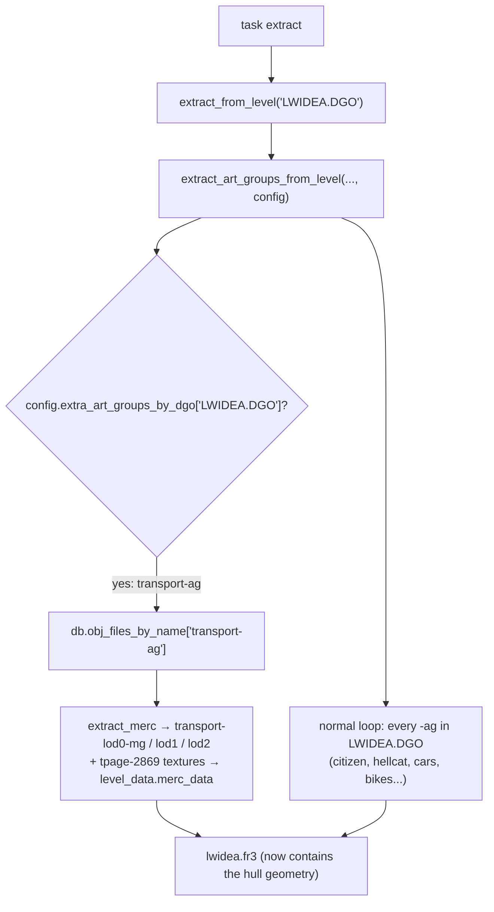
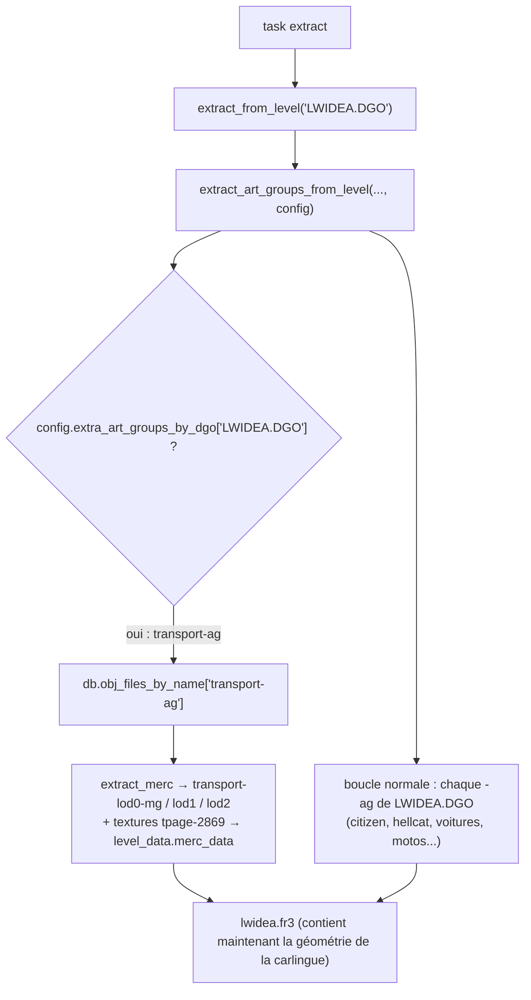

# Merc-geometry `.fr3` injection — POC / "Solution B" généralisée

> - **Branch / Branche :** `jak2/features/merc-fr3-injection-poc` (tirée de `master`)
> - **Type :** proof-of-concept outillage décompilateur (offline asset tool). Le runtime `gk` / `game` n'est **pas** modifié.
> - **But :** prouver qu'on peut rendre *n'importe quel* modèle squelettique du jeu affichable dans *n'importe quel* niveau, sans « borrow », en cuisant sa géométrie merc dans un `.fr3` résident — validé sur `transport-ag` (la carlingue du drop-ship des gardes).
> - **Contexte / Background :** [`../jak2_modding_utilities/18_merc_geometry_fr3_residency.md`](../jak2_modding_utilities/18_merc_geometry_fr3_residency.md) · [`transport_solution_B_bake_into_fr3.md`](transport_solution_B_bake_into_fr3.md)
> - [🇬🇧 English Version](#-english-version)
> - [🇫🇷 Version Française](#-version-française)

---

## 🇬🇧 English Version

### 1. Features

A single new decompiler config field, **`extra_art_groups_by_dgo`**, that bakes the
**merc render geometry** (`*-lod*-mg` vertices + textures) of art groups **into a
level's `.fr3`** even though that level's retail DGO never contained them.

This is the generalized, on-demand form of "Solution B":

```
"extra_art_groups_by_dgo": {
  "<TARGET DGO>": ["<art-group base name>", ...],
  ...
}
```

- **Key** = the target level, written as the DGO name exactly as it appears in
  `inputs.jsonc` → `levels_to_extract` (e.g. `"CWI.DGO"`, `"LWIDEA.DGO"`, `"GAME.CGO"`).
- **Value** = a list of `-ag` base names (e.g. `"transport-ag"`). Each only has to be
  reachable from *some* DGO already listed in `inputs.jsonc` → `dgo_names` (all levels
  are, by default) — you do **not** need the model's own level to be a borrow target.

Result: the PC merc renderer (`Merc2::handle_pc_model`) resolves those models by name
whenever the target `.fr3` is resident, exactly like a model that shipped in that level.

**POC test case:** `transport-ag` → `LWIDEA.DGO` / `LWIDEB.DGO` / `LWIDEC.DGO`, so the
Crimson-Guard troop-transport **hull** draws in Haven City the same way its chin
`vehicle-turret` already does — with **no borrow, no slot contention, paddy-wagon
untouched**.

### 2. Architecture & Tooling

#### 2.1 The two circuits (recap)

A skeletal model needs **both**:

| Circuit | Content | Lives in | Loaded into | Consumed by |
|---|---|---|---|---|
| **1 — art group** | skeleton, joint-geo (`*-lod*-jg`), animations (`*-ja`), LOD metadata | `*-ag.go` (listed in a `.gd`/DGO) | GOAL heap | `initialize-skeleton`, `art-group-get-by-name` |
| **2 — merc geometry** | render vertices (`*-lod*-mg`), texture pages | baked into `*.fr3` by the decompiler | renderer / VRAM | `Merc2::handle_pc_model` (by **name**) |

`.gd` edits only ever add Circuit 1. `Merc2` draws **only** from Circuit 2, and if a
name is missing it silently does `num_missing_models++; return;` (no crash, no error) —
that is why the hull was invisible while the turret worked.

#### 2.2 What the POC changes

**Decompiler (C++, offline):**

| File | Change |
|---|---|
| [`decompiler/config.h`](../../../decompiler/config.h) | new `Config` field `std::unordered_map<std::string, std::vector<std::string>> extra_art_groups_by_dgo` |
| [`decompiler/config.cpp`](../../../decompiler/config.cpp) | parse it from `jak2_config.jsonc` (optional key) |
| [`decompiler/level_extractor/extract_level.cpp`](../../../decompiler/level_extractor/extract_level.cpp) | `extract_art_groups_from_level` now takes `const Config&`; after the normal per-DGO `-ag` loop it processes the configured extras — looked up globally via `db.obj_files_by_name`, then fed through the **same** `extract_merc` / `extract_joint_group` / `extract_animations` calls. Guarded against a name already present in the retail DGO and against an unknown name. 3 call sites updated. |
| [`decompiler/config/jak2/jak2_config.jsonc`](../../../decompiler/config/jak2/jak2_config.jsonc) | POC value: `{"LWIDEA.DGO": ["transport-ag"], "LWIDEB.DGO": ["transport-ag"], "LWIDEC.DGO": ["transport-ag"]}` |

Because the extras are pushed through `extract_merc`, textures they reference
(`tpage-2869` for the transport) are pulled into the `.fr3` automatically via
`find_or_add_texture_to_level` — no separate texture config.

**GOAL source (needed only so a `transport` can actually be spawned & skinned in the city):**

| File | Change |
|---|---|
| [`goal_src/jak2/dgos/lwidea.gd`](../../../goal_src/jak2/dgos/lwidea.gd), [`lwideb.gd`](../../../goal_src/jak2/dgos/lwideb.gd), [`lwidec.gd`](../../../goal_src/jak2/dgos/lwidec.gd) | add `"tpage-2869.go"` + `"transport-ag.go"` before the level's own `.go` (Circuit 1, resident with the traffic art levels) |
| [`goal_src/jak2/levels/city/traffic/vehicle/transport.gc`](../../../goal_src/jak2/levels/city/traffic/vehicle/transport.gc) | one line + comment in `transport-init-by-other`: `(ctywide-entity-hack)` before `initialize-skeleton`, so a city-spawned transport is re-homed onto `ctywide` — identical to what `vehicle-turret-init-by-other` already does |

> **Why `lwidea/lwideb/lwidec` and not `CWI.DGO`?** The traffic manager assigns traffic
> actors to `lwidea` / `lwideb` / `lwidec` by city region, and one of those three is
> borrowed into `ctywide` slot 1 during free-roam. Baking into all three means the hull
> is in whichever one is resident. `CWI.DGO` → `ctywide.fr3` would also work for
> Circuit 2 (always resident), **but** `transport-ag.go` (Circuit 1) is reported to
> overrun the `cwi` DGO buffer, same as `paddy-wagon-ag.go` — hence the traffic art
> levels, which are sized for vehicle art groups.

#### 2.3 Extraction flow



### 3. How to Test

> All build commands are for **you** to run in your terminal — Claude does not run
> long build/runtime tasks. A legally-dumped Jak II ISO must already be set up.

#### Step 1 — build

```bash
task set-game-jak2
task extract          # re-bakes lwidea/lwideb/lwidec.fr3 with transport-lod*-mg
task build-release
```

#### Step 2 — verify the mechanism (decompiler side)

1. **Extract log** — during `task extract` you should see, once per target DGO:
   ```
   [info] extra_art_groups_by_dgo: baking 'transport-ag' into LWIDEA.DGO (.fr3)
   ```
   and no `merc failed to find texture` error for a `transport-*` draw.

2. **`.fr3` size** — `out/jak2/fr3/lwidea.fr3`, `lwideb.fr3`, `lwidec.fr3` each grow by
   a few hundred KB versus a `master` build.

3. **Optional, definitive** — set `"rip_levels": true` in `jak2_config.jsonc`, re-run
   `task extract`, then:
   ```bash
   ls decompiler_out/jak2/levels/lwidea/ | grep -i transport
   ```
   The transport LOD meshes now appear in the exported glTF. Revert `rip_levels` after.

#### Step 3 — verify in-game (renderer side)

Boot into Haven City with the REPL attached (`task run-game`), then in the REPL:

```lisp
;; spawn one transport ~25 m in front of the player; it drops in from above.
(let ((params (new 'stack 'transport-params)))
  (set! (-> params spawn-pos quad) (-> (target-pos 0) quad))
  (+! (-> params spawn-pos z) (meters 25))
  (forward-up-nopitch->quaternion
    (-> params quat)
    (new 'static 'vector :z 1.0 :w 1.0)
    (new 'static 'vector :y 1.0 :w 1.0))
  (set! (-> params nav-mesh) (find-nearest-nav-mesh (-> params spawn-pos) (the-as float #x7f800000)))
  (set! (-> params max-guard) (the-as uint 4))
  (set! (-> params max-time) 0.0)
  (set! (-> params turret?) #t)
  (set! (-> params speeches?) #f)
  (process-spawn transport params :to *default-pool* :name "poc-transport"))
```

**Expected:** the full drop-ship hull descends, textured, hatch opens, guards climb
out; the chin turret is attached and tracks. Walk 20–40 m away and back — the hull
stays visible (it is now in the resident `lwide*` `.fr3`, not gated on any borrow).

**Failure reading:**

| Symptom | Meaning |
|---|---|
| Turret + guards appear, **hull invisible** | Circuit 2 bake failed — check the extract log / `.fr3` size |
| `art-error` / process dies at spawn | Circuit 1 missing — `transport-ag.go` not resident (check `.gd` + rebuild) |
| Hull visible but **untextured / wrong textures** | `tpage-2869` texture remap mismatch in `lwide*` — mechanism works, texture path needs a tweak |
| Hull visible only in part of the city | one of `lwidea/lwideb/lwidec` was missed |

### 4. Status

| Item | State |
|---|---|
| Decompiler `extra_art_groups_by_dgo` field + extraction | **implemented** |
| `jak2_config.jsonc` POC value (`transport-ag` → 3 traffic art levels) | **implemented** |
| Circuit 1 wiring (`lwide[abc].gd`, `transport.gc` entity hack) | **implemented** |
| C++ compile check (`extractor` target) | see commit notes |
| `task extract` + in-game visual confirmation | **pending — requires the user to build** |

### 5. Generalization

`extra_art_groups_by_dgo` is not transport-specific. To make any model drawable in any level:

1. Find the model's `-ag` base name (`git grep -l "<model>-ag" -- goal_src/jak2/dgos/`
   or `goal_src/jak2/build/all_objs.json`).
2. Add `"<TARGET DGO>": ["<model>-ag"]` to `extra_art_groups_by_dgo`.
3. If you also need to *spawn / skin* it there (not just have it drawable), add
   `"<model>-ag.go"` (+ its tpage) to that level's `.gd` for Circuit 1.
4. `task extract` + `task build-release`.

Cost: one `task extract` per builder (offline; runtime untouched). This is the
"re-bake" row of the table in tip 18 — now a config line instead of a code patch.

### 6. Modding Changes Log

| Date | File | Change | Rationale |
|---|---|---|---|
| 2026-09-01 | `decompiler/config.h` | + `Config::extra_art_groups_by_dgo` | declare the new per-game extraction directive |
| 2026-09-01 | `decompiler/config.cpp` | parse `extra_art_groups_by_dgo` (optional) from `jak2_config.jsonc` | wire the field to the JSON |
| 2026-09-01 | `decompiler/level_extractor/extract_level.cpp` | `extract_art_groups_from_level` takes `const Config&`; extra `-ag` loop via `db.obj_files_by_name` → `extract_merc`/`extract_joint_group`/`extract_animations`; retail-dupe + unknown-name guards; 3 call sites updated | the actual bake |
| 2026-09-01 | `decompiler/config/jak2/jak2_config.jsonc` | + POC value `transport-ag` → `LWIDEA/LWIDEB/LWIDEC.DGO` | the transport test case |
| 2026-09-01 | `goal_src/jak2/dgos/lwidea.gd`, `lwideb.gd`, `lwidec.gd` | + `"tpage-2869.go"`, `"transport-ag.go"` before the bsp `.go` | Circuit 1 residency with the traffic art levels |
| 2026-09-01 | `goal_src/jak2/levels/city/traffic/vehicle/transport.gc` | `transport-init-by-other`: `(ctywide-entity-hack)` before `initialize-skeleton` (+ comment) | re-home a city-spawned transport onto `ctywide`, like `vehicle-turret` |
| 2026-09-01 | `docs/modding/current_mod/merc_fr3_injection_poc_readme.md` | new | this document |

---

## 🇫🇷 Version Française

### 1. Fonctionnalités

Un seul nouveau champ de config du décompilateur, **`extra_art_groups_by_dgo`**, qui
cuit la **géométrie de rendu merc** (sommets `*-lod*-mg` + textures) de groupes d'art
**dans le `.fr3` d'un niveau**, même si le DGO retail de ce niveau ne les a jamais
contenus.

C'est la forme généralisée et « à la demande » de la « Solution B » :

```
"extra_art_groups_by_dgo": {
  "<DGO CIBLE>": ["<nom de base du groupe d'art>", ...],
  ...
}
```

- **Clé** = le niveau cible, écrit comme le nom de DGO tel qu'il apparaît dans
  `inputs.jsonc` → `levels_to_extract` (ex. `"CWI.DGO"`, `"LWIDEA.DGO"`, `"GAME.CGO"`).
- **Valeur** = une liste de noms de base `-ag` (ex. `"transport-ag"`). Chacun doit
  seulement être atteignable depuis *un* DGO déjà listé dans `inputs.jsonc` →
  `dgo_names` (tous les niveaux le sont par défaut) — le niveau d'origine du modèle
  n'a **pas** besoin d'être une cible de « borrow ».

Résultat : le renderer merc PC (`Merc2::handle_pc_model`) résout ces modèles par leur
nom dès que le `.fr3` cible est résident, exactement comme un modèle livré dans ce
niveau.

**Cas de test POC :** `transport-ag` → `LWIDEA.DGO` / `LWIDEB.DGO` / `LWIDEC.DGO`, pour
que la **carlingue** du transport de troupes des Crimson Guards s'affiche dans Haven
City de la même manière que sa tourelle de menton `vehicle-turret` — **sans borrow,
sans contention de slot, paddy-wagon intact**.

### 2. Architecture & Outillage

#### 2.1 Les deux circuits (rappel)

Un modèle squelettique a besoin des **deux** :

| Circuit | Contenu | Réside dans | Chargé dans | Consommé par |
|---|---|---|---|---|
| **1 — groupe d'art** | squelette, joint-geo (`*-lod*-jg`), animations (`*-ja`), métadonnées LOD | `*-ag.go` (listé dans un `.gd`/DGO) | tas GOAL | `initialize-skeleton`, `art-group-get-by-name` |
| **2 — géométrie merc** | sommets de rendu (`*-lod*-mg`), pages de textures | cuit dans `*.fr3` par le décompilateur | renderer / VRAM | `Merc2::handle_pc_model` (par **nom**) |

Les modifications de `.gd` n'ajoutent jamais que le Circuit 1. `Merc2` ne dessine
**que** depuis le Circuit 2, et si un nom manque il fait silencieusement
`num_missing_models++; return;` (pas de crash, pas d'erreur) — c'est pourquoi la
carlingue était invisible alors que la tourelle fonctionnait.

#### 2.2 Ce que le POC modifie

**Décompilateur (C++, hors-ligne) :**

| Fichier | Modification |
|---|---|
| [`decompiler/config.h`](../../../decompiler/config.h) | nouveau champ `Config` : `std::unordered_map<std::string, std::vector<std::string>> extra_art_groups_by_dgo` |
| [`decompiler/config.cpp`](../../../decompiler/config.cpp) | le parse depuis `jak2_config.jsonc` (clé optionnelle) |
| [`decompiler/level_extractor/extract_level.cpp`](../../../decompiler/level_extractor/extract_level.cpp) | `extract_art_groups_from_level` prend désormais `const Config&` ; après la boucle `-ag` normale par DGO, elle traite les extras configurés — résolus globalement via `db.obj_files_by_name`, puis passés dans les **mêmes** appels `extract_merc` / `extract_joint_group` / `extract_animations`. Garde-fous contre un nom déjà présent dans le DGO retail et contre un nom inconnu. 3 sites d'appel mis à jour. |
| [`decompiler/config/jak2/jak2_config.jsonc`](../../../decompiler/config/jak2/jak2_config.jsonc) | valeur POC : `{"LWIDEA.DGO": ["transport-ag"], "LWIDEB.DGO": ["transport-ag"], "LWIDEC.DGO": ["transport-ag"]}` |

Comme les extras passent par `extract_merc`, les textures qu'ils référencent
(`tpage-2869` pour le transport) sont tirées dans le `.fr3` automatiquement via
`find_or_add_texture_to_level` — aucune config texture séparée.

**Source GOAL (nécessaire seulement pour qu'un `transport` puisse réellement être
spawné et « skinné » en ville) :**

| Fichier | Modification |
|---|---|
| [`goal_src/jak2/dgos/lwidea.gd`](../../../goal_src/jak2/dgos/lwidea.gd), [`lwideb.gd`](../../../goal_src/jak2/dgos/lwideb.gd), [`lwidec.gd`](../../../goal_src/jak2/dgos/lwidec.gd) | ajout de `"tpage-2869.go"` + `"transport-ag.go"` avant le `.go` propre du niveau (Circuit 1, résident avec les niveaux d'art de circulation) |
| [`goal_src/jak2/levels/city/traffic/vehicle/transport.gc`](../../../goal_src/jak2/levels/city/traffic/vehicle/transport.gc) | une ligne + commentaire dans `transport-init-by-other` : `(ctywide-entity-hack)` avant `initialize-skeleton`, pour qu'un transport spawné en ville soit re-rattaché à `ctywide` — identique à ce que fait déjà `vehicle-turret-init-by-other` |

> **Pourquoi `lwidea/lwideb/lwidec` et pas `CWI.DGO` ?** Le gestionnaire de circulation
> assigne les acteurs de trafic à `lwidea` / `lwideb` / `lwidec` par région de la
> ville, et l'un de ces trois est emprunté dans le slot 1 de `ctywide` en jeu libre.
> Cuire dans les trois garantit que la carlingue est dans celui qui est résident.
> `CWI.DGO` → `ctywide.fr3` fonctionnerait aussi pour le Circuit 2 (toujours résident),
> **mais** `transport-ag.go` (Circuit 1) est réputé déborder le tampon DGO de `cwi`,
> comme `paddy-wagon-ag.go` — d'où les niveaux d'art de circulation, dimensionnés pour
> des groupes d'art de véhicules.

#### 2.3 Flux d'extraction



### 3. Comment Tester

> Toutes les commandes de build sont à lancer **par toi** dans ton terminal — Claude
> ne lance pas les tâches longues de build/runtime. Un ISO Jak II légalement extrait
> doit déjà être configuré.

#### Étape 1 — build

```bash
task set-game-jak2
task extract          # re-cuit lwidea/lwideb/lwidec.fr3 avec transport-lod*-mg
task build-release
```

#### Étape 2 — vérifier le mécanisme (côté décompilateur)

1. **Log d'extraction** — pendant `task extract`, tu dois voir, une fois par DGO cible :
   ```
   [info] extra_art_groups_by_dgo: baking 'transport-ag' into LWIDEA.DGO (.fr3)
   ```
   et aucune erreur `merc failed to find texture` pour un draw `transport-*`.

2. **Taille des `.fr3`** — `out/jak2/fr3/lwidea.fr3`, `lwideb.fr3`, `lwidec.fr3`
   grossissent chacun de quelques centaines de Ko par rapport à un build `master`.

3. **Optionnel, définitif** — mettre `"rip_levels": true` dans `jak2_config.jsonc`,
   relancer `task extract`, puis :
   ```bash
   ls decompiler_out/jak2/levels/lwidea/ | grep -i transport
   ```
   Les maillages LOD du transport apparaissent dans le glTF exporté. Remettre
   `rip_levels` à `false` après.

#### Étape 3 — vérifier en jeu (côté renderer)

Boote dans Haven City avec le REPL attaché (`task run-game`), puis dans le REPL :

```lisp
;; spawne un transport ~25 m devant le joueur ; il descend depuis le ciel.
(let ((params (new 'stack 'transport-params)))
  (set! (-> params spawn-pos quad) (-> (target-pos 0) quad))
  (+! (-> params spawn-pos z) (meters 25))
  (forward-up-nopitch->quaternion
    (-> params quat)
    (new 'static 'vector :z 1.0 :w 1.0)
    (new 'static 'vector :y 1.0 :w 1.0))
  (set! (-> params nav-mesh) (find-nearest-nav-mesh (-> params spawn-pos) (the-as float #x7f800000)))
  (set! (-> params max-guard) (the-as uint 4))
  (set! (-> params max-time) 0.0)
  (set! (-> params turret?) #t)
  (set! (-> params speeches?) #f)
  (process-spawn transport params :to *default-pool* :name "poc-transport"))
```

**Attendu :** la carlingue complète du drop-ship descend, texturée, la trappe s'ouvre,
les gardes sortent ; la tourelle de menton est attachée et suit la cible. Éloigne-toi
de 20–40 m puis reviens — la carlingue reste visible (elle est maintenant dans le
`.fr3` résident `lwide*`, plus conditionnée à un borrow).

**Lecture des échecs :**

| Symptôme | Signification |
|---|---|
| Tourelle + gardes apparaissent, **carlingue invisible** | échec de la cuisson Circuit 2 — vérifier le log d'extraction / la taille des `.fr3` |
| `art-error` / le process meurt au spawn | Circuit 1 manquant — `transport-ag.go` pas résident (vérifier le `.gd` + rebuild) |
| Carlingue visible mais **non texturée / mauvaises textures** | mauvais remap de `tpage-2869` dans `lwide*` — le mécanisme marche, le chemin texture demande un ajustement |
| Carlingue visible seulement dans une partie de la ville | un des `lwidea/lwideb/lwidec` a été oublié |

### 4. Statut

| Élément | État |
|---|---|
| Champ décompilateur `extra_art_groups_by_dgo` + extraction | **implémenté** |
| Valeur POC `jak2_config.jsonc` (`transport-ag` → 3 niveaux d'art de circulation) | **implémenté** |
| Câblage Circuit 1 (`lwide[abc].gd`, entity hack `transport.gc`) | **implémenté** |
| Vérification de compilation C++ (cible `extractor`) | voir les notes de commit |
| `task extract` + confirmation visuelle en jeu | **en attente — nécessite le build par l'utilisateur** |

### 5. Généralisation

`extra_art_groups_by_dgo` n'est pas spécifique au transport. Pour rendre n'importe quel
modèle affichable dans n'importe quel niveau :

1. Trouver le nom de base `-ag` du modèle
   (`git grep -l "<modele>-ag" -- goal_src/jak2/dgos/` ou
   `goal_src/jak2/build/all_objs.json`).
2. Ajouter `"<DGO CIBLE>": ["<modele>-ag"]` à `extra_art_groups_by_dgo`.
3. Si tu dois aussi le *spawner / skinner* là (pas seulement l'avoir affichable),
   ajouter `"<modele>-ag.go"` (+ sa tpage) au `.gd` de ce niveau pour le Circuit 1.
4. `task extract` + `task build-release`.

Coût : un `task extract` par personne qui build (hors-ligne ; runtime intact). C'est la
ligne « re-bake » du tableau du tip 18 — désormais une ligne de config au lieu d'un
patch de code.

### 6. Journal des Modifications (Modding Changes Log)

| Date | Fichier | Modification | Justification |
|---|---|---|---|
| 2026-09-01 | `decompiler/config.h` | + `Config::extra_art_groups_by_dgo` | déclarer la nouvelle directive d'extraction par jeu |
| 2026-09-01 | `decompiler/config.cpp` | parse de `extra_art_groups_by_dgo` (optionnel) depuis `jak2_config.jsonc` | relier le champ au JSON |
| 2026-09-01 | `decompiler/level_extractor/extract_level.cpp` | `extract_art_groups_from_level` prend `const Config&` ; boucle `-ag` extra via `db.obj_files_by_name` → `extract_merc`/`extract_joint_group`/`extract_animations` ; garde-fous doublon-retail + nom-inconnu ; 3 sites d'appel mis à jour | la cuisson elle-même |
| 2026-09-01 | `decompiler/config/jak2/jak2_config.jsonc` | + valeur POC `transport-ag` → `LWIDEA/LWIDEB/LWIDEC.DGO` | le cas de test transport |
| 2026-09-01 | `goal_src/jak2/dgos/lwidea.gd`, `lwideb.gd`, `lwidec.gd` | + `"tpage-2869.go"`, `"transport-ag.go"` avant le `.go` du bsp | résidence Circuit 1 avec les niveaux d'art de circulation |
| 2026-09-01 | `goal_src/jak2/levels/city/traffic/vehicle/transport.gc` | `transport-init-by-other` : `(ctywide-entity-hack)` avant `initialize-skeleton` (+ commentaire) | re-rattacher un transport spawné en ville à `ctywide`, comme `vehicle-turret` |
| 2026-09-01 | `docs/modding/current_mod/merc_fr3_injection_poc_readme.md` | nouveau | ce document |
