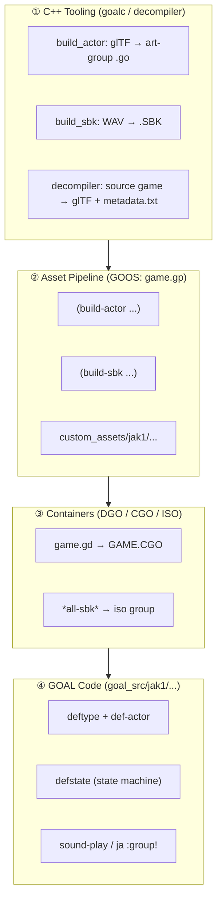
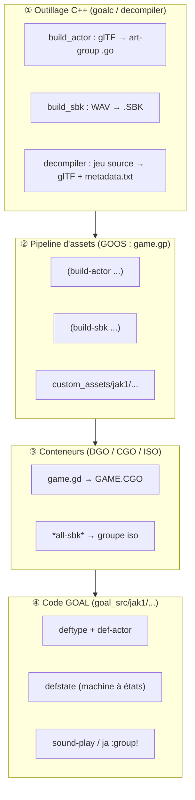

# 🚀 Custom Entity & Asset Ingestion Workflow / Injecter une Entité Personnalisée dans OpenGOAL

> **Bilingual Engineering Guide / Guide d'Ingénierie Bilingue**
>
> - **Subject / Sujet :** Custom 3D Models, Armatures, Animations & Audio Banks (SBK) — Case Study: `og-j1-board`
> - **Applies to / Concerne :** Jak 1 / Jak 2 / Jak 3 (OpenGOAL PC Port)
> - **Source of Truth / Source de Vérité :** `master-dev`

<p align="center">
  <a href="#-english-version"><b>🇬🇧 English Version</b></a> &nbsp;•&nbsp; <a href="#-version-française"><b>🇫🇷 Version Française</b></a>
</p>

> ### 📑 Summary / Sommaire
>
> - 🇬🇧 **English:** [1. Mental Model](#1-introduction--mental-model) · [2. Architecture & Tooling](#2-architecture--tooling-compiler--decompiler) · [3. Asset Pipeline](#3-asset-ingestion-pipeline) · [4. GOAL LISP Implementation](#4-implementation-in-opengoal-lisp) · [5. Abstraction Principles](#5-abstraction-principles-for-other-actors) · [6. Porting Checklist](#6-appendix--porting-checklist)
> - 🇫🇷 **Français :** [1. Modèle Mental](#1-introduction-et-modèle-mental) · [2. Architecture & Outillage](#2-architecture-et-outillage-compilateur--décompilateur) · [3. Pipeline d'Assets](#3-pipeline-dingestion-des-assets) · [4. Implémentation LISP](#4-implémentation-en-opengoal-lisp) · [5. Principes d'Abstraction](#5-principes-dabstraction-pour-dautres-projets--jeux) · [6. Checklist](#6-annexe--checklist-de-portage)

---

# 🇬🇧 English Version

## Engineering Guide — Custom Models, Animations, and Audio Banks with `og-j1-board` Case Study

---

## 1. Introduction & Mental Model

### 1.1 Objective

Our goal is to establish a **reusable engineering procedure** to inject any foreign entity into an OpenGOAL game (Jak 1, Jak II, Jak 3) that does not natively exist in the target game, comprising:
- A **custom actor**: GOAL type, 3D model, and state machine;
- **Custom animations**: either on the entity's own armature or grafted onto an existing character (Jak, Daxter);
- **Custom sound effects**: a dedicated sound bank (`.SBK`).

Our case study is **`og-j1-board`**: backporting the *Jak 3* Jetboard into *Jak 1*. This is intentionally a challenging benchmark because the entity is not autonomous; it **attaches to the player process**, swaps Jak's skeleton, drives velocity through animations, and integrates a real-time audio pipeline. Simpler entities (enemies, pickups, platforms) represent a subset of this process.

### 1.2 The Four Layers

Every imported asset must traverse four distinct architectural layers:



| Layer | Role | Location | Modifiable without C++ Rebuild? |
|---|---|---|---|
| ① Tooling | Converts foreign formats into engine binary formats | `goalc/`, `decompiler/`, `common/` | No — C++ recompilation required |
| ② Pipeline | Describes *what* to build and *how* | `goal_src/jak1/game.gp` (GOOS language) | Yes |
| ③ Containers | Packages `.o`/`.go`/`.SBK` for level streaming | `goal_src/jak1/dgos/*.gd`, `game.gp` | Yes |
| ④ GOAL Code | Entity logic, physics, and state transitions | `goal_src/jak1/engine/target/board/` | Yes (hot-reloaded via REPL) |

### 1.3 Asset Pipeline Distribution

| Asset Type | Ingestion Tool | Produced Engine Format | Container | `og-j1-board` Example Files |
|---|---|---|---|---|
| 3D Model | `build-actor` | `art-group` (`art-joint-geo` + `merc-ctrl`) in `.go` | `GAME.CGO` | [`custom_assets/jak1/models/custom_levels/board.glb`](custom_assets/jak1/models/custom_levels/board.glb) |
| Animations | `build-actor` (+ `master-ag-map`) / `decompiler` | Compressed `art-joint-anim` | `GAME.CGO` (in art-group) | [`eichar-board+0.glb`](custom_assets/jak1/models/custom_levels/eichar-board+0.glb), [`sidekick-board+0.glb`](custom_assets/jak1/models/custom_levels/sidekick-board+0.glb) |
| Sounds | `build-sbk` / `decompiler` (`rip_sound_banks`) | `.SBK` (SBlk v1 + FileAttributes) | ISO (`*all-sbk*`) | [`custom_assets/jak1/sounds/sfx/BOARD/`](custom_assets/jak1/sounds/sfx/BOARD/) |

---

## 2. Architecture & Tooling (Compiler / Decompiler)

### 2.1 Ecosystem Binaries

OpenGOAL consists of four core binaries:
- `goalc`: OpenGOAL x86-64 compiler + **data build tools** (`dgo`, `build-level`, `build-actor`, `build-sbk`).
- `decompiler`: Asset extraction and disassembler from original PS2 retail games.
- `game` / `gk`: C++ runtime simulating PS2 Emotion Engine RAM via `mmap` with OpenGL renderer.
- `gk` / REPL: Interactive developer shell connected to running game memory.

> **General Rule:** Everything that **produces or parses a binary format** is C++ in `goalc`/`decompiler`/`common`. Everything that **orchestrates the build** is GOOS in `game.gp`. Everything that defines **gameplay logic** is GOAL in `goal_src/`.

### 2.2 Tooling Modifications — Custom Actor

The `build-actor` tool was extended to support real skeletal hierarchies and animation channels:
- Added `master_art_group`, `master_ag_map` (`anim name → slot index`), `framerate`, and `joint_channel`.
- Supported bone `align`: In Jak games, the root joint `align` is not purely visual; each frame, the engine calculates its delta and **adds it to the character's velocity and rotation** (`compute-alignment!`).

### 2.3 Tooling Modifications — Custom Animations

- **Export (source game → glTF):** Decompiles `art-joint-anim` blocks, uncompresses LZO streams (Jak 2/3), reconstructs TRS curves per joint, and writes glTF accessors.
- **Import (glTF → engine format):** Re-samples keyframes, calculates constant vs animated flags, and encodes values into quantized `art-joint-anim` structures.

### 2.4 Tooling Modifications — Custom Audio Banks (`build_sbk`)

Located in `goalc/build_sbk/` (~1100 lines of C++):
1. **WAV Ingestion:** Requires 16-bit PCM; automatic stereo-to-mono downmix.
2. **Encoding:** Encodes SPU-ADPCM (16-byte blocks = 28 samples), optimizing filter and shift parameters.
3. **Pitch Matching:** Converts sample rate to SPU `center_note`.
4. **Header Construction:** Builds `SBlk` version 1 (downgrading Jak 2/3 bank formats to Jak 1).
5. **Name Table:** Prefixes a 2048-byte name table required by Jak 1 runtime resolution.

---

## 3. Asset Ingestion Pipeline

### 3.1 Directory Layout (`custom_assets/`)

```text
custom_assets/jak1/
├── models/
│   └── custom_levels/                 ← Read by (build-actor "<name>") → <name>.glb
│       ├── board.glb                   (The Jetboard: 13 joints, idle/close/open clips)
│       ├── eichar-board+0.glb          (Jak model + 54 "jakb-board-*" animations)
│       └── sidekick-board+0.glb        (Daxter model + 54 "daxter-board-*" animations)
└── sounds/
    └── sfx/
        └── BOARD/                      ← Read by (build-sbk "BOARD")
            ├── metadata.txt            (Sound & grain manifest — SOURCE OF TRUTH)
            └── BOARD_JUMP_0.wav        (16-bit PCM)
```

### 3.2 3D Models & Pipeline Macro

Declared in `goal_src/jak1/game.gp`:
```lisp
(build-actor "board" :texture-bucket 2 :force-run #t)
```
Outputs `$OUT/obj/board-ag.go`, packaging `[art-joint-geo, merc-ctrl, art-joint-anim...]`.

### 3.3 Animations: Direct vs Grafted

- **Strategy A (Self-contained):** The entity `.glb` contains its own clips (e.g. `board-open`, `board-close`).
- **Strategy B (Grafted onto Host):** For Jak to play 54 new skateboard animations, a companion art-group (`eichar-board+0`) links each glTF animation name to an empty slot index in Jak's master art-group `eichar`:
```lisp
(build-actor "eichar-board+0"
             :texture-bucket 2
             :force-run #t
             :framerate 60
             :joint-channel 24
             :master-art-group eichar
             :master-ag-map
             ((jakb-board-air-turn    180)
              (jakb-board-airwalk     181)
              ;; ... 54 mapped animation slots
              (jakb-board-turn-up     233)))
```

### 3.4 Audio Banks & Manifest

`metadata.txt` is the **human-readable source of truth**:
```text
[001] "board-jump" vol=120 volgroup=0 pan=0 instlimit=0 flags=0x0000
  grain[0] LFO_SETTINGS delay=0 which_lfo=0 target=4 shape=1 depth=512 step_size=3355443
  grain[1] TONE delay=0 priority=122 vol=127 note=-68 fine=124 adsr=[0xaeff,0x9fc0] -> BOARD_JUMP_0.wav
```
Declared in `game.gp`:
```lisp
(build-sbk "BOARD" :force-run #t)
```

### 3.5 Container Packaging (`GAME.CGO` & ISO)

- Code files (`.o`) and art-groups (`.go`) are registered in `goal_src/jak1/dgos/game.gd`.
- `board-h.o` must precede any consumer code referencing `board` or `board-info`.
- `BOARD.SBK` is added to `*all-sbk*` and packaged into the root ISO filesystem.

---

## 4. Implementation in OpenGOAL LISP

Located in `goal_src/jak1/engine/target/board/`.

### 4.1 Type Definitions: Visual Entity vs State Machine

- **Visual Actor (`board`):** Inherits from `process-drawable`. Mapped to `*8k-dead-pool*` as a lightweight child process.
```lisp
(deftype board (process-drawable)
  ((self         board :override)
   (parent       (pointer target) :override)
   (control      control-info :overlay-at root)
   (main         joint-mod)
   (in-head-time time-frame))
  (:state-methods (idle symbol) use hidden))
```
- **State Structure (`board-info`):** Embedded on `target` process heap. Contains ~200 fields tracking gameplay, combos, audio channel IDs, and physical parameters.

### 4.2 State Machine & Animation Playback

- Uses `defstate` blocks with `:enter`, `:code`, `:trans`, `:post`, and `:event`.
- Animation playback via `(ja-no-eval :group! ... :num! (seek! max))` and `(ja-blend-eval)`.
- Overriding bone transforms via `joint-mod` with `flex-blend` mode.

### 4.3 Skeleton Swapping (`target-set-lod`)

When the board mode activates:
1. `target-set-lod 'board` assigns `board-lod` and sets `node-list` to `board-node-list`.
2. Jak's rendering switches to `eichar-board+0`.
3. Daxter's skeleton similarly swaps to `sidekick-board+0`.
4. Upon exit (`target-board-get-off`), `old-lod` and `old-node-list` are restored cleanly.

---

## 5. Abstraction Principles for Other Actors

### 5.1 Clean Mod Isolation

1. **Subdirectory Isolation:** Keep all mod files in a dedicated folder (`engine/target/<feature>/`).
2. **Dedicated Overrides File (`<mod>-overrides.gc`):** Loaded last, redefining whole functions instead of patching vanilla files inline.
3. **Traceability Markers:** Tag every unavoidable core edit with `;; og:<mod> added` or `;; og:<mod> changed`.
4. **Namespace Hygiene:** Prefix all states, variables, and art groups (`target-<mod>-*`, `*mod-<slug>-*`).

### 5.2 Autonomous vs Grafted Entities

- **Autonomous (Enemies, Platforms, Items):** Independent `process-drawable`, own skeleton and collision shape, declared in level `.jsonc`.
- **Grafted (Jetboard, Worn Weapons):** Attaches to player, swaps player skeleton/LOD, borrows player collision.

---

## 6. Appendix — Porting Checklist

- [ ] C++ build tools compiled (`task gen-cmake-release && task build-release`).
- [ ] 3D Model `<X>.glb` prepared with single skin and valid bone hierarchy.
- [ ] Sound bank `metadata.txt` and 16-bit PCM WAVs placed in `sounds/sfx/<X>/`.
- [ ] `(build-actor ...)` and `(build-sbk ...)` added to `game.gp`.
- [ ] Files registered in `game.gd` (or level `.jsonc`).
- [ ] Types (`<X>-h.gc`) and states (`<X>-states.gc`) implemented in GOAL.
- [ ] In-game Mods menu toggle registered via `(mods-menu-register "<slug>" ...)`.
- [ ] Cold boot verification passed (`task boot-game`).

---

# 🇫🇷 Version Française

## Guide d'ingénierie — modèles, animations et sons custom, avec `og-j1-board` comme fil conducteur

---

## 1. Introduction et modèle mental

### 1.1 Objectif

On veut une **démarche réutilisable** pour ajouter à n'importe quel jeu de l'écosystème OpenGOAL (Jak 1, Jak II, Jak 3) une entité qui n'existe pas dans le jeu cible, avec :

- un **acteur personnalisé** (*custom actor*) — un type GOAL, un modèle 3D, une machine à états ;
- des **animations personnalisées** (*custom animations*) — soit sur le modèle de l'entité, soit greffées sur un modèle existant (Jak, Daxter) ;
- de **nouveaux effets sonores** (*custom sounds*) — une banque de sons (SBK) dédiée.

Le cas d'étude est **`og-j1-board`** : le portage du Jetboard de *Jak 3* dans *Jak 1*. C'est un cas volontairement difficile — l'entité n'est pas autonome, elle **se greffe sur le joueur** (elle échange le squelette de Jak, pilote sa vélocité via les animations, ajoute un pipeline audio temps réel). Tout ce qui est plus simple qu'un board (un ennemi, un objet ramassable, une plateforme) est un sous-ensemble de cette démarche.

### 1.2 Les quatre couches à franchir

Chaque asset exogène doit traverser quatre couches. C'est la grille de lecture de tout le guide.



| Couche | Rôle | Où ça vit | Modifiable sans toucher le C++ ? |
|---|---|---|---|
| ① Outillage | Convertir des formats exogènes en formats moteur | `goalc/`, `decompiler/`, `common/` | Non — recompilation C++ |
| ② Pipeline | Décrire *quoi* construire et *comment* | `goal_src/jak1/game.gp` (langage GOOS) | Oui |
| ③ Conteneurs | Empaqueter `.o`/`.go`/`.SBK` pour le chargement | `goal_src/jak1/dgos/*.gd`, `game.gp` | Oui |
| ④ Code GOAL | Logique de l'entité | `goal_src/jak1/engine/target/board/` | Oui (hot-reload REPL) |

### 1.3 Répartition par type d'asset

| Asset | Outil qui l'ingère | Format moteur produit | Conteneur | Fichier(s) `og-j1-board` |
|---|---|---|---|---|
| Modèle 3D | `build-actor` | `art-group` (`art-joint-geo` + `merc-ctrl`) dans un `.go` | `GAME.CGO` | [`custom_assets/jak1/models/custom_levels/board.glb`](custom_assets/jak1/models/custom_levels/board.glb) |
| Animations | `build-actor` (+ `master-ag-map`) / `decompiler` (export) | `art-joint-anim` compressées | `GAME.CGO` (dans l'art-group) | [`eichar-board+0.glb`](custom_assets/jak1/models/custom_levels/eichar-board+0.glb), [`sidekick-board+0.glb`](custom_assets/jak1/models/custom_levels/sidekick-board+0.glb) |
| Sons | `build-sbk` / `decompiler` (`rip_sound_banks`) | `.SBK` (SBlk v1 + FileAttributes) | ISO (`*all-sbk*`) | [`custom_assets/jak1/sounds/sfx/BOARD/`](custom_assets/jak1/sounds/sfx/BOARD/) |

---

## 2. Architecture et outillage (compilateur / décompilateur)

### 2.1 Les binaires de l'écosystème

`OpenGOAL` se compose de quatre exécutables :

| Binaire | Rôle | Impacté par le board ? |
|---|---|---|
| `goalc` | Compilateur GOAL x86-64 + **système de build des données** (les *tools* `dgo`, `build-level`, `build-actor`, `build-sbk`…) | **Oui** — nouveau tool `build-sbk`, extension de `build-actor` |
| `decompiler` | Décompilateur (extraction des assets du jeu original) | **Oui** — nouveaux extracteurs `extract_sbk`, `extract_anim`, export d'animations glTF |
| `game` (runtime) | Le PS2 émulé : GOAL VM, renderers, `overlord` (moteur audio) | **Oui** — `srpc.cpp` : passage du champ `reg` aux grains SFX |
| `gk` / REPL | Lance le jeu + REPL de dev connecté | Non (mais indispensable à l'itération) |

> **Règle générale.** Tout ce qui **produit** ou **consomme** un format binaire (modèle, anim, son) est du C++ dans `goalc`/`decompiler`/`common`. Tout ce qui **orchestre** (quoi construire, dans quel ordre) est du GOOS dans `game.gp`. Tout ce qui est **logique de jeu** est du GOAL dans `goal_src/`.

### 2.2 Modifications de l'outillage — acteur personnalisé

Le tool `build-actor` existait déjà pour les niveaux custom. Le board l'a étendu pour supporter des **squelettes réels + animations**.

- `struct BuildActorParams` : ajout de `master_art_group`, `master_ag_map`, `framerate`, `joint_channel`.
- Détection du bone `align` : chaque frame, le moteur lit son déplacement et l'**ajoute à la vélocité et à la rotation** du personnage (`compute-alignment!`).

### 2.3 Modifications de l'outillage — animation personnalisée

- **Export (jeu source → glTF) :** `extract_anim.cpp` et `fr3_to_gltf.cpp` reconstituent les animations sous forme d'actions glTF standards éditables dans Blender.
- **Import (glTF → format moteur) :** `animation_processing.cpp` ré-échantillonne en keyframes et quantifie les canaux trans/quat/scale.

### 2.4 Modifications de l'outillage — son personnalisé (`build_sbk`)

Composant C++ dédié (`goalc/build_sbk/`) :
- Lecture WAV PCM 16 bits obligatoire.
- Encodage SPU-ADPCM et calcul du pitch `center_note`.
- Écriture d'un bloc `SBlk` version 1 (Jak 1) et préfixage de la table de noms de 2048 octets.

---

## 3. Pipeline d'ingestion des assets

### 3.1 Arborescence `custom_assets/`

```text
custom_assets/jak1/
├── models/
│   └── custom_levels/                 ← lus par (build-actor "<nom>")  →  <nom>.glb
│       ├── board.glb                   (le Jetboard : 13 joints, clips idle/close/open)
│       ├── eichar-board+0.glb          (modèle de Jak + 54 anims « jakb-board-* »)
│       └── sidekick-board+0.glb        (modèle de Daxter + 54 anims « daxter-board-* »)
└── sounds/
    └── sfx/
        └── BOARD/                      ← lu par (build-sbk "BOARD")
            ├── metadata.txt            (manifeste : sons + grains — SOURCE DE VÉRITÉ)
            └── BOARD_JUMP_0.wav        (PCM 16 bits)
```

### 3.2 Modèles 3D

Déclaration dans `game.gp` :
```lisp
(build-actor "board" :texture-bucket 2 :force-run #t)
```
Sortie : `$OUT/obj/board-ag.go`.

### 3.3 Animations

- **Stratégie A (Autonome) :** Le modèle embarque ses propres animations (`board.glb`).
- **Stratégie B (Greffée sur Jak/Daxter) :** Les 54 animations de skate sont mappées sur les slots disponibles du master art-group `eichar` (slots 180 à 233).

### 3.4 Sons

Édition via `metadata.txt` et déclaration dans `game.gp` :
```lisp
(build-sbk "BOARD" :force-run #t)
```

### 3.5 Déclaration dans les conteneurs

- Inscription dans `goal_src/jak1/dgos/game.gd`.
- Respect de l'ordre : `board-h.o` en premier, `board-overrides.o` en dernier.
- `BOARD.SBK` ajouté à la racine de l'ISO via `*all-sbk*`.

---

## 4. Implémentation en OpenGOAL LISP

Dossier : `goal_src/jak1/engine/target/board/`.

### 4.1 Définition du type & Mémoire

- Type visuel `board` (fils léger de `process-drawable`).
- Machine à états lourde `board-info` rattachée directement au process `target`.
- Override d'orientation par `joint-mod` avec mode `flex-blend`.

### 4.2 Machine à états

- Utilisation de `defstate` (`:enter`, `:code`, `:trans`, `:post`, `:event`).
- Contrôle d'animation via `ja-channel-push!`, `ja-no-eval`, et `ja-blend-eval`.
- Prise en compte dynamique du déplacement du bone `align` pour l'impulsion physique.

### 4.3 Échange de squelette (`target-set-lod`)

À l'activation du board, `target-set-lod 'board` permute la géométrie et la liste des joints vers le squelette étendu (`eichar-board+0`), et les restaure lors de la sortie du mode.

---

## 5. Principes d'abstraction pour d'autres projets & jeux

1. **Confinement physique :** Rassembler le mod dans son propre sous-dossier de 6 fichiers (`<x>-h.gc`, `<x>-util.gc`, `target-<x>.gc`, `<x>-states.gc`, `<x>-part.gc`, `<x>-overrides.gc`).
2. **Fichier d'overrides unique :** Compiler `<x>-overrides.gc` en dernier pour redéfinir les fonctions globales sans modifier les fichiers sources natifs.
3. **Marqueurs de provenance :** Taguer chaque modification de code vanilla avec `;; og:<mod> added/changed`.
4. **Espaces de noms :** Préfixer rigoureusement les états et symboles globaux.

---

## 6. Annexe — checklist de portage

- [ ] Outillage C++ compilé (`task gen-cmake-release && task build-release`).
- [ ] Modèle `<X>.glb` préparé avec skin unique et bone `align`.
- [ ] Banque audio `metadata.txt` et WAVs 16 bits placés dans `sounds/sfx/<X>/`.
- [ ] Déclarations `(build-actor ...)` et `(build-sbk ...)` ajoutées à `game.gp`.
- [ ] Fichiers enregistrés dans `game.gd` (ou `.jsonc` de niveau custom).
- [ ] Types (`<X>-h.gc`) et états (`<X>-states.gc`) implémentés en LISP.
- [ ] Bascule dans le menu Mods enregistrée via `(mods-menu-register "<slug>" ...)`.
- [ ] Validation au démarrage à froid (`task boot-game`).
