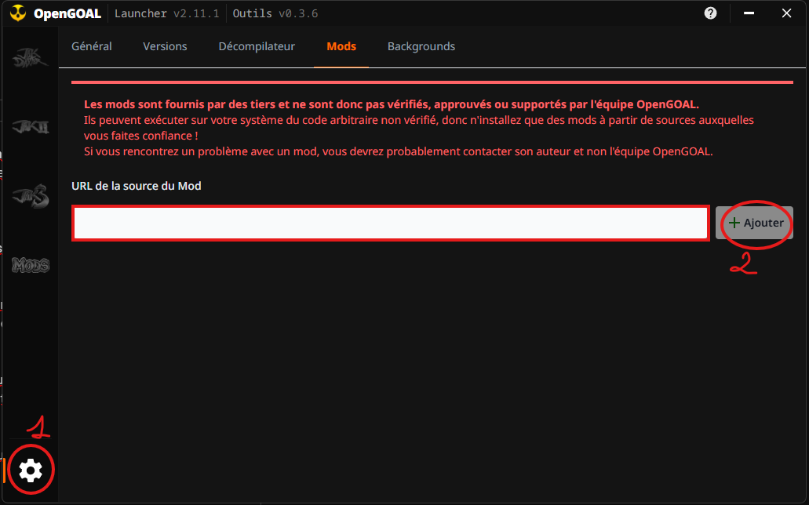
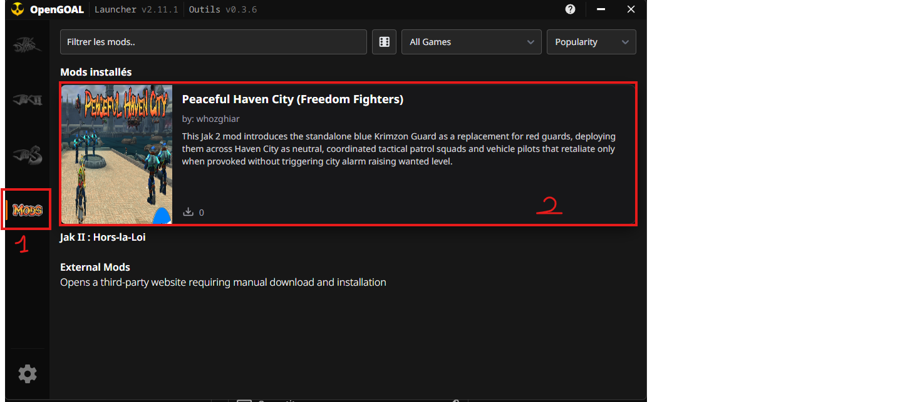
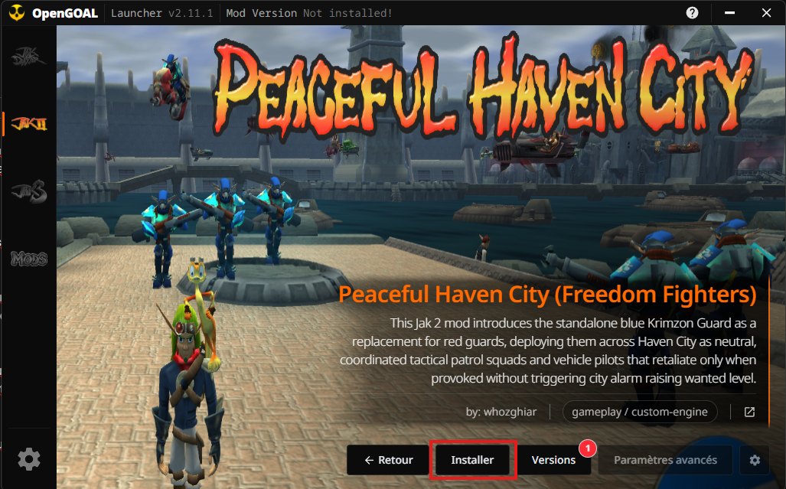
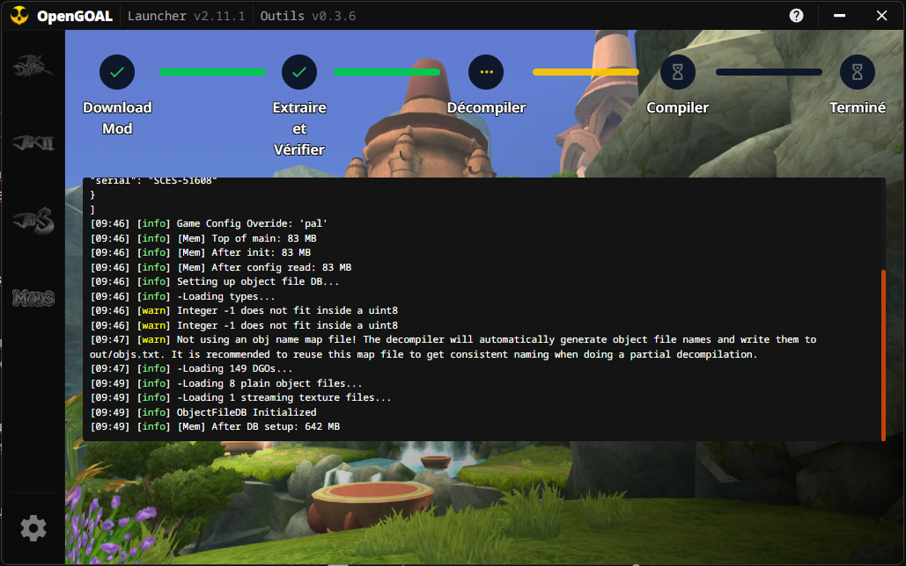
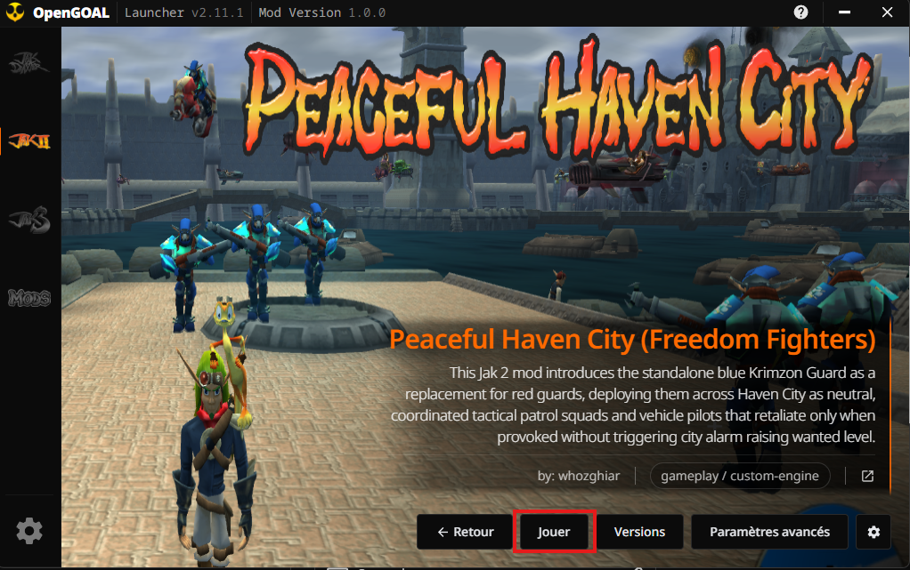
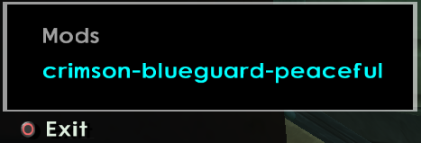

# 📥 How to Install a Mod (OpenGOAL Launcher)
# Comment Installer un Mod (OpenGOAL Launcher)

> **Bilingual OpenGOAL Reference Manual / Manuel de Référence Bilingue**
>
> - **Audience / Public :** Players / Joueurs
> - **Applies to / Concerne :** Any mod branch of this repository exposing an `index.json` catalog (see [`tools/mod_distribution_guide.md`](tools/mod_distribution_guide.md))

<p align="center">
  <a href="#-english-version"><b>🇬🇧 English Version</b></a> &nbsp;•&nbsp; <a href="#-version-française"><b>🇫🇷 Version Française</b></a>
</p>

> ### 📑 Summary / Sommaire
>
> - 🇬🇧 **English:** [1. Add Source](#1-add-the-mod-source) · [2. Open Page](#2-open-the-mod-page) · [3. Choose Version & Install](#3-choose-a-version-and-install) · [4. Installation Progress](#4-wait-for-the-installation) · [5. Launch Game](#5-launch-the-game)
> - 🇫🇷 **Français :** [1. Ajouter la Source](#1-ajouter-la-source-du-mod) · [2. Ouvrir la Page](#2-ouvrir-la-page-du-mod) · [3. Choisir la Version](#3-choisir-une-version-et-installer) · [4. Déroulement](#4-attendre-la-fin-de-linstallation) · [5. Lancer le Jeu](#5-lancer-le-jeu)

---

# 🇬🇧 English Version

This guide walks a player through installing and playing any mod from this repository using the official **OpenGOAL Launcher**, from adding the mod's catalog URL to activating it in-game.

---

## 1. Add the Mod Source

1. Open the **OpenGOAL Launcher**.
2. Go to **Settings** (gear icon, bottom-left corner).
3. Click the **"Mods"** tab.
4. Paste the mod's `index.json` raw URL into the input field, for example:
   ```text
   https://raw.githubusercontent.com/whozghiar/jak-project/jak2/features/peaceful-haven-city/index.json
   ```
5. Click **Add**.



---

## 2. Open the Mod Page

1. Go to the **Mods** tab from the left-hand panel.
2. Click on the mod you just added.



---

## 3. Choose a Version and Install

1. Select the mod version (the **latest version is recommended**).
2. Click the **Install** button.



---

## 4. Wait for the Installation

The Launcher downloads the release archive, extracts it, then runs the mod's own `extractor` and `goalc` to decompile and compile the assets. This can take a few minutes depending on the mod.



---

## 5. Launch the Game

Click **Play**.



---

## 6. Activate the Mod In-Game

Once in-game, press **L3 + SELECT** to open the Mods activation menu. This is where you toggle the mod on (and adjust its configuration, if it exposes one).



> [!NOTE]
> Every mod in this repository must be **disabled by default** and toggled on manually from this menu — see [`tools/mods_menu.md`](tools/mods_menu.md) for the underlying mechanism (`mods-menu-register`).

---

# 🇫🇷 Version Française

Ce guide accompagne un joueur pour installer et jouer à n'importe quel mod de ce dépôt via le **Launcher OpenGOAL officiel**, depuis l'ajout de l'URL du catalogue du mod jusqu'à son activation en jeu.

---

## 1. Ajouter la Source du Mod

1. Ouvrez le **Launcher OpenGOAL**.
2. Accédez aux **Paramètres** (roue crantée, en bas à gauche).
3. Cliquez sur l'onglet **« Mods »**.
4. Insérez l'URL brute du fichier `index.json` du mod dans la zone de saisie, par exemple :
   ```text
   https://raw.githubusercontent.com/whozghiar/jak-project/jak2/features/peaceful-haven-city/index.json
   ```
5. Cliquez sur **Ajouter**.


---

## 2. Ouvrir la Page du Mod

1. Accédez à l'onglet **Mods** depuis le volet de gauche.
2. Cliquez sur le mod que vous venez d'ajouter.


---

## 3. Sélectionner une Version et Installer

1. Sélectionnez la version du mod (la **dernière version est recommandée**).
2. Cliquez sur le bouton **Installer**.


---

## 4. Attendre la Fin de l'Installation

Le Launcher télécharge l'archive de la release, l'extrait, puis exécute les `extractor` et `goalc` propres au mod pour décompiler et compiler les assets. Cela peut prendre quelques minutes selon le mod.


---

## 5. Lancer le Jeu

Cliquez sur **Jouer**.


---

## 6. Activer le Mod en Jeu

Une fois en jeu, appuyez sur **L3 + SELECT** pour ouvrir le menu d'activation des Mods. C'est ici que vous activez le mod (et ajustez sa configuration, si celui-ci en propose une).


> [!NOTE]
> Tout mod de ce dépôt doit être **désactivé par défaut** et activé manuellement depuis ce menu — voir [`tools/mods_menu.md`](tools/mods_menu.md) pour le mécanisme sous-jacent (`mods-menu-register`).
