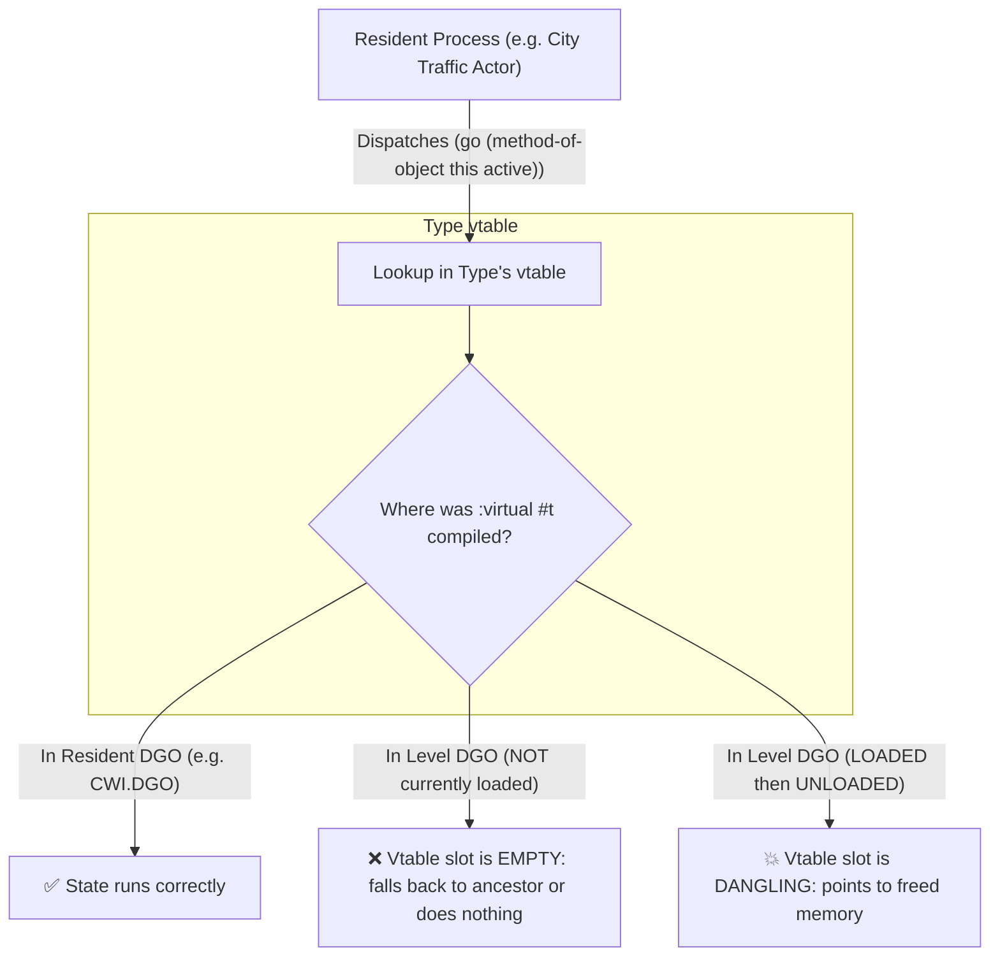
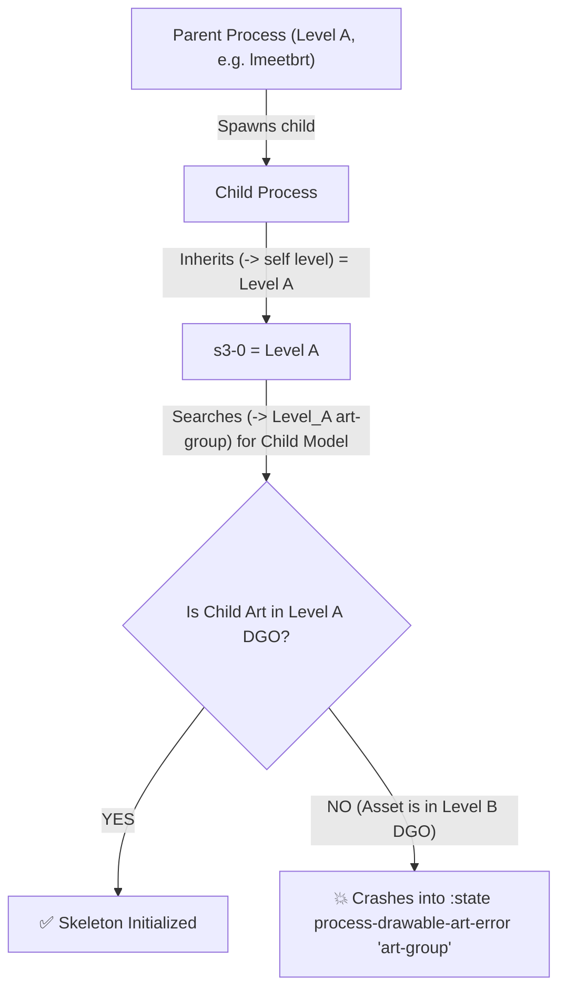
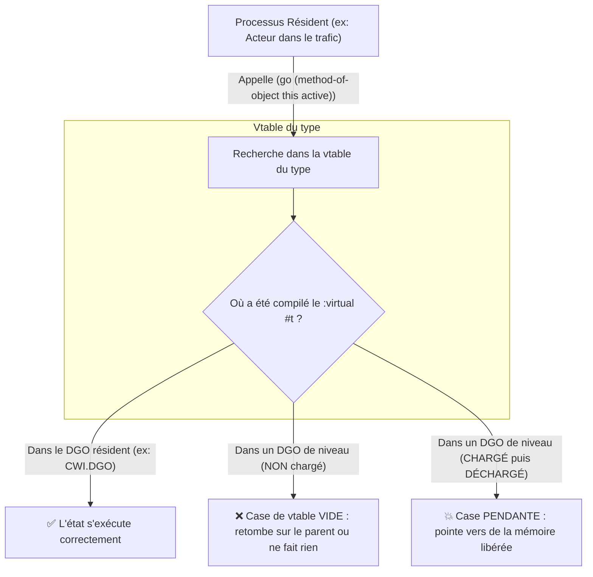
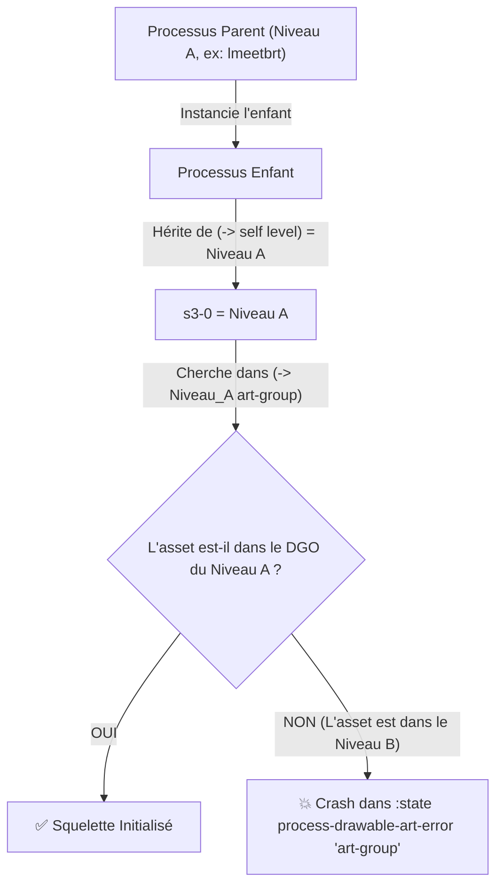

# Jak 2 — Virtual States, Methods & Child Process Level Binding (Vtables & Multi-DGOs) / Résidence des États, Méthodes et Niveau des Processus Enfants

> **Bilingual Knowledge Item / Base de Connaissances Bilingue**
>
> - **Origin / Provenance:** `jak2/features/paddy-wagon` (discovered during ambient vehicle traffic integration)
> - **Last Updated / Dernière modification:** `jak2/features/guard_transport`
> - [🇬🇧 English Version](#-english-version)
> - [🇫🇷 Version Française](#-version-française)

---

# 🇬🇧 English Version

## 🎯 Golden Rules

> [!IMPORTANT]
> **Rule 1 — Virtual Method & State Residency:**
> When an actor or process type is instantiated by an **always-resident system** (e.g. `traffic-manager`, global managers, or level-wide code in `CWI.DGO`), **ALL** of its `:virtual #t` states (`defstate`) and virtual methods (`defmethod`) **MUST** be defined in an **always-resident file** (e.g. `car.gc`, `vehicle.gc`), and NEVER in a level-scoped DGO (e.g. a mission file).

> [!IMPORTANT]
> **Rule 2 — Child Process Level Binding & Art-Group Resolution:**
> When a parent process belonging to Level A (e.g. `lmeetbrt`) spawns a child process whose assets live in Level B (e.g. `lwidea`), the child process **MUST** explicitly set its level pointer (`(-> this level)` and `(-> pp level)`) to Level B **BEFORE** calling `initialize-skeleton`.  
> Otherwise, `skeleton-group->draw-control` searches for the art-group inside Level A's container, fails, and crashes the child process into `:state process-drawable-art-error "art-group"`.

---

## 🧠 Mechanism 1: Virtual Dispatch & Vtables in GOAL

In GOAL, dynamic dispatch for virtual methods and virtual states relies on the type's **virtual table (vtable)**:



### Why does this cause silent bugs?
1. **No compilation error:** Each `.gc` file compiles independently without knowing when its companion DGOs will be loaded.
2. **Registration occurs at link/load time:** The `(defstate foo (my-type) :virtual #t ...)` expression fills its slot in `my-type`'s vtable only when that specific object file is linked into kernel memory.
3. **Silent failure:** If the level-scoped DGO is not loaded, the vtable entry is missing. The `(go ...)` call will fail silently: no crash, but the process never transitions to its active state (e.g., remaining stuck in `inactive` and invisible).

---

## 🧠 Mechanism 2: Child Process Level Binding & `process-drawable-art-error`

When a process initializes its skeleton (`initialize-skeleton`), it calls `skeleton-group->draw-control`:

```lisp
;; Engine implementation in process-drawable.gc
(defun skeleton-group->draw-control ((arg0 process-drawable) (arg1 skeleton-group) ...)
  (let ((s3-0 (-> arg0 level))) ;; <- Looks at the process's own level!
    (let ((s1-0 (load-to-heap-by-name (-> s3-0 art-group) (-> arg1 art-group-name) ...)))
      (when (or (zero? s1-0) (not s1-0))
        (go process-drawable-art-error "art-group") ;; <- CRASHES HERE!
        )
```



### The Fix for Multi-DGO Child Spawning:
```lisp
(defmethod vehicle-rider-method-32 ((this custom-child-rider) (arg0 traffic-object-spawn-params))
  (with-pp
    ;; Explicitly bind the child's level to the level containing its art-group
    (cond
      ((= (level-status *level* 'lwidea) 'active)
       (set! (-> this level) (level-get *level* 'lwidea))
       (set! (-> pp level) (level-get *level* 'lwidea))
       )
      ((= (level-status *level* 'lwideb) 'active)
       (set! (-> this level) (level-get *level* 'lwideb))
       (set! (-> pp level) (level-get *level* 'lwideb))
       )
      )
    ;; Now initialize-skeleton looks into lwidea/lwideb where its art-group exists!
    (initialize-skeleton this (the-as skeleton-group (art-group-get-by-name *level* "skel-custom-child-rider" (the-as (pointer uint32) #f))) (the-as pair 0))
    ...
    )
  )
```

---

## 🛠️ Diagnostic Checklist

- [ ] **Is the process spawned in free-roam while its `:virtual #t` state was defined in a mission file?**
- [ ] **Does the game log output `sending traffic-on to #<child-actor ... :state process-drawable-art-error>`?** *(Indicates `(-> self level)` is pointing to the wrong DGO).*
- [ ] **Does behavior differ between a fresh boot and returning from a mission?** *(Indicates a dangling vtable pointer).*

---

# 🇫🇷 Version Française

## 🎯 Règles d'Or

> [!IMPORTANT]
> **Règle 1 — Résidence des Méthodes et États Virtuels :**
> Lorsqu'un type d'acteur ou de processus est instancié par un système **toujours résident** (ex. `traffic-manager`, gestionnaires globaux ou code hôte dans `CWI.DGO`), **TOUTES** ses surcharges d'états (`defstate`) et de méthodes (`defmethod`) déclarées avec `:virtual #t` **DOIVENT** être définies dans un **fichier toujours résident** (ex. `car.gc`, `vehicle.gc`), et JAMAIS dans un DGO propre à une mission ou un sous-niveau.

> [!IMPORTANT]
> **Règle 2 — Liaison de Niveau des Processus Enfants & Résolution d'Art-Groups :**
> Lorsqu'un processus parent rattaché au Niveau A (ex. `lmeetbrt`) instancie un processus enfant dont les assets vivent dans le Niveau B (ex. `lwidea`), le processus enfant **DOIT** explicitement réassigner son pointeur de niveau (`(-> this level)` et `(-> pp level)`) vers le Niveau B **AVANT** d'appeler `initialize-skeleton`.  
> Sinon, `skeleton-group->draw-control` cherche l'art-group dans le conteneur du Niveau A, échoue, et fait basculer l'enfant dans l'état de crash gélé `:state process-drawable-art-error "art-group"`.

---

## 🧠 Mécanisme 1 : Répartition Virtuelle & Vtables en GOAL

En GOAL, l'exécution dynamique des méthodes et états virtuels s'appuie sur la **table virtuelle (vtable)** associée à chaque type :



### Pourquoi cela cause-t-il des bugs silencieux ?
1. **Aucune erreur de compilation :** Chaque fichier `.gc` compile indépendamment sans savoir à quel moment les autres DGOs seront chargés.
2. **Enregistrement au chargement (linking) :** L'instruction `(defstate foo (mon-type) :virtual #t ...)` ne remplit sa case dans la vtable que lorsque le fichier objet correspondant est lié dans la mémoire du kernel.
3. **Échec silencieux :** Si le DGO du niveau n'est pas chargé, la case est absente. L'appel à `(go ...)` échoue silencieusement : le jeu ne crashe pas, mais le processus reste bloqué dans son état précédent (ex. invisible dans `inactive`).

---

## 🧠 Mécanisme 2 : Liaison de Niveau des Enfants & `process-drawable-art-error`

Lorsqu'un processus initialise son squelette (`initialize-skeleton`), il appelle en interne `skeleton-group->draw-control` :

```lisp
;; Implémentation native dans process-drawable.gc
(defun skeleton-group->draw-control ((arg0 process-drawable) (arg1 skeleton-group) ...)
  (let ((s3-0 (-> arg0 level))) ;; <- Récupère le niveau propre au processus !
    (let ((s1-0 (load-to-heap-by-name (-> s3-0 art-group) (-> arg1 art-group-name) ...)))
      (when (or (zero? s1-0) (not s1-0))
        (go process-drawable-art-error "art-group") ;; <- CRASHE ICI !
        )
```



### La Solution pour les Enfants Multi-DGOs :
```lisp
(defmethod vehicle-rider-method-32 ((this custom-child-rider) (arg0 traffic-object-spawn-params))
  (with-pp
    ;; Lier explicitement le niveau de l'enfant au niveau possédant ses assets
    (cond
      ((= (level-status *level* 'lwidea) 'active)
       (set! (-> this level) (level-get *level* 'lwidea))
       (set! (-> pp level) (level-get *level* 'lwidea))
       )
      ((= (level-status *level* 'lwideb) 'active)
       (set! (-> this level) (level-get *level* 'lwideb))
       (set! (-> pp level) (level-get *level* 'lwideb))
       )
      )
    ;; initialize-skeleton cherchera désormais dans lwidea/lwideb où se trouvent ses modèles !
    (initialize-skeleton this (the-as skeleton-group (art-group-get-by-name *level* "skel-custom-child-rider" (the-as (pointer uint32) #f))) (the-as pair 0))
    ...
    )
  )
```

---

## 🛠️ Checklist de Diagnostic Rapide

- [ ] **Le processus est-il créé en jeu libre alors que son état `:virtual #t` a été codé dans un fichier de mission ?**
- [ ] **Les logs affichent-ils `:state process-drawable-art-error` pour un processus enfant ?** *(Indique que `(-> self level)` pointe sur le mauvais DGO).*
- [ ] **Le comportement change-t-il entre un démarrage à froid et après avoir visité une mission ?** *(Indique un pointeur pendant dans la vtable).*
