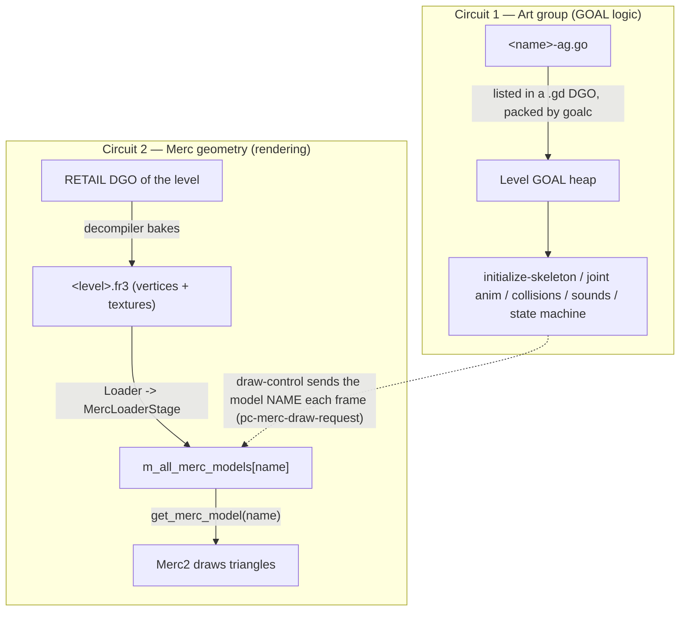
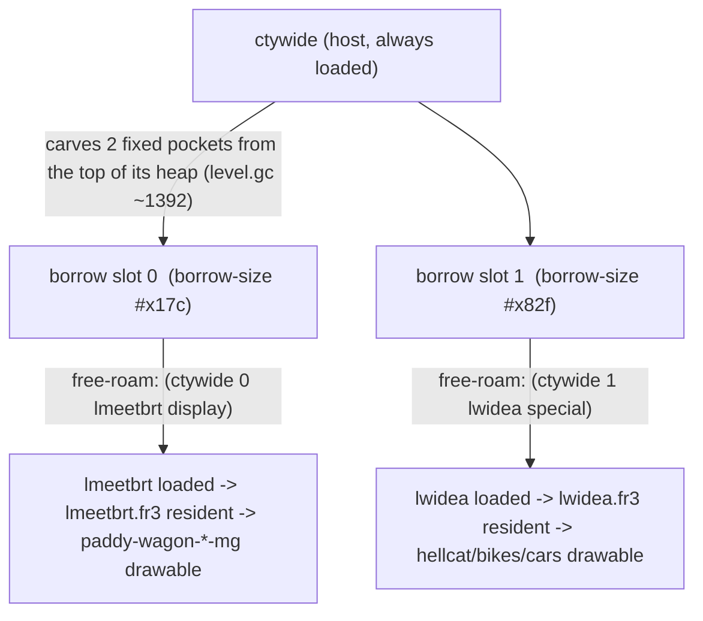
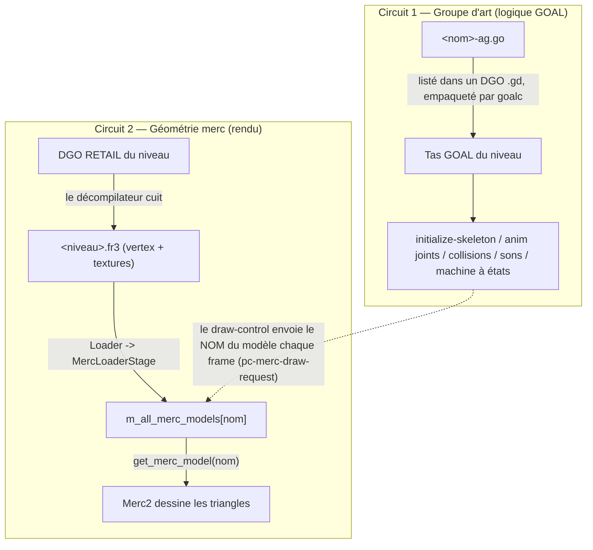
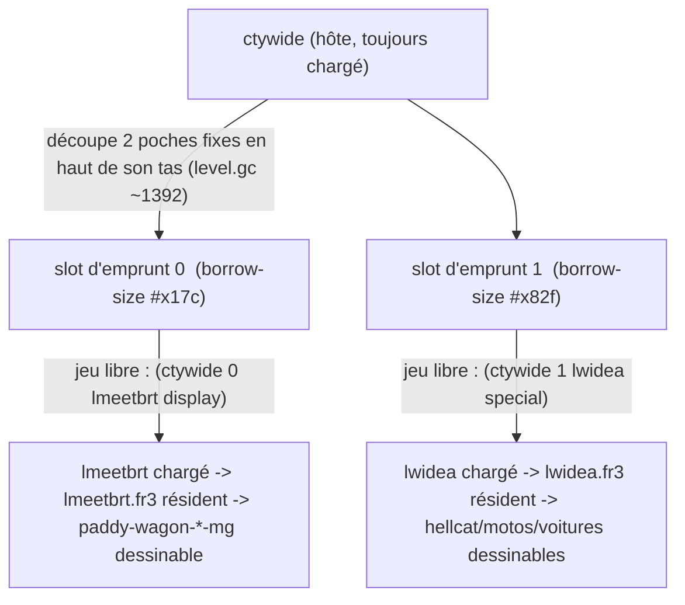

# Jak 2 — Merc Geometry, `.fr3` Residency & the Level Borrow System / Géométrie Merc, Résidence des `.fr3` et le Système d'Emprunt de Niveaux

> **Bilingual Knowledge Item / Base de Connaissances Bilingue**
>
> - **Origin / Provenance:** `jak2/features/guard_transport` (discovered while making an alert-spawned drop-ship visible in Haven City)
> - **Last Updated / Dernière modification:** `jak2/features/guard_transport`
> - [🇬🇧 English Version](#-english-version)
> - [🇫🇷 Version Française](#-version-française)

---

# 🇬🇧 English Version

## 🎯 Golden Rules

> [!IMPORTANT]
> **Rule 1 — A skeletal model is two separate data sets.**
> The **art group** (`<name>-ag.go`) and the **merc geometry** (`<name>-lod*-mg` vertices + its texture page) travel through **two independent pipelines**. Loading the art group (via a `.gd` DGO edit) makes the skeleton, joints and animations resident — it does **NOT** make the model drawable on the PC port.

> [!IMPORTANT]
> **Rule 2 — The PC merc renderer draws geometry only from a resident `.fr3`.**
> `Merc2::handle_pc_model` resolves a model **by name** against `m_all_merc_models`, which is populated exclusively from the `merc_data.models` of every currently-loaded `.fr3` (per-level and the common `GAME.fr3`). If the name is not found: `stats->num_missing_models++; return;` — no draw, **no crash, no error message**. An animated-but-invisible model is the signature of this.

> [!IMPORTANT]
> **Rule 3 — `.fr3` contents are fixed by the RETAIL DGOs, not by `goal_src/*.gd`.**
> The decompiler bakes each `.fr3` from the art groups present in the **retail PS2 DGO** of that level (`iso_data/jak2/DGO/*.DGO`). Editing `goal_src/jak2/dgos/<lvl>.gd` only changes what `goalc` packs into the runtime DGO (i.e. Rule 1's art group). It can **never** add merc geometry to a `.fr3`.

> [!IMPORTANT]
> **Rule 4 — `ctywide` has exactly 2 borrow slots, and both are always taken in the city.**
> Slot 0 = `lmeetbrt` (paddywagon hull), slot 1 = `lwidea` (traffic actors). The count `2` is baked into the `level` type (`(borrow-heap kheap 2 :inline)` in `level-h.gc`). A third resident art level in the city means a *temporal* share of a slot, or a decompiler-side re-bake — never a third slot without an engine-structural change.

---

## 🧠 Mechanism 1: The Two Circuits



- **Circuit 1** is what a `.gd` edit touches. Enough to make a process *run*: it will animate, drop passengers, play sounds, follow its state machine.
- **Circuit 2** is what actually puts pixels on screen. Its only knob a modder controls is **which `.fr3` files are resident** — via the level system (a level being active, or **borrowed**).
- The bridge: every frame, `pc-merc-draw-request` ([`foreground.gc`](../../../goal_src/jak2/engine/gfx/foreground/foreground.gc)) sends the string `(-> dc mgeo name)` (e.g. `"transport-lod0-mg"`) in a DMA packet. `Merc2` looks that string up in `m_all_merc_models`. Match → draw. No match → silently skipped.

### How to tell which `.fr3` contains a model

`decompiler_out/jak2/levels/<level>/<model>-lod0.glb` is a 1:1 mirror of that `.fr3`'s `merc_data.models` (the `rip_levels` gltf dump). If `decompiler_out/jak2/levels/ctywide/` has `vehicle-turret-lod0.glb` but not `transport-lod0.glb`, then `ctywide.fr3` can draw the turret but not the transport.

```bash
find decompiler_out/jak2/levels -iname "<model>-lod0.glb"        # which .fr3 have it
git grep -l "<model>-ag" master -- goal_src/jak2/dgos/           # which RETAIL DGOs had the art group
```

---

## 🧠 Mechanism 2: Why the turret is visible but the hull is not

| | chin `vehicle-turret` | `transport` hull |
|---|---|---|
| Type / states DGO | `CWI.DGO` (always resident) | `CWI.DGO` (always resident) |
| `<name>-ag` in retail `CWI.DGO`? | **YES** | no (only `LPROTECT`, `NES`, `CTYKORA`, `FOB`, `NESTT`) |
| → merc geometry baked into… | **`ctywide.fr3`** (always resident) | `lprotect.fr3` / `nes.fr3` / … (never resident in free-roam) |
| Result in Haven City | drawn | `get_merc_model` fails → invisible |

Two same-DGO processes, opposite outcomes — decided entirely by **retail DGO membership of the art group**, which fixes which `.fr3` gets the geometry.

---

## 🧠 Mechanism 3: The Borrow System (how a "mission" `.fr3` becomes resident in the city)

The borrow system lets an always-resident **host** level (`ctywide`) lend fixed memory pockets to small transient **borrower** levels.



- A borrow is declared as `(<host> <slot> <borrower> <priority>)` in a task node's `:borrow` list ([`game-task.gc`](../../../goal_src/jak2/engine/game/task/game-task.gc)), or pushed at runtime with `(set-setting *setting-control* proc 'borrow '((<host> <slot> <borrower> <prio>)) 0.0 0)`.
- **Evaluation order** ([`task-control.gc`](../../../goal_src/jak2/engine/game/task/task-control.gc) `update-task-masks`): the `fortress-escape-start` node (always) → every open task node → **the `'borrow` setting last**. Last write to a given `host/slot` wins, so a `set-setting` `'borrow` **overrides** a task-node borrow for that exact slot, and only that slot (other slots keep their task-node value).
- **On PC**, each pocket is `BORROW_MULT` (= 12.0) times the retail size — slot 0 ≈ 4.5 MB, slot 1 ≈ 24 MB. Memory is *not* the constraint; the **count of 2** is.
- A pocket holds **one borrower at a time** (`level.gc` ~766: "nobody else using the slot").
- Borrowing a level **also loads its `.fr3`** on the PC port (that is the whole point for a modder: it makes that level's merc geometry + textures drawable).

### The three ways to make a non-city model drawable in the city

| Approach | Cost | Coexistence | Example |
|---|---|---|---|
| **Permanent borrow** in a city task node | GOAL only, no re-extract | consumes a slot forever | paddywagon: `(ctywide 0 lmeetbrt display)` |
| **Temporal borrow** via `set-setting 'borrow`, released when done | GOAL only, no re-extract | shares a slot; the previous tenant's models blink out while active | transport: `lprotect` borrowed only during a drop |
| **Re-bake** the art group into a resident `.fr3` (`ctywide.fr3` or `GAME.fr3`) | decompiler patch + full `task extract` for every builder | perfect — behaves like `vehicle-turret` | Solution B (see the mod's `transport_solution_B_bake_into_fr3.md`) |

---

## 🛠️ Diagnostic Checklist

- [ ] Model animates / plays sounds / spawns children but **has no visible mesh**, no crash → **missing merc geometry in a resident `.fr3`** (Rules 1–3).
- [ ] `find decompiler_out/jak2/levels -iname "<model>-lod0.glb"` — is any of those levels resident where you need the model?
- [ ] `git grep -l "<model>-ag" master -- goal_src/jak2/dgos/` — which retail DGOs had it? Is a borrowable small level among them (like `lprotect`, `lmeetbrt`)?
- [ ] Did you edit only a `.gd` file and expect the mesh to appear? It won't — that's Circuit 1 only.
- [ ] Borrow not taking effect → check you are not fighting another `set-setting 'borrow` caller (whack.gc, hiphog-scenes.gc, race-manager.gc), and that the host level is actually loaded.

---

# 🇫🇷 Version Française

## 🎯 Règles d'Or

> [!IMPORTANT]
> **Règle 1 — Un modèle squelettique, c'est deux jeux de données distincts.**
> Le **groupe d'art** (`<nom>-ag.go`) et la **géométrie merc** (vertex `<nom>-lod*-mg` + sa page de textures) passent par **deux tuyaux indépendants**. Charger le groupe d'art (via un edit `.gd`) rend le squelette, les joints et les animations résidents — cela ne rend **PAS** le modèle dessinable sur le port PC.

> [!IMPORTANT]
> **Règle 2 — Le renderer merc PC ne dessine la géométrie que depuis un `.fr3` résident.**
> `Merc2::handle_pc_model` résout un modèle **par son nom** dans `m_all_merc_models`, peuplée exclusivement à partir du `merc_data.models` de chaque `.fr3` chargé (par niveau + le `GAME.fr3` commun). Si le nom est absent : `num_missing_models++; return;` — pas de dessin, **pas de crash, pas de message**. Un modèle animé mais invisible est la signature de ce cas.

> [!IMPORTANT]
> **Règle 3 — Le contenu des `.fr3` est fixé par les DGO RETAIL, pas par `goal_src/*.gd`.**
> Le décompilateur cuit chaque `.fr3` à partir des groupes d'art présents dans le **DGO PS2 retail** de ce niveau (`iso_data/jak2/DGO/*.DGO`). Éditer `goal_src/jak2/dgos/<lvl>.gd` ne change que ce que `goalc` empaquette dans le DGO runtime (le groupe d'art de la Règle 1). Cela ne peut **jamais** ajouter de géométrie merc à un `.fr3`.

> [!IMPORTANT]
> **Règle 4 — `ctywide` a exactement 2 slots d'emprunt, tous deux pris en permanence en ville.**
> Slot 0 = `lmeetbrt` (carlingue du paddywagon), slot 1 = `lwidea` (acteurs de circulation). Le nombre `2` est gravé dans le type `level` (`(borrow-heap kheap 2 :inline)` dans `level-h.gc`). Un troisième niveau d'art résident en ville implique un partage *temporel* d'un slot, ou une re-cuisson côté décompilateur — jamais un 3ᵉ slot sans modifier la structure du moteur.

---

## 🧠 Mécanisme 1 : Les Deux Circuits



- **Circuit 1** est ce qu'un edit `.gd` touche. Suffisant pour faire *tourner* un process : il s'animera, larguera des passagers, jouera des sons, suivra sa machine à états.
- **Circuit 2** est ce qui met réellement des pixels à l'écran. Le seul levier que le moddeur contrôle, c'est **quels `.fr3` sont résidents** — via le système de niveaux (un niveau actif, ou **emprunté**).
- Le pont : à chaque frame, `pc-merc-draw-request` ([`foreground.gc`](../../../goal_src/jak2/engine/gfx/foreground/foreground.gc)) envoie la chaîne `(-> dc mgeo name)` (ex. `"transport-lod0-mg"`) dans un paquet DMA. `Merc2` cherche cette chaîne dans `m_all_merc_models`. Trouvé → dessin. Absent → ignoré silencieusement.

### Comment savoir quel `.fr3` contient un modèle

`decompiler_out/jak2/levels/<niveau>/<modèle>-lod0.glb` est un miroir 1:1 du `merc_data.models` de ce `.fr3` (le dump gltf `rip_levels`). Si `decompiler_out/jak2/levels/ctywide/` contient `vehicle-turret-lod0.glb` mais pas `transport-lod0.glb`, alors `ctywide.fr3` peut dessiner la tourelle mais pas le transport.

```bash
find decompiler_out/jak2/levels -iname "<modèle>-lod0.glb"        # quels .fr3 l'ont
git grep -l "<modèle>-ag" master -- goal_src/jak2/dgos/           # quels DGO RETAIL avaient le groupe d'art
```

---

## 🧠 Mécanisme 2 : Pourquoi la tourelle est visible mais pas la carlingue

| | tourelle `vehicle-turret` | carlingue `transport` |
|---|---|---|
| DGO du type / des états | `CWI.DGO` (toujours résident) | `CWI.DGO` (toujours résident) |
| `<nom>-ag` dans le `CWI.DGO` retail ? | **OUI** | non (seulement `LPROTECT`, `NES`, `CTYKORA`, `FOB`, `NESTT`) |
| → géométrie merc cuite dans… | **`ctywide.fr3`** (toujours résident) | `lprotect.fr3` / `nes.fr3` / … (jamais résident en jeu libre) |
| Résultat à Abriville | dessinée | `get_merc_model` échoue → invisible |

Deux process du même DGO, résultats opposés — décidés entièrement par l'**appartenance du groupe d'art au DGO retail**, qui fixe quel `.fr3` reçoit la géométrie.

---

## 🧠 Mécanisme 3 : Le Système d'Emprunt (comment un `.fr3` de « mission » devient résident en ville)

Le système d'emprunt permet à un niveau **hôte** toujours résident (`ctywide`) de prêter des poches de mémoire fixes à de petits niveaux **emprunteurs** transitoires.



- Un emprunt se déclare `(<hôte> <slot> <emprunteur> <priorité>)` dans la liste `:borrow` d'un nœud de tâche ([`game-task.gc`](../../../goal_src/jak2/engine/game/task/game-task.gc)), ou se pousse à l'exécution via `(set-setting *setting-control* proc 'borrow '((<hôte> <slot> <emprunteur> <prio>)) 0.0 0)`.
- **Ordre d'évaluation** ([`task-control.gc`](../../../goal_src/jak2/engine/game/task/task-control.gc) `update-task-masks`) : le nœud `fortress-escape-start` (toujours) → chaque nœud de tâche ouvert → **le setting `'borrow` en dernier**. La dernière écriture sur un `hôte/slot` donné gagne : un `set-setting` `'borrow` **écrase** l'emprunt du nœud de tâche pour ce slot précis, et seulement lui (les autres slots gardent leur valeur de nœud).
- **Sur PC**, chaque poche fait `BORROW_MULT` (= 12,0) fois la taille retail — slot 0 ≈ 4,5 Mo, slot 1 ≈ 24 Mo. La mémoire n'est *pas* la contrainte ; c'est le **nombre de 2**.
- Une poche accueille **un emprunteur à la fois** (`level.gc` ~766 : « nobody else using the slot »).
- Emprunter un niveau **charge aussi son `.fr3`** sur le port PC (c'est tout l'intérêt pour un moddeur : cela rend la géométrie merc + les textures de ce niveau dessinables).

### Les trois façons de rendre un modèle non-urbain dessinable en ville

| Approche | Coût | Coexistence | Exemple |
|---|---|---|---|
| **Emprunt permanent** dans un nœud de tâche de la ville | GOAL seul, pas de re-extract | consomme un slot pour toujours | paddywagon : `(ctywide 0 lmeetbrt display)` |
| **Emprunt temporel** via `set-setting 'borrow`, rendu à la fin | GOAL seul, pas de re-extract | partage un slot ; les modèles du locataire précédent clignotent pendant ce temps | transport : `lprotect` emprunté seulement pendant un largage |
| **Re-cuire** le groupe d'art dans un `.fr3` résident (`ctywide.fr3` ou `GAME.fr3`) | patch du décompilateur + `task extract` complet pour chaque builder | parfaite — se comporte comme `vehicle-turret` | Solution B (voir `transport_solution_B_bake_into_fr3.md` du mod) |

---

## 🛠️ Checklist de Diagnostic

- [ ] Le modèle s'anime / joue des sons / spawn des enfants mais **n'a aucun maillage visible**, sans crash → **géométrie merc absente d'un `.fr3` résident** (Règles 1–3).
- [ ] `find decompiler_out/jak2/levels -iname "<modèle>-lod0.glb"` — l'un de ces niveaux est-il résident là où tu as besoin du modèle ?
- [ ] `git grep -l "<modèle>-ag" master -- goal_src/jak2/dgos/` — quels DGO retail l'avaient ? Y a-t-il un petit niveau empruntable parmi eux (comme `lprotect`, `lmeetbrt`) ?
- [ ] As-tu édité seulement un `.gd` en attendant que le maillage apparaisse ? Il n'apparaîtra pas — c'est le Circuit 1 uniquement.
- [ ] L'emprunt ne prend pas effet → vérifie que tu ne te bats pas avec un autre appelant `set-setting 'borrow` (whack.gc, hiphog-scenes.gc, race-manager.gc), et que le niveau hôte est bien chargé.
