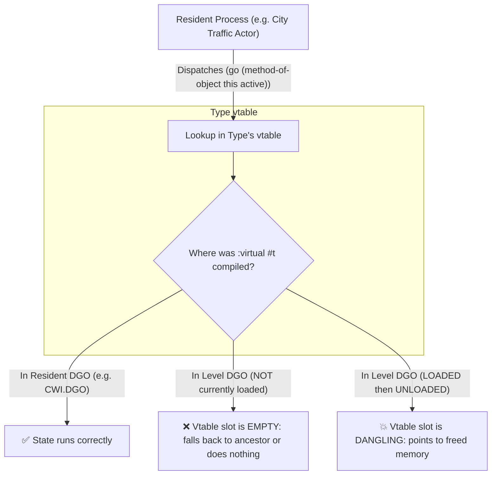
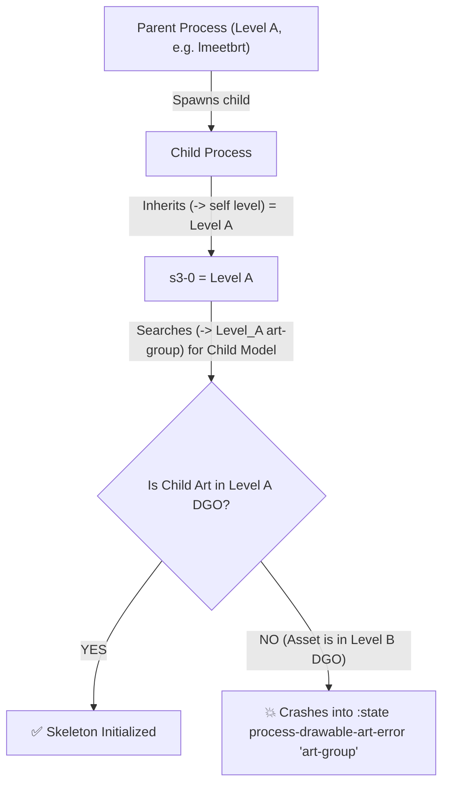
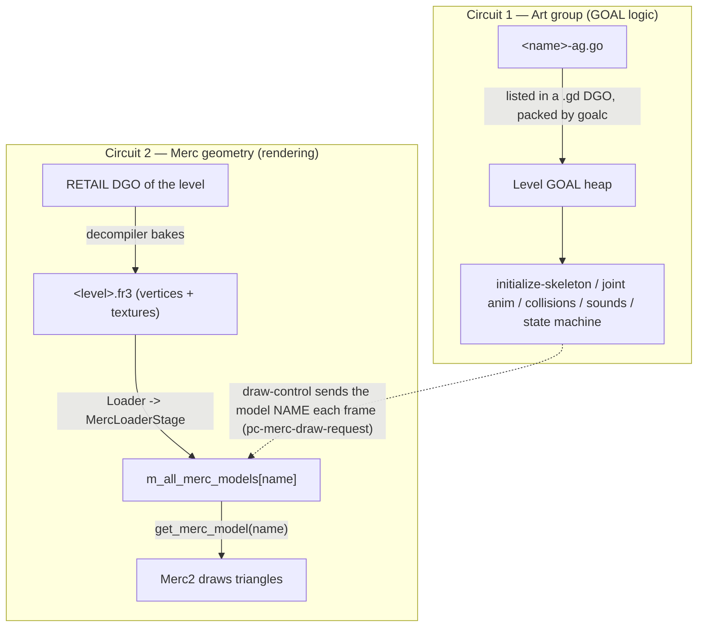
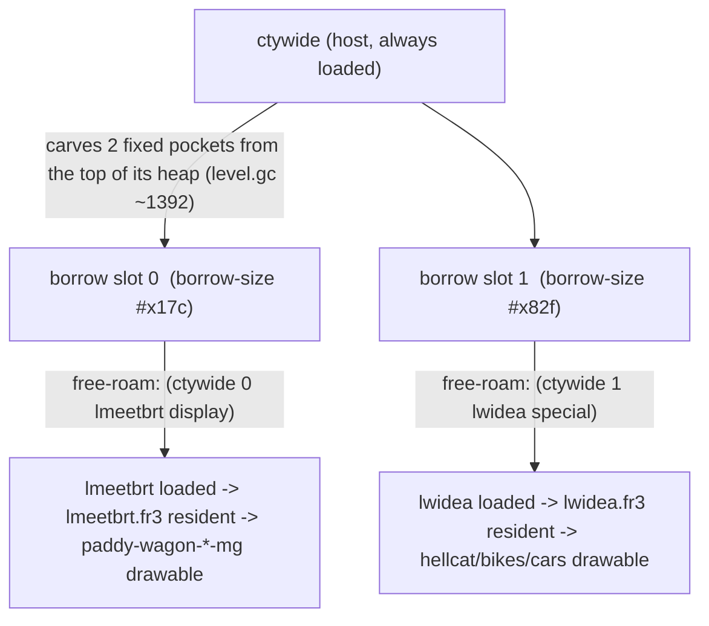
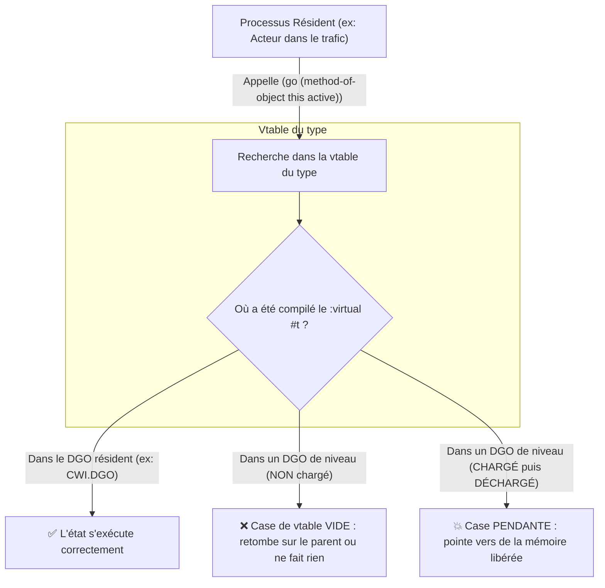
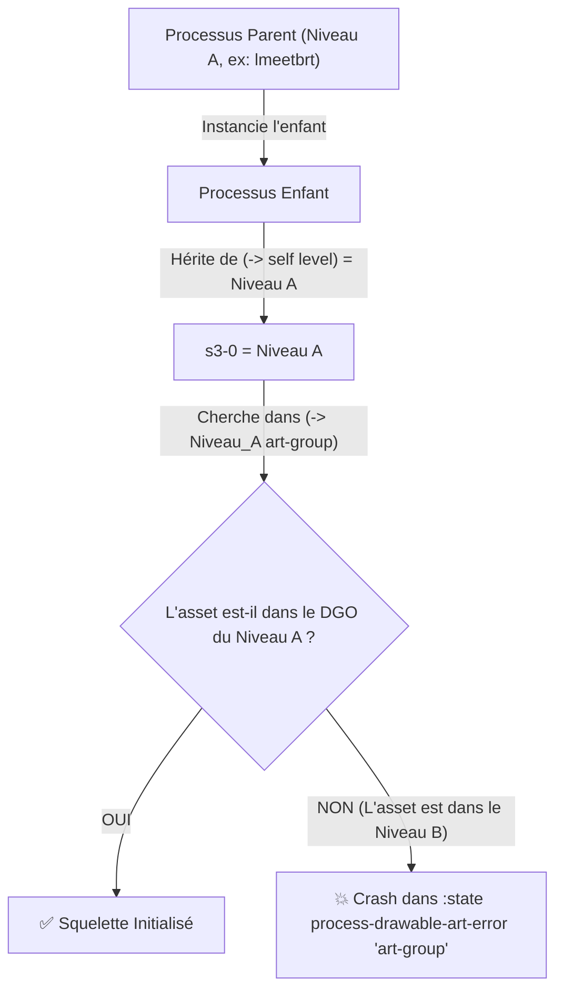
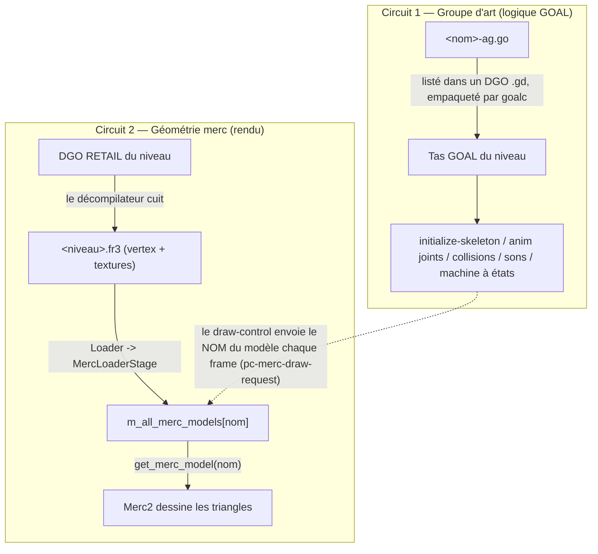
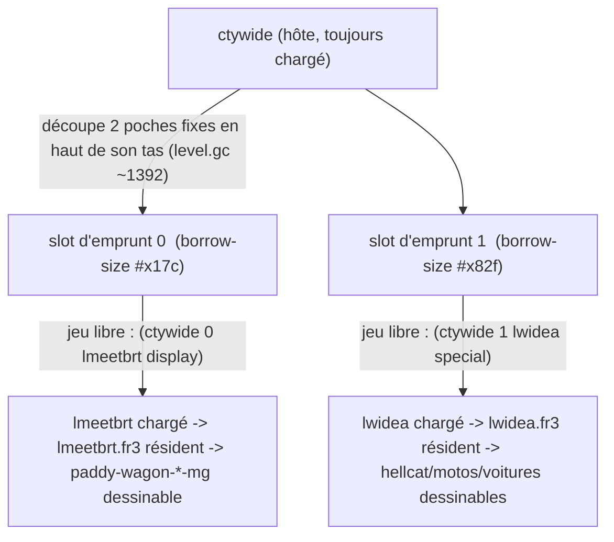

# Jak 2 — Modding Notes & Engine Utilities / Notes de Modding & Utilitaires Moteur

> **Bilingual Knowledge Base / Base de Connaissances Bilingue**
>
> - [🇬🇧 English Version](#-english-version)
> - [🇫🇷 Version Française](#-version-française)

---

# 🇬🇧 English Version

## Table of Contents
- [1. Core Vocabulary](#1-core-vocabulary)
- [2. Runtime Memory Architecture](#2-runtime-memory-architecture)
- [3. Memory Constants Definition](#3-memory-constants-definition)
- [4. 512 MB Memory Expansion](#4-512-mb-memory-expansion)
- [5. Compiling & Validating GOAL Changes](#5-compiling-validating-goal-changes)
- [6. Running the Game & Reading Boot Logs](#6-running-the-game-reading-boot-logs)
- [7. In-Game Memory Diagnostics](#7-in-game-memory-diagnostics)
- [8. Known Pitfalls & Best Practices](#8-known-pitfalls-best-practices)
- [9. Custom Art-Groups & Dynamic Animation Linking (`link-art!`)](#9-custom-art-groups-dynamic-animation-linking-link-art)
- [10. GLTF Retargeting & `build-actor` Skeletons](#10-gltf-retargeting-build-actor-skeletons)
- [11. Jetboard State Handling & Particle Tracking](#11-jetboard-state-handling-particle-tracking)
- [12. Generic Enemy Death Effect (Purple Skeleton-Dissolve Particles)](#12-generic-enemy-death-effect-purple-skeleton-dissolve-particles)
- [13. Custom Animation & Sound Import Pipeline (End-to-End)](#13-custom-animation-sound-import-pipeline-end-to-end)
- [14. Dark Jak Scaling, Multi-Tier Evolution & Super Attack Mechanics](#14-dark-jak-scaling-multi-tier-evolution-super-attack-mechanics)
- [15. Virtual States, Methods & Child Process Level Binding (Vtables & Multi-DGOs)](#15-virtual-states-methods-child-process-level-binding-vtables-multi-dgos)
- [16. Vehicle Mechanics: Hijacking, Grab Rails, Weapons & Flight Levels](#16-vehicle-mechanics-hijacking-grab-rails-weapons-flight-levels)
- [17. Traffic Engine: Spawn Rates, Alert Quotas, Distance Spheres & Nav-Mesh Limits](#17-traffic-engine-spawn-rates-alert-quotas-distance-spheres-nav-mesh-limits)
<<<<<<< HEAD
=======
- [18. Merc Geometry, `.fr3` Residency & the Level Borrow System](#18-merc-geometry-fr3-residency-the-level-borrow-system)
- [19. Injecting a Model into a Level it Never Shipped In](#19-injecting-a-model-into-a-level-it-never-shipped-in)
>>>>>>> master-dev

---

### 1. Core Vocabulary

> **Origin / Provenance:** `jak2/config/memory_increase` | **Last Updated:** `jak2/features/jak3-jetBoard`

| Term | Meaning |
|---|---|
| **EE** | "Emotion Engine", the main PS2 CPU. The PC port emulates its main memory by reserving a contiguous block via `mmap` (see `game/runtime.cpp`). |
| **GOAL** | The custom Lisp/Scheme dialect in which all original Naughty Dog game code is written (`goal_src/**/*.gc`). Compiled by **OpenGOAL**. |
| **`goalc`** | The OpenGOAL compiler executable. Runs in interactive REPL mode (`task repl`) or batch mode (`-c "(command)"`). |
| **`gk`** | The C++ runtime executable ("game kernel") that loads and executes compiled GOAL code. |
| **DGO** | "Data Group Object" — a package bundling compiled GOAL objects (code + data) loaded together from disk. |
| **Heap** | A memory arena allocated in bulk, within which GOAL dynamically allocates its own objects. |
| **`valid?`** | GOAL function in `gcommon.gc` checking pointer alignment and address boundaries before dereferencing. |

---

---

### 2. Runtime Memory Architecture

> **Origin / Provenance:** `jak2/config/memory_increase` | **Last Updated:** `jak2/features/jak3-jetBoard`

The runtime reserves **a single large contiguous virtual memory block** at startup (`EE_MAIN_MEM_SIZE`, via `mmap` in `game/runtime.cpp:161-171`), simulating the PS2 RAM. Everything lives inside this block at fixed offsets:

```
0x000000 ─────────────────────────────────────────────────────────────────► EE_MAIN_MEM_SIZE
│
├─ 0x000000 – 0x080000  Low protected area (EE_MAIN_MEM_LOW_PROTECT, like PS2 kernel)
├─ 0x013fd20            HEAP_START — start of the "global heap"
│                        (types, core processes, kernel code, symbol table…)
├─ 0x12D00000           GLOBAL_HEAP_END (with BIG_MEMORY enabled on PC)
│                        └─ "level heap" is allocated INSIDE the remaining global heap
│                           when a level loads (see goal_src/<game>/engine/level/level.gc)
├─ (free space buffer)
├─ 0x14000000           DEBUG_HEAP_START — separate heap for debug/REPL tools
└─ 512 MB (0x20000000)  End of reserved EE memory
```

**Key Principles:**
- `GLOBAL_HEAP_END`, `DEBUG_HEAP_START`, and `EE_MAIN_MEM_SIZE` are defined in **shared C++ code across all games** (`common/goal_constants.h`, `game/kernel/common/memory_layout.h`).
- The **level heap** is allocated via `kmalloc` from the global heap when loading a level. Its maximum size is defined **per game in GOAL** via `DEBUG_LEVEL_HEAP_MULT` in `goal_src/<game>/engine/level/level.gc`.
- `valid?` (in `gcommon.gc`) rejects any pointer `>= END_OF_MEMORY`. If `END_OF_MEMORY` remains at the 128 MB PS2 limit (`0x8000000`) while memory is expanded to 512 MB, objects allocated above 128 MB trigger `"bad address"` errors.

---

---

### 3. Memory Constants Definition

> **Origin / Provenance:** `jak2/config/memory_increase` | **Last Updated:** `jak2/features/jak3-jetBoard`

| Constant | File | Scope |
|---|---|---|
| `EE_MAIN_MEM_SIZE` | `common/goal_constants.h` | **Shared** (all games) |
| `GLOBAL_HEAP_END` | `game/kernel/common/memory_layout.h` | **Shared** |
| `DEBUG_HEAP_START` | `game/kernel/common/memory_layout.h` | **Shared** |
| `DEBUG_HEAP_SIZE` | `game/kernel/common/memory_layout.h` | Per-game namespace, identical values |
| `END_OF_MEMORY` (used by `valid?`) | `goal_src/<game>/kernel/gcommon.gc` | **Per-game** |
| `DEBUG_LEVEL_HEAP_MULT` (level heap multiplier) | `goal_src/<game>/engine/level/level.gc` | **Per-game** |

---

---

### 4. 512 MB Memory Expansion

> **Origin / Provenance:** `jak2/config/memory_increase` | **Last Updated:** `jak2/features/jak3-jetBoard`

When porting the 512 MB memory increase from Jak 3 to Jak 2:
- C++ shared constants (`EE_MAIN_MEM_SIZE`, `GLOBAL_HEAP_END`) were already active on `master`.
- `END_OF_MEMORY` in `goal_src/jak2/kernel/gcommon.gc` was raised to `#x20000000` (512 MB).
- **The Pitfall:** Setting `DEBUG_LEVEL_HEAP_MULT` to `15.0` (Jak 3's value) caused out-of-memory kernel panics at boot because Jak 2 loads ~35 MB of resident code before the first level, leaving ~279 MB free. A multiplier of `15.0` requested 282 MB.
- **The Validated Fix:** Setting `DEBUG_LEVEL_HEAP_MULT = 12.0` allocates ~215 MB, leaving a safe 60 MB buffer while providing a **10× increase** over the PS2 original (1.1×).

---

---

### 5. Compiling & Validating GOAL Changes

> **Origin / Provenance:** `jak2/config/memory_increase` | **Last Updated:** `jak2/features/jak3-jetBoard`

Compile the entire project in batch mode:
```bash
./goalc.exe --game jak2 -c "(mi)"
```
Or interactively in the OpenGOAL REPL:
```bash
task repl
# Inside REPL:
(mi)
```

---

---

### 6. Running the Game & Reading Boot Logs

> **Origin / Provenance:** `jak2/config/memory_increase` | **Last Updated:** `jak2/features/jak3-jetBoard`

Boot with debug and verbose logging:
```bash
./gk.exe -v --game jak2 -- -boot -fakeiso -debug
```
Check log files in `log/jak2.<timestamp>.log`:
```bash
grep -iE "main memory|bad address|not a valid object|unable to malloc" log/jak2.<timestamp>.log
```

---

---

### 7. In-Game Memory Diagnostics

> **Origin / Provenance:** `jak2/config/memory_increase` | **Last Updated:** `jak2/features/jak3-jetBoard`

To display the live memory overlay in `-debug` mode:
```lisp
(set! *stats-memory* #t)
```
This prints the real-time breakdown of textures, collision, animations, and level heap usage per loaded sector.

---

---

### 8. Known Pitfalls & Best Practices

> **Origin / Provenance:** `jak2/config/memory_increase` | **Last Updated:** `jak2/features/jak3-jetBoard`

1. **Shared C++ Constants:** Modifying `GLOBAL_HEAP_END` affects Jak 1, 2, 3, and Jak X simultaneously.
2. **Boot Allocation Differences:** Available global heap budget varies per game depending on resident boot code.
3. **Always Validate at Runtime:** A change that compiles cleanly can still crash at runtime; always verify via `(mi)` -> boot -> log check.

---

---

### 9. Custom Art-Groups & Dynamic Animation Linking (`link-art!`)

> **Origin / Provenance:** `jak2/features/jak3-jetBoard` | **Last Updated:** `jak2/features/jak3-jetBoard`

### The Requirement
Add custom animations imported from a `.glb` into a resident character art-group (`jakb-ag`, `daxter-ag`) without modifying or recompiling the hundreds of native animations.

### The Engine Mechanism
1. `build-actor` (in `goal_src/jak2/game.gp`) uses `:master-art-group` and `:master-ag-map` to bake target slot indices into the compiled art-group.
2. `link-art!` (`loader.gc`) iterates through the custom group's entries and attaches pointers to the target slots in the master group.
3. `needs-link?` (`joint.gc`) only returns `#t` if slot 0 is an `art-joint-anim`. In `build-actor` outputs with a skeleton, slot 0 is a `joint-geo`, so `needs-link?` is always `#f`.

### ⚠️ Where to Hook `link-art!`
- ❌ **NEVER call `link-art!` during gameplay** (e.g. `target-board-init`): level art-group array states may be inconsistent, risking memory crashes.
- ✅ **The Correct Hook is `art-group::relocate`** in `goal_src/jak2/engine/anim/joint.gc`:
```lisp
(when (or (not s5-1) (= (-> s5-1 name) 'default))
  (login this)
  (if (or (needs-link? this)
          (string= (-> this name) "jakb-jak3-board-import"))
      (link-art! this)))
```

---

---

### 10. GLTF Retargeting & `build-actor` Skeletons

> **Origin / Provenance:** `jak2/features/jak3-jetBoard` | **Last Updated:** `jak2/features/jak3-jetBoard`

### Skeletons in OpenGOAL vs GLTF
In OpenGOAL, character skeletons (like `jakb-lod0-jg`) contain:
1. **2 Matrix joints (indices 0 & 1):** `align` (Matrix 0) and `prejoint` (Matrix 1).
2. **61 TransformQ joints (indices 2 to 62):** `main` (TQ 0), `waist_prog` (TQ 1), ..., `hips` (TQ 23), `Lthigh` (TQ 24), ..., `pantsRthigh` (TQ 60).

### ⚠️ The Duplicate `align` Pitfall in `build-actor` (Off-By-One Shift)
- `convert_joints` in `goalc/build_actor/common/build_actor.cpp` historically prepended a synthetic `"align"` joint at index 0 and offset all GLTF skin joints by `+1` (assuming external models lacked an align joint).
- Because decompiled models (`jakb-lod0.glb`) **already include `align` at index 0**, this created 64 joints instead of 63, shifting every TransformQ joint by `+1` during playback (`main` mapped to `waist_prog`, `waist_prog` to `upper_body`, `hips` to `Lthigh`).
- **Symptom:** Animation looks 100% perfect in Blender, but in-game the mesh stretches/dislocates violently whenever the imported animation is evaluated.
- **Rule:** Always detect if `gjoints[0].name == "align"` and use direct 0-indexed mapping (`prefix_count = 0`), producing `num_joints = 61` matching native `jakb-ag`.

---

---

### 11. Jetboard State Handling & Particle Tracking

> **Origin / Provenance:** `jak2/features/jak3-jetBoard` | **Last Updated:** `jak2/features/jak3-jetBoard`

### ⚠️ The `target-board-exit` Whitelist Pitfall (The Mini-Jetboard Bug)
In Jak 2, the jetboard (`board-lod0`) is a standalone actor process (`board.gc`) anchored to `node-list data 25` with two distinct visual states:
1. **`use` (`board-open-ja`):** Fins, wings, and tips deployed in full snowboard/surfboard shape.
2. **`idle` (`board-close-ja`):** Fully retracted into its center dome (a small round disc for Jak's back).

- The `target-board-exit` function (`target-board.gc:882`) contains a **hardcoded whitelist** of valid board states.
- When creating a new board state (e.g. `target-board-turn-around`), **it MUST be added to the whitelist** in `target-board-exit`, `target-board-pre-move`, and `target-board-real-post`.
- **Symptom if omitted:** Upon entering the new state, the engine assumes Jak is dismounting, clears `(focus-status board)`, and the `board` actor instantly drops to `idle` / `board-close-ja` (the board shrinks into a mini-puck under Jak's boots).

### Autonomous Rotation & Pad Steering Lockout (`turn-lockout-end-time`)
During autonomous animation-driven turns, `target-board-real-post` continuously executes `read-pad` and calls `turn-to-vector` (or `rot->dir-targ!` on neutral stick), which can overwrite `dir-targ` every frame with the player's stick input or reset it to the previous facing quaternion.
- **Fix:** Set `(set! (-> self control turn-lockout-end-time) (+ (current-time) (seconds 1.5)))` in `:enter` (and reset to 0 in `:exit`), ensuring standard stick steering is suppressed until the turnaround completes.
- **Entry Momentum:** Calculate entry velocity using `(fmax (-> self control ctrl-xz-vel) (vector-length (vector-flatten! (new-stack-vector0) (-> self control transv) (-> self control dynam gravity-normal))) 40960.0)` so momentum is preserved even if the player was drifting or gliding without forward stick input.

### Heading Inversion, Boost & Forward Momentum on State Exit
To guarantee a complete autonomous heading change (e.g. 180° turnaround) and reward the player:
1. `(quaternion-copy! (-> self control quat-for-control) (-> self control dir-targ))`: Inverts the control quaternion.
2. `(set-quaternion! (-> self control) (-> self control dir-targ))`: Inverts root-transform orientation.
3. `(vector-z-quaternion! (-> self control transv) (-> self control dir-targ))` & `(vector-float*! (-> self control transv) ... f30-1)`: Re-aligns world velocity in the reversed heading with acceleration boost (`(fmax (+ f30-0 20480.0) 114688.0)`).
4. `(set-forward-vel f30-1)` & `(set! (-> self control ctrl-xz-vel) f30-1)`: Passes scalar forward velocity.
5. `(sound-play "board-boost")`, `(cpad-set-buzz!)`, and `part-tracker-spawn group-board-land-straight`: Plays audio, rumble, and landing dust VFX matching native spin-trick rewards.

### Dynamic Joint Tracking, Particle Ripples & Collision Spheres (`board-zap-track`)
For area-of-effect attacks while riding (e.g. `board-zap`):
- **Dynamic Tracking:** Sparticle callbacks (`(:func 'board-zap-track)`) should query `*target*` directly and copy the board joint translation `(joint-node-index jakb-lod0-jg board)` into `(-> arg2 x/y/z)`. In parallel, `part-tracker-spawn` should pass `:callback part-tracker-track-target`. This ensures all particles and the tracker process follow the moving board in real time at high velocity.
- **Concentric Multi-Ring Ripple:** Replicating Jak 3's `group-board-zap-attack` (`:num 0.25`, `:length (seconds 0.335)`, `:scalevel-x (meters 0.16666667)`) emits 4 to 5 concentric ripples expanding up to $3.0\text{ m}$.
- **Damage Radius Alignment:** Configure the attack collision sphere in `target-util.gc` (`sphere<-vector+r!`) to $12288.0$ ($3.0\text{ m}$) with root bounding sphere $13107.2$ ($3.2\text{ m}$), matching native Jak 3 values exactly.
- **Suppression of Trick FX on Hit:** In `target-board.gc` (`'touched` event handler), guard `(process-spawn part-tracker :init part-tracker-init group-board-spin-attack ...)` with `(if (!= (-> self control danger-mode) 'board-zap) ...)` to prevent native spin-trick flashes during zap attacks.

---

---

### 12. Generic Enemy Death Effect (Purple Skeleton-Dissolve Particles)

> **Origin / Provenance:** `jak2/features/yakow_killable` | **Last Updated:** `jak2/features/yakow_killable`

### Context & Core Concepts
When many Jak II enemies (civilians, Crimson Guards, wasps, etc.) die, their model dissolves into purple/violet particles that appear to trace the outline of the mesh as it fades out, accompanied by a "fizz" sound. This is **not** a per-joint/bone particle emitter — it is a generic, reusable engine system built around a `death-info` data type and a handful of static presets, driven through the existing `effect-control` resource-tag dispatcher (`do-effect`).

- **Type:** `death-info` (`goal_src/jak2/engine/gfx/foreground/merc/merc-death.gc:12-19`) — `vertex-skip`, `timer`, `overlap`, `effect` (a `sparticle-launcher` id), `sound` (a sound-bank name symbol).
- **Presets:** `death-default` (id `73`, purple, generic kill), `death-seed` (id `72`, orange/yellow, used for life-seed death scenes), `death-warp-in` / `death-warp-out` (id `74`, blue-purple, warp-gate teleport — not a kill).
- These are plain global `(define ...)` symbols, so `(-> 'death-default value)` **is already the `death-info` struct** — no per-actor resource tag needs to be declared to use it.

### Technical Implementation
1. **Trigger:** Call `(do-effect (-> self skel effect) 'death-default 0.0 -1)` from any `process-drawable`'s death code. `self skel effect` is an `effect-control` instance automatically created for every skeleton-having process-drawable inside `initialize-skeleton` (`goal_src/jak2/engine/process-drawable/process-drawable.gc:777`) — so this works for **any** enemy/NPC without extra setup, as long as `initialize-skeleton` was called (true for all `nav-enemy`/`enemy` subclasses).
2. **Dispatch:** `do-effect` (`effect-control.gc:272-585`) resolves `arg0`'s symbol value; when it is a `death-info`, it copies `vertex-skip`/`timer`/`overlap`/`effect` onto the process's `draw-control` (`death-vertex-skip`, `death-timer`, `death-timer-org`, `death-draw-overlap`, `death-effect` — fields declared in `goal_src/jak2/engine/data/art-h.gc:303-307`), plays the preset's `sound` via `play-effect-sound`, and sends the process a `'death-start` event (`effect-control.gc:531-576`).
3. **Per-frame mesh dissolve:** Every frame, `foreground-generic-merc-death` (`foreground.gc:728-752`) advances a randomized vertex stride (`death-vertex-skip`) through the skinned mesh and can start hiding triangles once the "overlap" threshold passes (visual erosion of the model). The actual vertex walk + world-space transform (via the current skinning matrices, so it inherently follows the animated pose) happens in the native `generic-merc-death` function — C++ port at `game/mips2c/jak2_functions/generic_merc.cpp:2470-2536`.
4. **Particle spawn:** For each sampled vertex, `merc-death-spawn` (`merc-death.gc:149-157`) looks up the launcher id (e.g. `73`) in `*part-id-table*` and calls `sp-launch-particles-death` (`sparticle-launcher.gc:486-489`) on `*sp-particle-system-2d*`. Launcher `73` chains into launcher `76` (`sparticle-motion-blur`), producing the drifting/fading trailing wisp look.
5. **Purple color values** (`merc-death.gc:116-132`, preset `death-default`): `:r 96.0-150.0 :g 32.0-64.0 :b 128.0-128.0 :a 128.0` — high/constant blue, low green, moderate red → violet/magenta.

### Concrete Annotated Code Example
The canonical minimal pattern (from `wasp.gc:1015-1033`, state `die-now`):
```lisp
:code (behavior ()
  (dying self)                                          ;; plays enemy-info's sound-die, spawns skull gems
  (let ((v1-3 (-> self root root-prim)))                 ;; clear collision so corpse stops blocking things
    (set! (-> v1-3 prim-core collide-as) (collide-spec))
    (set! (-> v1-3 prim-core collide-with) (collide-spec))
    )
  (set! (-> self hit-points) 0)
  (do-effect (-> self skel effect) 'death-default 0.0 -1) ;; spawn the purple dissolve + "enemy-fizz" sound
  (suspend-for (seconds 1))                               ;; let the ~1.25s vertex-skip timer play out
  (send-event self 'death-end)
  (cleanup-for-death self)
  )
```
Applied identically to `yakow.gc`'s `die` state (`goal_src/jak2/levels/city/farm/yakow.gc`), replacing a placeholder `group-land-poof-drt` dust-poof `part-tracker-spawn`.

### Known Pitfalls / Edge Cases
- **Don't skip the `suspend-for`:** the particle spawning is driven by `foreground-generic-merc-death`, which only runs while the process is still alive and drawing. Calling `cleanup-for-death` immediately after `do-effect` destroys the process before any particle ever spawns — the entity just vanishes silently. `death-default`'s `timer` is `0x4b` (75 game frames ≈ 1.25s @ 60 fps); `(suspend-for (seconds 1))` (as used by `wasp.gc`) is close enough in practice.
- **Requires a skeleton:** `(-> self skel effect)` is only populated for process-drawables that went through `initialize-skeleton`. A process without a skeleton (e.g. a pure collide-shape actor) has no valid target for `do-effect`.
- **Sound is baked into the preset, not chosen per-call:** `death-default` always plays `"enemy-fizz"`. If an enemy needs its own signature death cry *in addition*, play it separately (e.g. via the base `enemy` method `dying`, which already calls `(play-damage-or-death-sound this 1)` = `enemy-info :sound-die`) — both sounds will layer naturally.
- **Joint argument (`-1`) is not the spawn origin:** the last argument to `do-effect` selects an `'effect-joint` resource tag (defaults to joint 0/root when `-1` and no tag is declared) used only for the accompanying sound's 3D position — it has no effect on where the dissolve particles appear, since those are generated from mesh vertices in world space, not from a single joint.
- **`death-seed` looks similar but is a different effect:** it is orange/yellow and semantically tied to the "life seed" death sequence, not a generic kill.

### Verification Steps
1. `./goalc.exe --game jak2 -c "(mi)"` (or `task repl` → `(mi)`) — must build with `Successfully built all N targets`.
2. `task boot-game`, kill an entity using this effect, and confirm: purple dissolving particles tracing the mesh, a trailing wisp, and an audible "fizz" alongside any enemy-specific death sound.

---

---

### 13. Custom Animation & Sound Import Pipeline (End-to-End)

> **Origin / Provenance:** `jak2/features/jak3-jetBoard` | **Last Updated:** `jak2/features/jak3-jetBoard`

This is the generalized, end-to-end procedure for two recurring modding needs, distilled from
porting the Jak 3 jetboard's animations and sounds into Jak 2 (`jak2/features/jak3-jetBoard`):

- **Part A** — importing a custom animation onto an existing in-game skeleton, including cross-game
  retargeting (e.g. Jak 3 source animation → Jak 2 skeleton).
- **Part B** — adding a new custom sound that plays reliably at runtime, including one that needs
  continuous per-frame updates (looping / ramping volume).
- **Part C** — the rebuild/iteration mechanisms that make both of the above fast to debug, instead
  of paying for a full engine rebuild + game boot on every attempt.

This complements two existing, narrower tips in this folder: [10_gltf_retargeting_build_actor.md](10_gltf_retargeting_build_actor.md)
(the `align`/`prejoint` off-by-one pitfall) and [09_custom_art_groups_link_art.md](09_custom_art_groups_link_art.md)
(the `link-art!` hook). Read this file first for the full pipeline, then those two for the specific
pitfalls they document.

---

## Part A — Importing a Custom Animation

### A1. Gather your source and base assets
- **Base skeleton+mesh**: use the project's own decompiled, already-correct GLB for the target
  character, e.g. `decompiler_out/jak2/levels/common/jakb-lod0.glb`. This guarantees the output
  skin/joint order exactly matches the native `jakb-ag`'s expectations — never hand-build or
  hand-edit a GLTF/GLB from scratch, that was the source of an earlier, much harder-to-diagnose
  boot crash in this same mod.
- **Source animation data**: if porting from another game in this repo (Jak 1/2/3 share the same
  decompiler pipeline), check whether the target character's own decompiled GLB **already contains**
  the animation you want — e.g. `decompiler_out/jak3/levels/common/jakb-lod0.glb` had all ~280+
  native Jak 3 animations already baked in, fully decompressed, with no extra `.go`-decompression
  step required. Always check this first; it saves an entire decompiler pass.
- Confirm the animation's compiled name via the target game's `art-elts.gc` (e.g.
  `goal_src/jak3/engine/data/art-elts.gc`) so you retarget the exact clip you think you are.

### A2. Use (or extend) the retargeting tool
A dedicated, standalone CLI tool — `goalc/retarget_anim/` — exists for this. It:
1. Loads the base GLB (`-b/--base`) as the skeleton + mesh to keep unchanged.
2. Loads the source GLB (`-s/--source`) and pulls out one or more named animations
   (`-a/--anim`, repeatable).
3. Maps joints by **name** between the two skeletons.
4. Writes a new, structurally valid `.glb` (`-o/--output`) via the project's existing `tiny_gltf`
   dependency — never hand-patch GLTF JSON/binary directly.

Flags worth knowing: `--root-joints` (default `align main`) and `--neutral-scale-joints` (default
`board`) — see A3 for why these exist. `--force-180-yaw-anim` exists but should stay unused unless
the gameplay code does **not** already drive the rotation itself (double-check first — forcing it
when gameplay code also rotates will double-rotate the result).

### A3. The retargeting rules (why they matter)
Ground-truthed against real native data before trusting them — do not skip this kind of check when
adapting this tool to a new character/animation pair:
- **Root joints (`align`, `main`)**: copy full translation + rotation (+ scale if present) from the
  source. This is real root motion and must carry over exactly.
- **Every other joint**: copy **rotation only**, retargeted as a delta from the *source's own bind
  pose* (`delta = source_animated * inverse(source_bind)`, then `result = delta * target_bind`) —
  not a raw copy of the source's absolute rotation. Keep the *target's own* bind-pose translation and
  scale. Reason: translation encodes bone length, which differs between skeletons (even
  structurally similar ones across games); copying it directly stretches/dislocates the mesh. The
  delta-from-bind-pose formula degrades to a raw copy when both skeletons happen to share identical
  bind rotations for a joint — verify this by direct comparison rather than assuming either way.
- **Explicitly neutral-scale joints** (e.g. `board`, a joint that must never visually stretch):
  force `(1,1,1)` scale at every keyframe rather than trusting either skeleton's source data.

### A4. Verify the output structurally — before compiling anything
Write a small, throwaway Python script that parses the GLB directly (12-byte header + JSON chunk +
BIN chunk — parseable with just the standard-library `json` and `struct` modules; **no `numpy` is
installed in this environment**, so do not depend on it). Check, per regenerated file:
- Skin joint count and names match the native base exactly.
- Both requested animations are present with the expected channels.
- Root joints have translation channels; forced-neutral joints have constant `(1,1,1)` scale across
  all keyframes.
- If in doubt about visual correctness, implement a minimal forward-kinematics (FK) check in the
  same script (compose per-joint local TRS down the parent chain into world matrices) rather than
  guessing — this is cheap in Python and catches joint-order mistakes immediately, without ever
  touching the compiler or the game.

This step exists specifically to avoid the "compile → boot → crash → guess → repeat" loop; nearly
every real bug in this mod's animation pipeline was actually visible in the raw GLB data once
someone looked with the right check.

### A5. Register the GLB with `build-actor`
In the target game's project file (`goal_src/jak2/game.gp`), a `build-actor` declaration with
`:master-art-group` and `:master-ag-map` bakes target slot indices into the compiled art-group at
compile time. If you're replacing an existing custom import's `.glb` file in place (same declared
name/slots), **no `.gp` changes are needed at all** — only the binary GLB input changes.

Also be aware of `goalc/build_actor/common/build_actor.cpp`'s `kGltfToGameJointOffset` constant
(currently `1`): in-game joint index = GLTF skin joint index + 1, **except** when the GLB's joint 0
is already named `align` (true for our decompiled bases), in which case the tool uses direct
0-indexed mapping instead — see [10_gltf_retargeting_build_actor.md](10_gltf_retargeting_build_actor.md)
for the full pitfall this caused historically. When identifying "what is joint N", always resolve it
via this rule (or via the `joint-node-index`/`joint-node` compile-time macros in `art-h.gc`, which
resolve by **name** against `*jg-info*`) — never hand-count a raw GLB joint array. Hand-counting
produced at least one confidently-wrong finding in this mod before the offset rule was applied
correctly.

### A6. Link the animations at runtime
`build-actor` output with a skeleton has a `joint-geo` in slot 0, so the engine's own `needs-link?`
check (`joint.gc`) — which only returns true if slot 0 is an `art-joint-anim` — will never trigger
automatically for it. You must special-case your custom art-group's name where `link-art!` is
called. The correct, and only safe, hook is `art-group::relocate` in
`goal_src/jak2/engine/anim/joint.gc` — **never** call `link-art!` from gameplay code (e.g. an
actor's `-init` function): level art-group array state is not guaranteed consistent there, and this
risks a memory crash. See [09_custom_art_groups_link_art.md](09_custom_art_groups_link_art.md) for
the exact hook code.

### A7. Compile and test
Once the GLB structurally checks out, pulling it into the running game is a **pure GOAL-side**
change (no C++ was touched) — `(mi)` is sufficient, see Part C for why a full engine rebuild is not
needed here.

---

## Part B — Adding a Custom Sound

### B1. Place the raw sound and add it to the bank
New sounds are appended into a game `.SBK` bank via `goalc/build_sbk/build_sbk.cpp`'s
`append_sbk_from_dir` (or the equivalent bank-build step for your target bank). Verify the target
bank's on-disk layout preconditions the tool expects (e.g. terminator format) hold, ideally by
parsing the real `.SBK` by hand in Python the same way you'd verify a GLB — the append logic is easy
to get subtly wrong against a real, non-trivial binary layout.

### B2. Make sure the bank can actually be *allocated* at runtime
This is the step that is easy to skip and hardest to diagnose from GOAL code alone, because the
failure surfaces as a generic "out of slots" from C++ code far from where the sound was triggered.
`game/overlord/common/sbank.cpp` (shared by Jak 1 and Jak 2 — **not** Jak 3, which has its own,
structurally different `game/overlord/jak3/sbank.cpp`) has a fixed `N_BANKS` array: a handful of
**dedicated, name-reserved slots** (`common`, `gun`, `board` for Jak 2) plus a small **rotating pool**
of level banks. `AllocateBankName` must explicitly special-case any dedicated bank name you rely on
— a name that isn't special-cased falls through to the rotating-pool loop, which is normally always
full during real gameplay (a level keeps its own rotation occupied), so allocation silently fails
with "out of slots" even though a perfectly good dedicated slot sits unused. If you add sounds to an
existing dedicated bank (like `board`), double-check `AllocateBankName` already special-cases that
exact name — do not assume it does just because the slot exists in `InitBanks`.

### B3. Initialize a persistent sound-id for anything that needs per-frame updates
`sound-play-by-name` (`goal_src/jak2/engine/sound/gsound.gc`) does **not** generate a sound id — it
always returns whatever id (`arg1`) it was given. For a one-shot sound this doesn't matter. For a
sound that needs to be *updated* every frame while it plays (a ramping-volume charge sound, an
engine loop, etc.), the caller must pre-initialize a real, unique id via `(new-sound-id)` **once**,
typically in the owning object's `-init` function, so the audio engine can recognize repeated calls
as updates to the *same* live instance rather than unrelated new requests. If you add a new
per-frame sound trigger, grep the equivalent native code (if it exists in another game version) for
where it initializes its own id — this exact omission (forgetting the `new-sound-id` call when
porting a new sound-id struct field) silently broke a charge-up sound in this mod while every other
sound worked fine, because the failure looks identical to "the sound never triggers" rather than
"the sound triggers but is never recognized as continuing."

### B4. Trigger the sound from GOAL
Standard `(sound-play-by-name (static-sound-name "your-sound") id volume pitch bend (sound-group)
position)` call, same as any native sound trigger. `static-sound-name` packs the literal string at
compile time — nothing dynamic to worry about there.

---

## Part C — Fast, Targeted Rebuild Mechanisms

These are what actually kept iteration fast on this mod — use them in this order of preference:

### C1. Build only the standalone tool, not the whole engine
`retarget_anim` (and similarly `build_sbk`, `build_actor`) are standalone CLI targets, not part of
the game runtime. Build just the one target you're iterating on:
```bash
cmake --build out/build/Release --target retarget_anim --config Release
```
This compiles in seconds, versus a full `gk`/engine rebuild. Only fall back to a full build when
you've actually changed game-runtime C++ (e.g. `game/overlord/**`).

### C2. Iterate offline, with no game boot at all
Run the built tool's `.exe` directly against your GLB inputs to regenerate output — this whole loop
(edit tool code → rebuild tool target → rerun → re-verify structurally per A4) never needs to touch
GOAL or boot the game. Only move to a game boot once the structural verification script is clean.

### C3. Structural verification before compiling GOAL or booting
As in A4: a throwaway Python script against the raw GLB/SBK bytes catches the large majority of
mistakes (wrong joint mapping, wrong scale, malformed bank layout) instantly and for free. Treat a
compile-and-boot cycle as the *expensive* last check, not the first one.

### C4. Know whether you need `(mi)` or a full C++ rebuild
- Changed only `.gc`/GOAL code, or swapped in a new `.glb`/asset with no `.gp`/C++ changes? `(mi)`
  (incremental compile in the REPL, or `./goalc.exe --game jak2 -c "(mi)"` in batch mode) is
  sufficient — see [05_compilation_validation_workflow.md](05_compilation_validation_workflow.md).
- Changed C++ under `game/` (e.g. a `sbank.cpp`/`srpc.cpp` fix)? You need an actual engine rebuild
  (`task build-release` / `task build-debug`) before `(mi)` or a boot will reflect the change —
  `(mi)` alone will not pick up C++ changes.
- Don't guess which one applies — check `git status`/`git diff` for what you actually touched before
  proposing a rebuild command to the user, so you propose the cheapest one that's actually correct.

### C5. Scoped debug logging + targeted log grepping
When a bug can only be diagnosed from real runtime behavior (as both the turn-around and the sound
bugs in this mod ultimately were — static analysis alone was not enough), add temporary,
distinctively-prefixed log lines (e.g. `[board-sound-debug]`) at the specific decision points you
suspect, guarded by a one-time-print flag if the code runs every frame (to avoid drowning the log in
spam). Then grep the resulting `log/jak2.<timestamp>.log` for that exact prefix instead of reading
the whole log. Remove or gate these prefixes once the bug is confirmed fixed.

---

---

### 14. Dark Jak Scaling, Multi-Tier Evolution & Super Attack Mechanics

> **Origin / Provenance:** `jak2/features/dark_jak_enhanced` | **Last Updated:** `jak2/features/dark_jak_enhanced`

In Jak 2, Dark Jak's physical transformation is governed by an engine interpolation variable `darkjak-giant-interp` (ranging from `1.0` to `2.0` in retail code) and the `darkjak-stage` bitfield enum in [`goal_src/jak2/engine/target/target-h.gc`](../../../goal_src/jak2/engine/target/target-h.gc).

Because OpenGOAL couples character scaling across physics velocities (`ctrl-xz-vel`), animation bone scales, collision spheres, and damage penetration, understanding how to extend this pipeline unlocks seamless multi-tier transformations, acrobatic restoration, manual cancel controls, and robust super abilities.

---

## 2. Multi-Tier Progressive Scaling Architecture

### A. Stage Enumeration & Unlocked State Transitions

The `darkjak-stage` bitfield enum can be safely extended with new evolutionary tiers (such as `mega-giant`):

```lisp
(defenum darkjak-stage
  :bitfield #t
  :type uint32
  (force-on)
  (active)
  (bomb0)
  (bomb1)
  (invinc)
  (giant)
  (no-anim)
  (disable-force-on)
  (mega-giant)
  )
```

In `target-darkjak.gc`, `want-to-darkjak?` allows progressive evolution across all tiers:

```lisp
(and (focus-test? self dark)
     (nonzero? (-> self darkjak))
     (not (logtest? (-> self darkjak stage) (darkjak-stage mega-giant)))
     )
```

### B. Headroom Collision Queries & Progressive Camera Offsets

When expanding to a colossal scale (e.g. `3.5x`), collision probe spheres and camera spring settings scale proportionally:

```lisp
(let* ((already-giant? (logtest? (-> self darkjak stage) (darkjak-stage giant)))
       (target-scale (if already-giant? 3.5 2.0))
       (start-scale (if already-giant? (-> self darkjak-giant-interp) 1.0))
       )
  (+! (-> s5-1 0 y) (if already-giant? 22000.0 12697.6))
  (set! (-> s5-1 0 r) (if already-giant? 18000.0 11878.4))
  )
```

---

## 3. Manual Cancel Control & Eco Consumption

### A. Universal Manual Revert (`R2`)

In `target-darkjak-post`, checking `(cpad-pressed? (-> self control cpad number) r2)` allows Jak to exit Dark Jak smoothly at any moment:

```lisp
(if (and (cpad-pressed? (-> self control cpad number) r2)
         (not (focus-test? self dead dangerous hit grabbed))
         (not (and (-> self next-state) (= (-> self next-state name) 'target-darkjak-get-off)))
         (not (logtest? (-> self darkjak stage) (darkjak-stage force-on)))
         )
    (go target-darkjak-get-off)
    )
```

### B. Full Eco Consumption on Exit

When Dark Jak ends (via `R2`, timeout, Dark Bomb, Dark Blast, or death), all remaining dark eco is consumed:

```lisp
(set! (-> self game eco-pill-dark) 0.0)
```

---

---

### 15. Virtual States, Methods & Child Process Level Binding (Vtables & Multi-DGOs)

> **Origin / Provenance:** `jak2/features/paddy-wagon` | **Last Updated:** `jak2/features/guard_transport`

> [!IMPORTANT]
> **Rule 1 — Virtual Method & State Residency:**
> When an actor or process type is instantiated by an **always-resident system** (e.g. `traffic-manager`, global managers, or level-wide code in `CWI.DGO`), **ALL** of its `:virtual #t` states (`defstate`) and virtual methods (`defmethod`) **MUST** be defined in an **always-resident file** (e.g. `car.gc`, `vehicle.gc`), and NEVER in a level-scoped DGO (e.g. a mission file).

> [!IMPORTANT]
> **Rule 2 — Child Process Level Binding & Art-Group Resolution:**
> When a parent process belonging to Level A (e.g. `lmeetbrt`) spawns a child process whose assets live in Level B (e.g. `lwidea`), the child process **MUST** explicitly set its level pointer (`(-> this level)` and `(-> pp level)`) to Level B **BEFORE** calling `initialize-skeleton`.  
> Otherwise, `skeleton-group->draw-control` searches for the art-group inside Level A's container, fails, and crashes the child process into `:state process-drawable-art-error "art-group"`.

---

## 🧠 Mechanism 1: Virtual Dispatch & Vtables in GOAL

In GOAL, dynamic dispatch for virtual methods and virtual states relies on the type's **virtual table (vtable)**:



### Why does this cause silent bugs?
1. **No compilation error:** Each `.gc` file compiles independently without knowing when its companion DGOs will be loaded.
2. **Registration occurs at link/load time:** The `(defstate foo (my-type) :virtual #t ...)` expression fills its slot in `my-type`'s vtable only when that specific object file is linked into kernel memory.
3. **Silent failure:** If the level-scoped DGO is not loaded, the vtable entry is missing. The `(go ...)` call will fail silently: no crash, but the process never transitions to its active state (e.g., remaining stuck in `inactive` and invisible).

---

## 🧠 Mechanism 2: Child Process Level Binding & `process-drawable-art-error`

When a process initializes its skeleton (`initialize-skeleton`), it calls `skeleton-group->draw-control`:

```lisp
;; Engine implementation in process-drawable.gc
(defun skeleton-group->draw-control ((arg0 process-drawable) (arg1 skeleton-group) ...)
  (let ((s3-0 (-> arg0 level))) ;; <- Looks at the process's own level!
    (let ((s1-0 (load-to-heap-by-name (-> s3-0 art-group) (-> arg1 art-group-name) ...)))
      (when (or (zero? s1-0) (not s1-0))
        (go process-drawable-art-error "art-group") ;; <- CRASHES HERE!
        )
```



### The Fix for Multi-DGO Child Spawning:
```lisp
(defmethod vehicle-rider-method-32 ((this custom-child-rider) (arg0 traffic-object-spawn-params))
  (with-pp
    ;; Explicitly bind the child's level to the level containing its art-group
    (cond
      ((= (level-status *level* 'lwidea) 'active)
       (set! (-> this level) (level-get *level* 'lwidea))
       (set! (-> pp level) (level-get *level* 'lwidea))
       )
      ((= (level-status *level* 'lwideb) 'active)
       (set! (-> this level) (level-get *level* 'lwideb))
       (set! (-> pp level) (level-get *level* 'lwideb))
       )
      )
    ;; Now initialize-skeleton looks into lwidea/lwideb where its art-group exists!
    (initialize-skeleton this (the-as skeleton-group (art-group-get-by-name *level* "skel-custom-child-rider" (the-as (pointer uint32) #f))) (the-as pair 0))
    ...
    )
  )
```

---

## 🛠️ Diagnostic Checklist

- [ ] **Is the process spawned in free-roam while its `:virtual #t` state was defined in a mission file?**
- [ ] **Does the game log output `sending traffic-on to #<child-actor ... :state process-drawable-art-error>`?** *(Indicates `(-> self level)` is pointing to the wrong DGO).*
- [ ] **Does behavior differ between a fresh boot and returning from a mission?** *(Indicates a dangling vtable pointer).*

---

---

### 16. Vehicle Mechanics: Hijacking, Grab Rails, Weapons & Flight Levels

> **Origin / Provenance:** `jak2/features/paddy-wagon` | **Last Updated:** `jak2/features/guard_transport`

In Jak 2, all ambient and player vehicles inherit from the base `vehicle` class (defined in [`goal_src/jak2/levels/city/traffic/vehicle/vehicle.gc`](../../../goal_src/jak2/levels/city/traffic/vehicle/vehicle.gc)). This document outlines the generic engine mechanics governing vehicle boarding, edge-grabbing, weapons while driving, and flight altitude zones.

---

## 2. Vehicle Constant Flags (`info flags`)

The `rigid-body-vehicle-constants` struct contains a `:flags` bitfield that configures key gameplay behaviors:

| Flag Bit | Hex Value | Name / Effect | Description |
| :--- | :--- | :--- | :--- |
| **Bit 2** | `#x04` | `guard-vehicle` | Marks the vehicle as a Crimson Guard asset (Hellcat, Guard Bike, Prison Zoomer). |
| **Bit 3** | `#x08` | `vehicle` | Standard vehicle physics flag. |
| **Bit 5** | `#x20` | `allow-gun` (`gun?`) | Enables Jak to draw, aim, and fire all guns while driving (`(-> self pilot gun?)` in `target-pilot.gc`). |
| **Bit 6** | `#x40` | `allow-flight-zones` | Enables altitude switching (`switch-zone-high!` / `switch-zone-low!`) via **R2** and vertical flight-level transitions. |

> [!TIP]
> To allow Jak to both change altitude levels with **R2** and use guns on a guard vehicle, set `:flags #x6c` (`#x04 | #x08 | #x20 | #x40`).

---

## 3. Hijacking & Grab Rails (`grab-rail-array`)

Jak 2 distinguishes between two boarding behaviors based on the vehicle's grab rails:

### A. Small Vehicles (Bikes, no grab rails)

- `:grab-rail-array #f` and `:grab-rail-count 0`.
- Pressing **Triangle** immediately seats Jak without an intermediate suspension phase.

### B. Large Vehicles (Cars, Transports, Hellcats)

- Defining `:grab-rail-count` and `:grab-rail-array` enables long-range edge-grabbing (up to 20 meters / `81920.0` units):

  ```lisp
  :grab-rail-count 6
  :grab-rail-array (new 'static 'inline-array vehicle-grab-rail-info 6
    (new 'static 'vehicle-grab-rail-info
      :local-pos (new 'static 'inline-array vector 2
        (new 'static 'vector :x 5120.0 :y 1024.0 :z 8192.0 :w 1.0)
        (new 'static 'vector :x -5120.0 :y 1024.0 :z 8192.0 :w 1.0)
        )
      :normal (new 'static 'vector :z 1.0 :w 1.0)
      )
    ;; Additional side, rear, and corner rails...
    )
  ```

- **Workflow:**
  1. When Jak is on the ground underneath or jumping near the vehicle, the prompt `PRESS TRIANGLE TO USE` appears.
  2. Pressing **Triangle** sends `'pilot-edge-grab` to `*target*`.
  3. Jak leaps up and **hangs / suspends from the rail** (`target-pilot-edge-grab` state).
  4. Pressing **Jump (Cross)** or **Triangle** while hanging pulls Jak up into the cockpit, ejects the driver, and takes full control.

---

## 4. Player Driving Controls & Uninitialized Turret Pitfalls

When a vehicle enters the `player-control` state (`vehicle-states.gc`), its `:post` handler executes `vehicle-method-94`:

- **`vehicle-guard` assumption:** The default `(vehicle-method-94 ((this vehicle-guard)))` assumes the vehicle is armed with a turret (`hellcat`, `guard-bike`) and attempts to update `(-> this turret info)`.
- **Unarmed vehicles (`paddywagon`):** If a child of `vehicle-guard` has no turret, calling `vehicle-guard`'s `vehicle-method-94` causes an immediate **null pointer dereference (exit status 5 / SIGSEGV)**.
- **Fix:** Override `vehicle-method-94` to call the base `vehicle` method directly:

  ```lisp
  (defmethod vehicle-method-94 ((this paddywagon))
    ((method-of-type vehicle vehicle-method-94) this)
    0
    (none)
    )
  ```

---

## 5. Flight Altitude & Zone Switching

- **Player Control:** Pressing **R2** toggles between low and high altitude flight corridors (provided `#x40` is set in `:flags`).
- **Ambient Guard Traffic:** `vehicle-guard-method-150` forces all guard vehicles to `(switch-zone-high! this)` on every cycle. If an ambient vehicle should roam both low and high traffic lanes naturally, ensure its `vehicle-method-120` delegates to `(method-of-type vehicle vehicle-method-120)` rather than `vehicle-guard`.

---

## 6. Known Pitfalls — Passenger Ejection & Nav-Mesh Saturation

During `target-pilot-init`, the engine sends `'knocked-off` to **all seats** of the vehicle:

- For rear passenger / captive seats (e.g. `seat-index > 0`), the rider should return `#f` on `'knocked-off` to remain safely seated inside.
- When spawning ejected riders onto the ground, always verify `(when (-> gp-0 nav-mesh) ...)` before sending `'activate-object` to `*traffic-manager*` to prevent infinite spawn retry loops and memory exhaustion crashes.

---

## 7. Verification Steps

1. `task repl` → `(mi)` must report `Successfully built all N targets`.
2. `task boot-game`, free-roam in Haven City.
3. Stand under a large guard vehicle: `PRESS TRIANGLE TO USE` must appear; Triangle → edge-grab → Cross → cockpit control.
4. With `#x40` set, **R2** must swap altitude corridors without dropping the vehicle.
5. With `#x20` set, guns must draw and fire while driving.
6. Drive an unarmed guard-derived vehicle for 30+ seconds: no `exit status 5` from the turret path.

---

---

### 17. Traffic Engine: Spawn Rates, Alert Quotas, Distance Spheres & Nav-Mesh Limits

> **Origin / Provenance:** `jak2/config/enhanced_spawnrates` | **Last Updated:** `jak2/config/enhanced_spawnrates`

This document details the city traffic engine in Jak 2 — how ambient citizens, Crimson Guards, and vehicles are managed, and how to scale spawn densities and ranges without exceeding engine limits.

---

## 2. Traffic Object Types & Quotas (`traffic-manager.gc`)

The traffic system controls ambient density via `want-count` entries assigned in `init-params` of `traffic-manager`:

| Type Index | Traffic Type Enum | Description | Vanilla Quota | Enhanced Quota Example |
| :---: | :--- | :--- | :---: | :---: |
| **0** | `citizen-norm` | Standard male citizen | 20 | 18 |
| **1** | `citizen-chick` | Female citizen | 20 | 18 |
| **2** | `citizen-fat` | Heavy citizen | 20 | 18 |
| **4** | `crimson-guard-0` | Crimson Guard (Patrol) | 1 | 6 |
| **6** | `crimson-guard-1` | Crimson Guard (Rifle) | 9 | 22 |
| **7** | `crimson-guard-2` | Crimson Guard (Tazer) | 0 | 10 |
| **11-13** | `car-a`, `car-b`, `car-c` | Civilian hover cars | 16 / 16 / 16 | 16 / 16 / 16 |
| **14-16** | `bike-a`, `bike-b`, `bike-c` | Civilian hover bikes | 14 / 14 / 14 | 14 / 14 / 14 |
| **18** | `guard-bike` | Crimson Guard hover bike | 4 | 10 |
| **19** | `hellcat` | Crimson Guard Hellcat cruiser | 3 | 8 |

---

## 3. Alert Level Settings (`traffic-engine.gc`)

When an alarm triggers in Haven City, the `traffic-alert-state` dynamically overrides guard want counts according to `*alert-level-settings*` (indexed 0 to 4):

```lisp
(define *alert-level-settings* (new 'static 'inline-array traffic-alert-state-settings 5
  ;; Alert Level 0 (Peacetime / Low Tension)
  (new 'static 'traffic-alert-state-settings
    :ped-tazer (new 'static 'traffic-guard-type-settings :target-count 12 ...)
    :ped-rifle (new 'static 'traffic-guard-type-settings :target-count 6 ...)
    :bike-turret (new 'static 'traffic-guard-type-settings :target-count 2 ...)
    :hellcat-turret (new 'static 'traffic-guard-type-settings :target-count 2 ...)
    )
  ;; Alert Level 4 (Maximum Alert / Heavy Reinforcements)
  (new 'static 'traffic-alert-state-settings
    :ped-tazer (new 'static 'traffic-guard-type-settings :target-count 8 ...)
    :ped-rifle (new 'static 'traffic-guard-type-settings :target-count 22 ...)
    :ped-grenade (new 'static 'traffic-guard-type-settings :target-count 6 ...)
    :bike-turret (new 'static 'traffic-guard-type-settings :target-count 10 ...)
    :hellcat-turret (new 'static 'traffic-guard-type-settings :target-count 8 ...)
    )
  )
)
```

---

## 4. Cell Activation Radii & Distance Spheres (`per-frame-cell-update`)

The method `(per-frame-cell-update ((this traffic-level-data)))` in [`traffic-engine.gc`](../../../goal_src/jak2/levels/city/traffic/traffic-engine.gc) evaluates visibility and distance for each cell in the level's grid:

```lisp
(let ((s5-0 (math-camera-pos))
      (f30-0 122880.0)    ;; 30m - Frustum cull threshold
      (f28-0 983040.0)    ;; 240m - Active vehicle sphere (vanilla: 200m)
      (f26-0 655360.0)    ;; 160m - Active pedestrian sphere (vanilla: 120m)
      )
  ...)
```

> [!WARNING]
> **Static Cell Limit (255 Cells):**
> `traffic-level-data` defines `(active-cell-list vis-cell 255)`. If the vehicle/pedestrian distance sphere is set too high (e.g. > 300m), especially during level streaming transitions where multiple levels are resident simultaneously, more than 255 cells become active, resulting in buffer overflows and rendering DMA crashes (`exit status 5`).
> Keep vehicle activation around **240m** and pedestrian activation around **160m** for optimal density and stability.

---

## 5. Nav-Mesh Capacity & Multi-Level Streaming (`nav-mesh.gc`)

Every city district (`ctywide`, `ctyport`, `ctypal`, `ctyfarmb`, etc.) has its own `nav-mesh` containing navigation polygons. When an enemy or pedestrian spawns, `(new-nav-control this proc)` requests a slot on that nav-mesh.

### The 64-User Nav-Mesh Bottleneck

In vanilla Jak 2, `(init-from-entity ((this nav-mesh) (arg0 entity-nav-mesh)))` defaults `nav-max-users` to `64`:

```lisp
(let ((s5-1 (res-lump-value arg0 'nav-max-users uint128 :default (the-as uint128 64) :time -1000000000.0)))
```

When moving between districts with high density, all active guards and civilians request nav slots on the destination district's mesh. Exceeding 64 users outputs:

```text
nav-mesh::new-nav-control:  too many users for nav-mesh #f
ERROR: nav-mesh::change-to: unable to allocate nav-mesh for #<crimson-guard ...>
```

and crashes the runtime.

### The Fix

Update `init-from-entity` in [`nav-mesh.gc`](../../../goal_src/jak2/engine/nav/nav-mesh.gc) to raise the default user limit:

```lisp
(let ((s5-1 (the-as uint128 (min 200 (max 128 (the-as int (res-lump-value arg0 'nav-max-users uint128 :default (the-as uint128 128) :time -1000000000.0)))))))
```

This safely allocates `nav-control-array` and engine `user-list` for up to **128 concurrent pathfinding actors** per level.

---

## 6. Known Pitfalls — Console Diagnostics & OpenGOAL Constraints

- **8-Parameter Function Limit:** GOAL functions strictly limit calls to 8 parameters (including `#t` and format strings). Split diagnostic logging into multiple `format` statements if more parameters are required.
- **Dead-Pool Type Casting:** `*default-dead-pool*` is typed as generic `dead-pool`. To invoke `(memory-free ...)` or `(memory-total ...)`, cast it explicitly:

  ```lisp
  (/ (memory-free (the-as dead-pool-heap *default-dead-pool*)) 1024)
  ```

---

## 7. Verification Steps

1. `task repl` → `(mi)` reports `Successfully built all N targets`.
2. `task boot-game`, roam Haven City: guard density should visibly match the tuned quotas.
3. Trigger a full city alert (attack a guard): reinforcement waves scale up to the level-4 targets.
4. Cross several district boundaries at high alert: no `too many users for nav-mesh` error, no DMA `exit status 5`.
5. Check the console diagnostic line for free `*default-dead-pool*` headroom staying comfortably positive.

---

---

<<<<<<< HEAD
=======
### 18. Merc Geometry, `.fr3` Residency & the Level Borrow System

> **Origin / Provenance:** `jak2/features/guard_transport` | **Last Updated:** `jak2/features/guard_transport`

> [!IMPORTANT]
> **Rule 1 — A skeletal model is two separate data sets.**
> The **art group** (`<name>-ag.go`) and the **merc geometry** (`<name>-lod*-mg` vertices + its texture page) travel through **two independent pipelines**. Loading the art group (via a `.gd` DGO edit) makes the skeleton, joints and animations resident — it does **NOT** make the model drawable on the PC port.

> [!IMPORTANT]
> **Rule 2 — The PC merc renderer draws geometry only from a resident `.fr3`.**
> `Merc2::handle_pc_model` resolves a model **by name** against `m_all_merc_models`, which is populated exclusively from the `merc_data.models` of every currently-loaded `.fr3` (per-level and the common `GAME.fr3`). If the name is not found: `stats->num_missing_models++; return;` — no draw, **no crash, no error message**. An animated-but-invisible model is the signature of this.

> [!IMPORTANT]
> **Rule 3 — `.fr3` contents are fixed by the RETAIL DGOs, not by `goal_src/*.gd`.**
> The decompiler bakes each `.fr3` from the art groups present in the **retail PS2 DGO** of that level (`iso_data/jak2/DGO/*.DGO`). Editing `goal_src/jak2/dgos/<lvl>.gd` only changes what `goalc` packs into the runtime DGO (i.e. Rule 1's art group). It can **never** add merc geometry to a `.fr3`.

> [!IMPORTANT]
> **Rule 4 — `ctywide` has exactly 2 borrow slots, and both are always taken in the city.**
> Slot 0 = `lmeetbrt` (paddywagon hull), slot 1 = `lwidea` (traffic actors). The count `2` is baked into the `level` type (`(borrow-heap kheap 2 :inline)` in `level-h.gc`). A third resident art level in the city means a *temporal* share of a slot, or a decompiler-side re-bake — never a third slot without an engine-structural change.

---

## 🧠 Mechanism 1: The Two Circuits



- **Circuit 1** is what a `.gd` edit touches. Enough to make a process *run*: it will animate, drop passengers, play sounds, follow its state machine.
- **Circuit 2** is what actually puts pixels on screen. Its only knob a modder controls is **which `.fr3` files are resident** — via the level system (a level being active, or **borrowed**).
- The bridge: every frame, `pc-merc-draw-request` ([`foreground.gc`](../../../goal_src/jak2/engine/gfx/foreground/foreground.gc)) sends the string `(-> dc mgeo name)` (e.g. `"transport-lod0-mg"`) in a DMA packet. `Merc2` looks that string up in `m_all_merc_models`. Match → draw. No match → silently skipped.

### How to tell which `.fr3` contains a model

`decompiler_out/jak2/levels/<level>/<model>-lod0.glb` is a 1:1 mirror of that `.fr3`'s `merc_data.models` (the `rip_levels` gltf dump). If `decompiler_out/jak2/levels/ctywide/` has `vehicle-turret-lod0.glb` but not `transport-lod0.glb`, then `ctywide.fr3` can draw the turret but not the transport.

```bash
find decompiler_out/jak2/levels -iname "<model>-lod0.glb"        # which .fr3 have it
git grep -l "<model>-ag" master -- goal_src/jak2/dgos/           # which RETAIL DGOs had the art group
```

---

## 🧠 Mechanism 2: Why the turret is visible but the hull is not

| | chin `vehicle-turret` | `transport` hull |
|---|---|---|
| Type / states DGO | `CWI.DGO` (always resident) | `CWI.DGO` (always resident) |
| `<name>-ag` in retail `CWI.DGO`? | **YES** | no (only `LPROTECT`, `NES`, `CTYKORA`, `FOB`, `NESTT`) |
| → merc geometry baked into… | **`ctywide.fr3`** (always resident) | `lprotect.fr3` / `nes.fr3` / … (never resident in free-roam) |
| Result in Haven City | drawn | `get_merc_model` fails → invisible |

Two same-DGO processes, opposite outcomes — decided entirely by **retail DGO membership of the art group**, which fixes which `.fr3` gets the geometry.

---

## 🧠 Mechanism 3: The Borrow System (how a "mission" `.fr3` becomes resident in the city)

The borrow system lets an always-resident **host** level (`ctywide`) lend fixed memory pockets to small transient **borrower** levels.



- A borrow is declared as `(<host> <slot> <borrower> <priority>)` in a task node's `:borrow` list ([`game-task.gc`](../../../goal_src/jak2/engine/game/task/game-task.gc)), or pushed at runtime with `(set-setting *setting-control* proc 'borrow '((<host> <slot> <borrower> <prio>)) 0.0 0)`.
- **Evaluation order** ([`task-control.gc`](../../../goal_src/jak2/engine/game/task/task-control.gc) `update-task-masks`): the `fortress-escape-start` node (always) → every open task node → **the `'borrow` setting last**. Last write to a given `host/slot` wins, so a `set-setting` `'borrow` **overrides** a task-node borrow for that exact slot, and only that slot (other slots keep their task-node value).
- **On PC**, each pocket is `BORROW_MULT` (= 12.0) times the retail size — slot 0 ≈ 4.5 MB, slot 1 ≈ 24 MB. Memory is *not* the constraint; the **count of 2** is.
- A pocket holds **one borrower at a time** (`level.gc` ~766: "nobody else using the slot").
- Borrowing a level **also loads its `.fr3`** on the PC port (that is the whole point for a modder: it makes that level's merc geometry + textures drawable).

### The three ways to make a non-city model drawable in the city

| Approach | Cost | Coexistence | Example |
|---|---|---|---|
| **Permanent borrow** in a city task node | GOAL only, no re-extract | consumes a slot forever | paddywagon: `(ctywide 0 lmeetbrt display)` |
| **Temporal borrow** via `set-setting 'borrow`, released when done | GOAL only, no re-extract | shares a slot; the previous tenant's models blink out while active | transport: `lprotect` borrowed only during a drop |
| **Re-bake** the art group into a resident `.fr3` (`ctywide.fr3` or `GAME.fr3`) | decompiler patch + full `task extract` for every builder | perfect — behaves like `vehicle-turret` | Solution B (see the mod's `transport_solution_B_bake_into_fr3.md`) |

---

## 🛠️ Diagnostic Checklist

- [ ] Model animates / plays sounds / spawns children but **has no visible mesh**, no crash → **missing merc geometry in a resident `.fr3`** (Rules 1–3).
- [ ] `find decompiler_out/jak2/levels -iname "<model>-lod0.glb"` — is any of those levels resident where you need the model?
- [ ] `git grep -l "<model>-ag" master -- goal_src/jak2/dgos/` — which retail DGOs had it? Is a borrowable small level among them (like `lprotect`, `lmeetbrt`)?
- [ ] Did you edit only a `.gd` file and expect the mesh to appear? It won't — that's Circuit 1 only.
- [ ] Borrow not taking effect → check you are not fighting another `set-setting 'borrow` caller (whack.gc, hiphog-scenes.gc, race-manager.gc), and that the host level is actually loaded.

---

---

### 19. Injecting a Model into a Level it Never Shipped In

> **Origin / Provenance:** `jak2/features/merc-fr3-injection-poc` | **Last Updated:** `jak2/features/merc-fr3-injection-poc`

You want a skeletal model — a vehicle, an enemy, a prop with joints/animation — to
appear in a level where the retail game never used it. You add its art group to the
level's `.gd`, it compiles, the process spawns, animations play, sounds play… **but the
model is invisible** (or visible but untextured). Only its child processes (a turret, a
rider) show up.

This is because a skeletal model needs **two independent pieces of data**, and the
`.gd` edit only provides one of them.

## 2. The two circuits

| Circuit | What it is | Where it lives | Loaded into | Used by |
|---|---|---|---|---|
| **1 — art group** | skeleton, joint geometry (`*-lod*-jg`), animations (`*-ja`), LOD distances | `<model>-ag.go`, listed in a level's `.gd` (→ DGO) | the GOAL heap | `art-group-get-by-name`, `initialize-skeleton`, the animation system |
| **2 — merc render geometry** | the actual triangles the PC renderer draws (`*-lod*-mg`), plus the textures they use | baked into `<level>.fr3` by the **decompiler**, from the **retail** DGO contents | the OpenGL renderer / VRAM | `Merc2::handle_pc_model`, which looks models up **by name** |

Key facts:

- **`.gd` / DGO edits only ever add Circuit 1.** They put the skeleton + animations in
  the GOAL heap. They do nothing for the renderer.
- **`Merc2` draws only from Circuit 2.** For every skinned draw, GOAL sends a model
  name (e.g. `transport-lod0-mg`). `Merc2` looks it up in `m_all_merc_models`, which is
  populated only from the `merc_data.models` of each **resident `.fr3`**. Miss = silent
  `num_missing_models++; return;` — no crash, no log, nothing drawn.
- **What is in a `.fr3` is fixed by the *retail* DGO membership**, read by the
  decompiler from `iso_data/jak2/DGO/*.DGO`. It is **not** controlled by
  `goal_src/jak2/dgos/*.gd`. Editing a `.gd` never changes a `.fr3`.
- So: to make a model drawable in a level it never shipped in, you must get its
  Circuit-2 geometry **baked into a `.fr3` that is resident there**. That is what the
  `extra_art_groups_by_dgo` decompiler config field does.

See also: the merc renderer path is `foreground.gc` DMA → `Merc2.cpp` →
`Loader.cpp`/`LoaderStages.cpp` (`MercLoaderStage`).

## 3. The mechanism — `extra_art_groups_by_dgo`

In `decompiler/config/jak2/jak2_config.jsonc`:

```jsonc
"extra_art_groups_by_dgo": {
  "<TARGET DGO>": [ "<art-group>:<HOME.DGO>", ... ],
  ...
}
```

- **`<TARGET DGO>`** — the level whose `.fr3` gets the geometry, written as the DGO
  name exactly as in `inputs.jsonc` → `levels_to_extract` (e.g. `CWI.DGO`,
  `LWIDEA.DGO`, or `GAME.CGO` for the global `GAME.fr3`).
- **`<art-group>`** — the base name of the model's art group, e.g. `transport-ag`. It
  must be reachable from *some* DGO already in `inputs.jsonc` → `dgo_names` (every
  level is, by default) — its own home level does **not** need to be a borrow target.
- **`<HOME.DGO>`** — the level the model shipped in. Its `texture-remap-table` is used
  to resolve the model's texture ids. **This part matters**: a merc's texture ids are
  *relative to the level it was built for*. Resolve them against the wrong level's
  remap and the model renders **untextured** (shiny, environment-map only, no albedo).
  If you omit `:<HOME.DGO>`, the decompiler auto-picks the first real level DGO the art
  group shipped in — often wrong, so **always specify it**.

At `task extract`, for each `<TARGET DGO>`, the decompiler runs the same
`extract_merc` / `extract_joint_group` / `extract_animations` it runs for that level's
native art groups — but for the listed extras, sourced globally from the object DB and
textured via `<HOME.DGO>`'s remap. The referenced texture pages are pulled into the
`.fr3` automatically. No C++ patch, no runtime change — the `gk`/`game` binaries are
untouched. Cost: one `task extract` (offline, needs a legally-dumped ISO) for anyone
who builds the mod.

Implementation: `decompiler/config.{h,cpp}` (the field), and
`decompiler/level_extractor/extract_level.cpp` → `extract_art_groups_from_level` (the
extra loop, after the native `-ag` loop).

## 4. Choosing the target level

The geometry only helps while its `.fr3` is **resident**. Pick the target by where the
model needs to be visible:

| Target | `.fr3` | Resident when | Use for |
|---|---|---|---|
| `GAME.CGO` | `GAME.fr3` | always, every level | a model needed everywhere; cheapest to reason about, costs a bit of RAM in every level |
| `CWI.DGO` | `ctywide.fr3` | the whole time you are in Haven City (`small-center`) | anything city-wide. **But** `ctywide`'s DGO heap is tight — a large `-ag.go` (Circuit 1) may not fit in `cwi.gd` (same issue as `paddy-wagon-ag.go`) |
| `LWIDEA.DGO` / `LWIDEB.DGO` / `LWIDEC.DGO` | `lwidea/b/c.fr3` | borrowed into `ctywide` slot 1 during free-roam; the traffic manager picks one of the three by city region | traffic-actor-sized vehicle art in the city. Bake into **all three** so the model is in whichever one is resident where the player is |
| a mission level DGO (`FRA.DGO`, `NEB.DGO`, …) | that level's `.fr3` | only while that mission level is loaded | a model needed in one specific mission |

## 5. Worked example — the Crimson Guard troop transport in Haven City

Goal: make the `transport` drop-ship hull draw in free-roam Haven City, the same way
its chin `vehicle-turret` already does. (This is the `jak2/features/guard_transport`
mod; the POC branch is `jak2/features/merc-fr3-injection-poc`.)

### Step 0 — confirm the diagnosis

In the REPL, in Haven City, spawn the model. Hull invisible, turret + guards fine →
Circuit 2 missing. Confirm the geometry is *not* in any resident `.fr3`:

```bash
git grep -l "transport-ag" master -- goal_src/jak2/dgos/
# -> ctykora.gd fob.gd lprotect.gd nes.gd nestt.gd   (no city level)
```

### Step 1 — find the pieces

| Piece | How | Value here |
|---|---|---|
| art-group base name | `grep transport-ag goal_src/jak2/build/all_objs.json` | `transport-ag` |
| the model names GOAL sends | the `defskelgroup` in the model's `.gc` | `transport-lod0-mg`, `-lod1-mg`, `-lod2-mg` |
| home level DGO (for textures) | which retail DGO has the `-ag` **and** its `tpage-*.go` | `LPROTECT.DGO` (its `lprotect.gd` lists both `transport-ag.go` and `tpage-2869.go`) |
| the tpage | `all_objs.json` line for the `tpage-*` next to the `-ag`, or `lprotect.gd` | `tpage-2869` |
| target level(s) | where it must be visible → §4 | `LWIDEA.DGO`, `LWIDEB.DGO`, `LWIDEC.DGO` |

### Step 2 — Circuit 2: the `.fr3` bake

`decompiler/config/jak2/jak2_config.jsonc`:

```jsonc
"extra_art_groups_by_dgo": {
  "LWIDEA.DGO": ["transport-ag:LPROTECT.DGO"],
  "LWIDEB.DGO": ["transport-ag:LPROTECT.DGO"],
  "LWIDEC.DGO": ["transport-ag:LPROTECT.DGO"]
}
```

### Step 3 — Circuit 1: the art group in the target levels

`goal_src/jak2/dgos/lwidea.gd`, `lwideb.gd`, `lwidec.gd` — add **before** the level's
own `<level>.go` (the bsp must stay last):

```
  "tpage-2869.go"
  "transport-ag.go"
```

`transport-ag` already has a source-folder entry in `all_objs.json` (it is a
retail object), so no `.gp` change is needed — the DGO build picks it up.

### Step 4 — make it reachable at runtime

A model spawned in the city has no home entity, so `*level*` art lookups and the merc
draw-control's texture level bind to the wrong level. Re-home the process onto the
resident city level, exactly like `vehicle-turret-init-by-other` does:

```lisp
;; in transport-init-by-other, before initialize-skeleton
(ctywide-entity-hack)
```

### Step 5 — build and verify

```bash
task extract        # re-bakes lwidea/lwideb/lwidec.fr3 with transport-lod*-mg + tpage-2869
# no task build-release needed for the .fr3 — it is runtime data
```

The extract log must show, per target DGO:

```
extra_art_groups_by_dgo: 'transport-ag' textures remapped via LPROTECT.DGO
extra_art_groups_by_dgo: baking 'transport-ag' into LWIDEA.DGO (.fr3)
```

and **no** `merc failed to find texture: … for transport-…`.

Then run the game, go to Haven City, spawn the model. Hull draws, textured, and stays
visible as you move around (it is in the resident `lwide*` `.fr3`, not gated on any
runtime borrow).

## 6. Template — any model into any level

1. **Pick the target level DGO** (§4). If it must be visible city-wide and its `-ag.go`
   is large, use `LWIDEA/LWIDEB/LWIDEC.DGO` (bake into all three), not `CWI.DGO`.
2. **Find `<model>-ag`** and its **`<HOME.DGO>`** (a retail level that has both the
   `-ag.go` and its `tpage-*.go` in its `.gd`).
3. **Config:** add `"<TARGET DGO>": ["<model>-ag:<HOME.DGO>"]` to
   `extra_art_groups_by_dgo` (append to the target's list if it already has one).
4. **`.gd`:** add `"<tpage>.go"` and `"<model>-ag.go"` to the target level's `.gd`,
   before the bsp `.go`. (Skip if you only need the model *drawable* as a child of
   something whose art is already resident, and never call `initialize-skeleton` /
   `art-group-get-by-name` for it yourself.)
5. **Runtime:** if you spawn it yourself in a level it has no entity in, call the
   level's entity hack (`ctywide-entity-hack`, `lwide-entity-hack`, …) in its
   `init-by-other` before `initialize-skeleton`.
6. **`task extract`**, check the log, run the game.

## 7. Troubleshooting

| Symptom | Cause | Fix |
|---|---|---|
| model **invisible**, child processes fine | Circuit 2 missing — geometry not in a resident `.fr3` | add / fix the `extra_art_groups_by_dgo` entry; check the target `.fr3` is actually resident where you tested (§4) |
| `process-drawable-art-error` / process dies at spawn | Circuit 1 missing — `<model>-ag.go` not resident | add it (+ its tpage) to the resident level's `.gd`, rebuild GOAL |
| model visible but **untextured** (shiny, envmap only) | textures resolved against the wrong level's remap | add / fix `:<HOME.DGO>` — pick the retail level that carries the model's `tpage-*.go` |
| `merc failed to find texture: 0x… Should be in tpage N` in the extract log | that tpage was not processed, or the remap points nowhere | make sure `<HOME.DGO>` (or the DGO holding `tpage-N`) is in `inputs.jsonc` `dgo_names` |
| model visible only in part of the city | only one of `lwidea/lwideb/lwidec` was baked | bake into all three |
| `extra_art_groups_by_dgo: '<x>' not found in the object DB` | the `-ag`'s source DGO is not a decompiler input | add its DGO to `inputs.jsonc` `dgo_names` |
| `task extract` seems to run but the `.fr3` is unchanged | **you ran a stale decompiler** — see §8 | rebuild it into the path the Taskfile uses |

## 8. Build gotcha — Ninja vs Visual Studio output layout

The Taskfile (`task extract`, `task build-release`, …) expects the **Ninja** preset
(`Release-windows-clang`), which puts binaries flat in `out/build/Release/bin/`. If
your `out/build/Release` was instead configured with the **Visual Studio** generator
(VS, or VS Code's CMake Tools default on Windows), binaries go to
`out/build/Release/bin/Release/` and the flat `bin/` keeps whatever old build was there.

`task extract` runs `out/build/Release/bin/decompiler.exe` + `bin/decomp.dll`. If those
are stale, your decompiler config changes silently do nothing.

- **One-off fix:** `cp out/build/Release/bin/Release/{decomp,common,compiler}.dll
  out/build/Release/bin/Release/decompiler.exe → out/build/Release/bin/` after building.
  (The DLL is the one that matters; it holds the decompiler code.)
- **Permanent fix:** `rm -rf out/build/Release && task gen-cmake-release && task
  build-release` — reconfigures with the Ninja preset so every `task` uses the same,
  fresh binaries.
- **Check:** `grep -ac extra_art_groups_by_dgo out/build/Release/bin/decomp.dll` should
  be non-zero.

## 9. Limits and alternatives

- **Offline cost.** Everyone who builds the mod must run `task extract` (needs a
  legally-dumped ISO). Pure-source mods (`(mi)` and go) do not. This is the price of
  Circuit 2.
- **`.fr3` size.** Each injected model adds its vertices + textures (typically a few
  hundred KB) to every target `.fr3`. Do not inject the whole game catalog into
  `GAME.fr3`.
- **Drawable ≠ placed entity.** This makes a model *renderable* and lets you spawn it
  from code. Hand-placing it as an `entity-actor` in a level still needs level/bsp
  editing (custom level tools).
- **Collision, nav-mesh, LOD ranges** all come from Circuit 1 (`-ag` + the model's
  `.gc`) and behave normally once both circuits are present.
- **Alternatives:**
  - `custom_assets/jak2/merc_replacements/<ctrl>.glb` — *replace* an existing merc.
  - `custom_assets/jak2/models/<level|common>/<name>.glb` — *add* a merc from a GLB
    (auto directory-scan, no config; needs the GLB, which loses some material
    fidelity). `extra_art_groups_by_dgo` is the no-GLB-roundtrip variant for
    game-native models.
  - a runtime level **borrow** of the model's home level — no re-extract, but it
    consumes one of `ctywide`'s two borrow slots for the borrow's lifetime.

---

---

>>>>>>> master-dev
# 🇫🇷 Version Française

## Sommaire
- [1. Vocabulaire de Base](#1-vocabulaire-de-base)
- [2. Architecture Mémoire du Runtime](#2-architecture-mémoire-du-runtime)
- [3. Définition des Constantes Mémoire](#3-définition-des-constantes-mémoire)
- [4. Étude de Cas : Extension Mémoire à 512 Mo](#4-étude-de-cas-extension-mémoire-à-512-mo)
- [5. Compiler & Valider un Changement GOAL](#5-compiler-valider-un-changement-goal)
- [6. Lancer le Jeu & Lire les Logs](#6-lancer-le-jeu-lire-les-logs)
- [7. Outils de Diagnostic Mémoire en Jeu](#7-outils-de-diagnostic-mémoire-en-jeu)
- [8. Pièges Connus & Bonnes Pratiques](#8-pièges-connus-bonnes-pratiques)
- [9. Art-Groups Custom & Liaison Dynamique](#9-art-groups-custom-liaison-dynamique)
- [10. Reciblage GLTF & Squelettes `build-actor`](#10-reciblage-gltf-squelettes-build-actor)
- [11. Gestion des États Jetboard & Particules](#11-gestion-des-états-jetboard-particules)
- [12. Effet de Mort Générique des Ennemis (Particules Violettes de Dissolution)](#12-effet-de-mort-générique-des-ennemis-particules-violettes-de-dissolution)
- [13. Pipeline Complet d'Import d'Animations et de Sons Custom](#13-pipeline-complet-dimport-danimations-et-de-sons-custom)
- [14. Mise à l'Échelle de Dark Jak, Évolution Multi-Stades & Mécaniques des Super-Attaques](#14-mise-à-léchelle-de-dark-jak-évolution-multi-stades-mécaniques-des-super-attaques)
- [15. Résidence des États, Méthodes et Niveau des Processus Enfants](#15-résidence-des-états-méthodes-et-niveau-des-processus-enfants)
- [16. Mécaniques des Véhicules : Détournement, Barres d'Accroche, Armes & Niveaux de Vol](#16-mécaniques-des-véhicules-détournement-barres-daccroche-armes-niveaux-de-vol)
- [17. Moteur de Trafic : Taux d'Apparition, Quotas d'Alerte, Sphères de Distance & Limites de Nav-Mesh](#17-moteur-de-trafic-taux-dapparition-quotas-dalerte-sphères-de-distance-limites-de-nav-mesh)
<<<<<<< HEAD
=======
- [18. Géométrie Merc, Résidence des `.fr3` et le Système d'Emprunt de Niveaux](#18-géométrie-merc-résidence-des-fr3-et-le-système-demprunt-de-niveaux)
- [19. Injecter un Modèle dans un Niveau où il n'a Jamais Été Livré](#19-injecter-un-modèle-dans-un-niveau-où-il-na-jamais-été-livré)
>>>>>>> master-dev

---

### 1. Vocabulaire de Base

> **Origin / Provenance :** `jak2/config/memory_increase` | **Dernière modification :** `jak2/features/jak3-jetBoard`

| Terme | Signification & Rôle |
|---|---|
| **EE** | "Emotion Engine", le processeur principal de la PS2. Le port PC émule sa mémoire en réservant un bloc contigu via `mmap` (voir `game/runtime.cpp`). |
| **GOAL** | Le dialecte Lisp/Scheme propriétaire dans lequel tout le code de Naughty Dog est écrit (`goal_src/**/*.gc`). Compilé par **OpenGOAL**. |
| **`goalc`** | Le compilateur OpenGOAL. S'utilise en REPL interactif (`task repl`) ou en mode batch (`-c "(command)"`). |
| **`gk`** | L'exécutable C++ ("game kernel") qui charge et exécute le code GOAL compilé. |
| **DGO** | "Data Group Object" — archive regroupant du code et des assets GOAL compilés, chargés d'un bloc depuis le disque. |
| **Heap** | Un espace mémoire alloué en bloc, dans lequel GOAL alloue dynamiquement ses propres objets. |
| **`valid?`** | Fonction GOAL dans `gcommon.gc` vérifiant l'alignement et les bornes d'un pointeur avant déréférencement. |

---

### 2. Architecture Mémoire du Runtime

> **Origin / Provenance :** `jak2/config/memory_increase` | **Dernière modification :** `jak2/features/jak3-jetBoard`

Le runtime réserve un bloc de mémoire virtuelle contiguë (`EE_MAIN_MEM_SIZE` via `mmap`), simulant la RAM de la PS2 :

```
0x000000 ─────────────────────────────────────────────────────────────────► EE_MAIN_MEM_SIZE
│
├─ 0x000000 – 0x080000  Zone basse protégée (EE_MAIN_MEM_LOW_PROTECT)
├─ 0x013fd20            HEAP_START — début du "global heap"
│                        (types, process de base, code kernel, table des symboles…)
├─ 0x12D00000           GLOBAL_HEAP_END (avec BIG_MEMORY sur PC)
│                        └─ Le "level heap" est alloué DANS l'espace restant du global heap
├─ (espace libre de sécurité)
├─ 0x14000000           DEBUG_HEAP_START — heap séparé pour les outils de debug
└─ 512 Mo (0x20000000)  Fin de la mémoire EE
```

**Points Clés :**
- `GLOBAL_HEAP_END`, `DEBUG_HEAP_START` et `EE_MAIN_MEM_SIZE` sont partagés entre tous les jeux en C++ (`common/goal_constants.h`, `memory_layout.h`).
- Le **level heap** est alloué par `kmalloc` dans le global heap au chargement d'un niveau. Sa taille maximale est définie en GOAL par `DEBUG_LEVEL_HEAP_MULT` dans `goal_src/<jeu>/engine/level/level.gc`.
- `valid?` (`gcommon.gc`) rejette tout pointeur `>= END_OF_MEMORY`. Il faut aligner cette borne sur 512 Mo (`#x20000000`).

---

### 3. Définition des Constantes Mémoire

> **Origin / Provenance :** `jak2/config/memory_increase` | **Dernière modification :** `jak2/features/jak3-jetBoard`

| Constante | Fichier | Portée |
|---|---|---|
| `EE_MAIN_MEM_SIZE` | `common/goal_constants.h` | **Partagée** (tous les jeux) |
| `GLOBAL_HEAP_END` | `game/kernel/common/memory_layout.h` | **Partagée** |
| `DEBUG_HEAP_START` | `game/kernel/common/memory_layout.h` | **Partagée** |
| `DEBUG_HEAP_SIZE` | `game/kernel/common/memory_layout.h` | Par namespace de jeu |
| `END_OF_MEMORY` (utilisé par `valid?`) | `goal_src/<jeu>/kernel/gcommon.gc` | **Par jeu** |
| `DEBUG_LEVEL_HEAP_MULT` (multiplicateur level heap) | `goal_src/<jeu>/engine/level/level.gc` | **Par jeu** |

---

### 4. Étude de Cas : Extension Mémoire à 512 Mo

> **Origin / Provenance :** `jak2/config/memory_increase` | **Dernière modification :** `jak2/features/jak3-jetBoard`

- `END_OF_MEMORY` dans `goal_src/jak2/kernel/gcommon.gc` a été passé à `#x20000000` (512 Mo).
- **Le Piège :** `DEBUG_LEVEL_HEAP_MULT = 15.0` (valeur de Jak 3) faisait crasher Jak 2 au boot car Jak 2 charge ~35 Mo de code résident avant le premier niveau (laissant ~279 Mo libres, insuffisant pour les 282 Mo demandés par 15.0).
- **La Valeur Retenue :** `DEBUG_LEVEL_HEAP_MULT = 12.0` alloue ~215 Mo, laissant une marge de sécurité de 60 Mo sous le budget disponible tout en augmentant la taille par **10×** par rapport à l'original (1.1×).

---

### 5. Compiler & Valider un Changement GOAL

> **Origin / Provenance :** `jak2/config/memory_increase` | **Dernière modification :** `jak2/features/jak3-jetBoard`

Compiler l'ensemble du projet en mode batch :
```bash
./goalc.exe --game jak2 -c "(mi)"
```
Ou via le REPL interactif :
```bash
task repl
# Dans le REPL :
(mi)
```

---

### 6. Lancer le Jeu & Lire les Logs

> **Origin / Provenance :** `jak2/config/memory_increase` | **Dernière modification :** `jak2/features/jak3-jetBoard`

Lancer le jeu en mode debug verbeux :
```bash
./gk.exe -v --game jak2 -- -boot -fakeiso -debug
```
Vérification des logs d'exécution :
```bash
grep -iE "main memory|bad address|not a valid object|unable to malloc" log/jak2.<horodatage>.log
```

---

### 7. Outils de Diagnostic Mémoire en Jeu

> **Origin / Provenance :** `jak2/config/memory_increase` | **Dernière modification :** `jak2/features/jak3-jetBoard`

Pour afficher l'overlay mémoire en temps réel (mode `-debug`) :
```lisp
(set! *stats-memory* #t)
```
Affiche la répartition exacte des textures, collisions, animations et l'espace restant sur le level heap pour chaque niveau chargé.

---

### 8. Pièges Connus & Bonnes Pratiques

> **Origin / Provenance :** `jak2/config/memory_increase` | **Dernière modification :** `jak2/features/jak3-jetBoard`

1. **Constantes C++ Partagées :** Modifier `GLOBAL_HEAP_END` impacte simultanément Jak 1, 2, 3 et Jak X.
2. **Différences d'Allocation au Boot :** L'espace global heap disponible varie selon la quantité de code résident chargée au boot par chaque jeu.
3. **Validation Runtime Obligatoire :** Un changement qui compile sans erreur peut crasher à l'exécution ; toujours valider avec `(mi)` -> boot -> vérification des logs.

---

### 9. Art-Groups Custom & Liaison Dynamique

> **Origin / Provenance :** `jak2/features/jak3-jetBoard` | **Dernière modification :** `jak2/features/jak3-jetBoard`

### L'Objectif
Injecter des animations importées d'un `.glb` dans un art-group résident (`jakb-ag`, `daxter-ag`) sans modifier ni recompiler les centaines d'animations natives d'origine.

### Le Mécanisme Moteur
1. `build-actor` (dans `goal_src/jak2/game.gp`) utilise `:master-art-group` et `:master-ag-map` pour inscrire les index cibles dans l'art-group compilé.
2. `link-art!` (`loader.gc`) parcourt le groupe custom et attache les pointeurs d'animations dans les slots cibles du master group.
3. `needs-link?` (`joint.gc`) ne renvoie `#t` que si le slot 0 est un `art-joint-anim`. Dans les sorties de `build-actor` avec squelette, le slot 0 est un `joint-geo`, donc `needs-link?` renvoie `#f`.

### ⚠️ Où Accrocher `link-art!`
- ❌ **Ne JAMAIS appeler `link-art!` pendant le gameplay** (ex : `target-board-init`) : les tableaux d'art-groups en RAM ne sont pas dans un état stable, provoquant des plantages mémoire.
- ✅ **Le Bon Emplacement est `art-group::relocate`** dans `goal_src/jak2/engine/anim/joint.gc` :
```lisp
(when (or (not s5-1) (= (-> s5-1 name) 'default))
  (login this)
  (if (or (needs-link? this)
          (string= (-> this name) "jakb-jak3-board-import"))
      (link-art! this)))
```

---

### 10. Reciblage GLTF & Squelettes `build-actor`

> **Origin / Provenance :** `jak2/features/jak3-jetBoard` | **Dernière modification :** `jak2/features/jak3-jetBoard`

### Les Squelettes dans OpenGOAL vs GLTF
Dans OpenGOAL, les squelettes de personnages (comme `jakb-lod0-jg`) contiennent :
1. **2 joints Matriciels (index 0 et 1) :** `align` (Matrice 0) et `prejoint` (Matrice 1).
2. **61 joints TransformQ (index 2 à 62) :** `main` (TQ 0), `waist_prog` (TQ 1), ..., `hips` (TQ 23), `Lthigh` (TQ 24), ..., `pantsRthigh` (TQ 60).

### ⚠️ Le Piège du Double `align` dans `build-actor` (Décalage de +1 Os)
- `convert_joints` (`goalc/build_actor/common/build_actor.cpp`) insérait historiquement un os `"align"` synthétique à l'index 0 et décalait tous les os du GLTF de `+1` (en supposant que les modèles externes n'avaient pas d'align).
- Comme les modèles décompilés (`jakb-lod0.glb`) **possèdent déjà `align` à l'index 0**, cela créait 64 joints au lieu de 63, décalant chaque os TransformQ de `+1` (`main` vers `waist_prog`, `waist_prog` vers `upper_body`, `hips` vers `Lthigh`).
- **Symptôme :** L'animation paraît parfaite dans Blender, mais en jeu le maillage se disloque et s'étire violemment à la lecture de l'animation.
- **Règle :** Toujours détecter si `gjoints[0].name == "align"` et utiliser une indexation directe à 0 (`prefix_count = 0`), produisant `num_joints = 61` identique aux animations natives de `jakb-ag`.

---

### 11. Gestion des États Jetboard & Particules

> **Origin / Provenance :** `jak2/features/jak3-jetBoard` | **Dernière modification :** `jak2/features/jak3-jetBoard`

### ⚠️ Le Piège de la Whitelist `target-board-exit` (Le Bug du Mini-Jetboard)
Dans Jak 2, le jetboard (`board-lod0`) est un processus acteur autonome (`board.gc`) attaché à `node-list data 25` avec deux états visuels distincts :
1. **`use` (`board-open-ja`) :** Ailerons, pointes et spoilers déployés en grand skate/snowboard.
2. **`idle` (`board-close-ja`) :** Rétracté entièrement dans son dôme central (disque compact fixé au dos de Jak).

- La fonction `target-board-exit` (`target-board.gc:882`) possède une **liste blanche codée en dur** des états de jetboard valides.
- Lors de l'ajout d'un nouvel état de jetboard (ex: `target-board-turn-around`), **il DOIT être ajouté à la liste blanche** de `target-board-exit`, `target-board-pre-move` et `target-board-real-post`.
- **Symptôme si omis :** Dès l'entrée dans le nouvel état, le moteur croit que Jak descend du skate, efface `(focus-status board)`, et l'acteur `board` bascule instantanément en `idle` / `board-close-ja` (la planche se rétracte en mini-rondelle sous les pieds de Jak).

### Rotation Autonome & Verrouillage du Pilotage Stick (`turn-lockout-end-time`)
Lors d'un demi-tour piloté par animation, `target-board-real-post` exécute continuellement `read-pad` et appelle `turn-to-vector` (ou `rot->dir-targ!` si stick neutre), écrasant `dir-targ` à chaque frame avec l'orientation du joystick ou le réinitialisant sur l'ancien cap.
- **Correctif :** Définir `(set! (-> self control turn-lockout-end-time) (+ (current-time) (seconds 1.5)))` dans `:enter` (et remettre à 0 dans `:exit`), supprimant toute interférence du joystick pendant le demi-tour.
- **Conservation de vitesse d'entrée :** Calculer la vitesse initiale via `(fmax (-> self control ctrl-xz-vel) (vector-length (vector-flatten! (new-stack-vector0) (-> self control transv) (-> self control dynam gravity-normal))) 40960.0)` pour conserver l'élan même si Jak glissait ou dérivait sans pousser le stick vers l'avant.

### Inversion de Cap, Boost & Maintien de Vélocité à la Sortie
Pour garantir un changement de cap complet (demi-tour à 180°) et gratifier le joueur :
1. `(quaternion-copy! (-> self control quat-for-control) (-> self control dir-targ))` : Inverse le quaternion de contrôle.
2. `(set-quaternion! (-> self control) (-> self control dir-targ))` : Inverse l'orientation du root-transform.
3. `(vector-z-quaternion! (-> self control transv) (-> self control dir-targ))` & `(vector-float*! (-> self control transv) ... f30-1)` : Aligne la vélocité monde dans la nouvelle direction avec boost d'accélération (`(fmax (+ f30-0 20480.0) 114688.0)`).
4. `(set-forward-vel f30-1)` & `(set! (-> self control ctrl-xz-vel) f30-1)` : Transmet la vitesse scalaire vers l'avant.
5. `(sound-play "board-boost")`, `(cpad-set-buzz!)`, et `part-tracker-spawn group-board-land-straight` : Déclenche le son de boost, la vibration manette et les particules de poussière au sol (identiques aux figures réussies).

### Suivi Dynamique de Joint, Ondes Particulaires & Sphères de Collision (`board-zap-track`)
Pour les attaques de zone en déplacement (ex: `board-zap`) :
- **Suivi Dynamique :** Les callbacks de sparticles (`(:func 'board-zap-track)`) doivent interroger `*target*` directement et recopier la translation du joint du skate `(joint-node-index jakb-lod0-jg board)` dans `(-> arg2 x/y/z)`. En parallèle, `part-tracker-spawn` doit recevoir `:callback part-tracker-track-target`. Les particules et le processus tracker accompagnent ainsi la planche en temps réel même à haute vitesse.
- **Ondes Concentriques Multi-Anneaux :** La réplication de `group-board-zap-attack` de Jak 3 (`:num 0.25`, `:length (seconds 0.335)`, `:scalevel-x (meters 0.16666667)`) émet 4 à 5 anneaux concentriques successifs s'étendant jusqu'à $3.0\text{ m}$.
- **Alignement du Rayon de Dégâts :** Configurer la sphère de collision d'attaque dans `target-util.gc` (`sphere<-vector+r!`) à $12288.0$ ($3.0\text{ m}$) avec une sphère racine englobante de $13107.2$ ($3.2\text{ m}$), calquées à l'identique sur les constantes de Jak 3.
- **Suppression de l'Effet de Spin à l'Impact :** Dans `target-board.gc` (gestionnaire d'événement `'touched`), protéger le spawn de `group-board-spin-attack` avec `(if (!= (-> self control danger-mode) 'board-zap) ...)` pour empêcher le déclenchement de l'effet visuel de figure/spin bleu lors des attaques zap.

---

### 12. Effet de Mort Générique des Ennemis (Particules Violettes de Dissolution)

> **Origin / Provenance :** `jak2/features/yakow_killable` | **Dernière modification :** `jak2/features/yakow_killable`

### Contexte & Concepts Clés
Quand de nombreux ennemis de Jak II meurent (civils, Crimson Guards, guêpes, etc.), leur modèle se dissout en particules violettes qui semblent tracer le contour du maillage pendant qu'il disparaît, accompagné d'un son de "fizz". Ce n'est **pas** un émetteur de particules par joint/os — c'est un système moteur générique et réutilisable, construit autour d'un type `death-info` et de quelques presets statiques, déclenché via le dispatcher de resource-tags existant `effect-control` (`do-effect`).

- **Type :** `death-info` (`goal_src/jak2/engine/gfx/foreground/merc/merc-death.gc:12-19`) — `vertex-skip`, `timer`, `overlap`, `effect` (un id de `sparticle-launcher`), `sound` (un symbole de nom de banque sonore).
- **Presets :** `death-default` (id `73`, violet, mort générique), `death-seed` (id `72`, orange/jaune, utilisé pour les scènes de mort avec "life seed"), `death-warp-in` / `death-warp-out` (id `74`, bleu-violet, téléportation par warp-gate — pas une mort).
- Ce sont de simples symboles globaux `(define ...)`, donc `(-> 'death-default value)` **est déjà la structure `death-info`** — aucun resource-tag par acteur n'est nécessaire pour l'utiliser.

### Implémentation Technique
1. **Déclenchement :** Appeler `(do-effect (-> self skel effect) 'death-default 0.0 -1)` depuis le code de mort de n'importe quel `process-drawable`. `self skel effect` est une instance `effect-control` créée automatiquement pour tout process-drawable possédant un squelette, dans `initialize-skeleton` (`goal_src/jak2/engine/process-drawable/process-drawable.gc:777`) — cela fonctionne donc pour **n'importe quel** ennemi/PNJ sans configuration supplémentaire, tant que `initialize-skeleton` a été appelé (vrai pour toutes les sous-classes `nav-enemy`/`enemy`).
2. **Dispatch :** `do-effect` (`effect-control.gc:272-585`) résout la valeur du symbole `arg0` ; quand c'est un `death-info`, elle copie `vertex-skip`/`timer`/`overlap`/`effect` sur le `draw-control` du process (`death-vertex-skip`, `death-timer`, `death-timer-org`, `death-draw-overlap`, `death-effect` — champs déclarés dans `goal_src/jak2/engine/data/art-h.gc:303-307`), joue le son du preset via `play-effect-sound`, et envoie un événement `'death-start` au process (`effect-control.gc:531-576`).
3. **Dissolution du maillage image par image :** Chaque frame, `foreground-generic-merc-death` (`foreground.gc:728-752`) avance un pas aléatoire (`death-vertex-skip`) sur le maillage skinné et peut commencer à cacher des triangles une fois le seuil "overlap" dépassé (érosion visuelle du modèle). Le parcours réel des vertices + la transformation en espace monde (via les matrices de skinning courantes, donc suit naturellement la pose animée) se fait dans la fonction native `generic-merc-death` — portage C++ dans `game/mips2c/jak2_functions/generic_merc.cpp:2470-2536`.
4. **Spawn des particules :** Pour chaque vertex échantillonné, `merc-death-spawn` (`merc-death.gc:149-157`) recherche l'id du launcher (ex : `73`) dans `*part-id-table*` et appelle `sp-launch-particles-death` (`sparticle-launcher.gc:486-489`) sur `*sp-particle-system-2d*`. Le launcher `73` enchaîne sur le launcher `76` (`sparticle-motion-blur`), produisant l'effet de traînée qui dérive et s'estompe.
5. **Valeurs de couleur violette** (`merc-death.gc:116-132`, preset `death-default`) : `:r 96.0-150.0 :g 32.0-64.0 :b 128.0-128.0 :a 128.0` — bleu élevé/constant, vert faible, rouge modéré → violet/magenta.

### Exemple de Code Annoté
Le pattern minimal canonique (issu de `wasp.gc:1015-1033`, état `die-now`) :
```lisp
:code (behavior ()
  (dying self)                                          ;; joue sound-die de enemy-info, spawn les skull gems
  (let ((v1-3 (-> self root root-prim)))                 ;; efface la collision pour que le cadavre ne bloque plus rien
    (set! (-> v1-3 prim-core collide-as) (collide-spec))
    (set! (-> v1-3 prim-core collide-with) (collide-spec))
    )
  (set! (-> self hit-points) 0)
  (do-effect (-> self skel effect) 'death-default 0.0 -1) ;; spawn la dissolution violette + le son "enemy-fizz"
  (suspend-for (seconds 1))                               ;; laisse le timer vertex-skip (~1.25s) se dérouler
  (send-event self 'death-end)
  (cleanup-for-death self)
  )
```
Appliqué à l'identique dans l'état `die` de `yakow.gc` (`goal_src/jak2/levels/city/farm/yakow.gc`), en remplacement d'un `part-tracker-spawn` placeholder de poussière `group-land-poof-drt`.

### Pièges / Cas Particuliers
- **Ne pas sauter le `suspend-for` :** le spawn des particules est piloté par `foreground-generic-merc-death`, qui ne s'exécute que tant que le process est vivant et affiché. Appeler `cleanup-for-death` immédiatement après `do-effect` détruit le process avant qu'aucune particule n'ait pu apparaître — l'entité disparaît silencieusement. Le `timer` de `death-default` est `0x4b` (75 frames jeu ≈ 1.25s @ 60 fps) ; `(suspend-for (seconds 1))` (comme dans `wasp.gc`) est suffisant en pratique.
- **Nécessite un squelette :** `(-> self skel effect)` n'est peuplé que pour les process-drawables passés par `initialize-skeleton`. Un process sans squelette (ex : un simple acteur collide-shape) n'a pas de cible valide pour `do-effect`.
- **Le son est intégré au preset, pas choisi par appel :** `death-default` joue toujours `"enemy-fizz"`. Si un ennemi a besoin de son propre cri de mort *en plus*, le jouer séparément (ex : via la méthode de base `enemy` `dying`, qui appelle déjà `(play-damage-or-death-sound this 1)` = `enemy-info :sound-die`) — les deux sons se superposeront naturellement.
- **L'argument joint (`-1`) n'est pas l'origine du spawn :** le dernier argument de `do-effect` sélectionne un resource-tag `'effect-joint` (par défaut joint 0/racine si `-1` et aucun tag déclaré) utilisé uniquement pour la position 3D du son accompagnant — il n'a aucun effet sur l'endroit où apparaissent les particules de dissolution, car elles sont générées à partir des vertices du maillage en espace monde, pas d'un joint unique.
- **`death-seed` ressemble mais est un effet différent :** il est orange/jaune et lié sémantiquement à la séquence de mort "life seed", pas à une mort générique.

### Procédure de Validation
1. `./goalc.exe --game jak2 -c "(mi)"` (ou `task repl` → `(mi)`) — doit compiler avec `Successfully built all N targets`.
2. `task boot-game`, tuer une entité utilisant cet effet, et vérifier : particules violettes qui se dissolvent en traçant le maillage, traînée qui s'estompe, et un "fizz" audible en plus du son de mort spécifique éventuel de l'ennemi.

---

### 13. Pipeline Complet d'Import d'Animations et de Sons Custom

> **Origin / Provenance :** `jak2/features/jak3-jetBoard` | **Dernière modification :** `jak2/features/jak3-jetBoard`

Voici la procédure généralisée et complète pour deux besoins de modding récurrents, tirée de
l'import des animations et des sons du jetboard de Jak 3 vers Jak 2
(`jak2/features/jak3-jetBoard`) :

- **Partie A** — importer une animation custom sur un squelette existant en jeu, y compris le
  reciblage inter-jeux (ex : animation source Jak 3 → squelette Jak 2).
- **Partie B** — ajouter un nouveau son custom qui joue de façon fiable en jeu, y compris un son
  nécessitant des mises à jour continues par frame (boucle / volume progressif).
- **Partie C** — les mécanismes de rebuild/itération qui rendent le débogage des deux points
  ci-dessus rapide, plutôt que de payer un rebuild complet du moteur + boot du jeu à chaque essai.

Ce document complète deux fiches existantes plus ciblées dans ce dossier :
[10_gltf_retargeting_build_actor.md](10_gltf_retargeting_build_actor.md) (le piège du décalage
`align`/`prejoint`) et [09_custom_art_groups_link_art.md](09_custom_art_groups_link_art.md) (le hook
`link-art!`). Lisez d'abord ce fichier pour le pipeline complet, puis ces deux fiches pour les pièges
spécifiques qu'elles documentent.

---

## Partie A — Importer une Animation Custom

### A1. Rassembler les assets source et de base
- **Squelette+mesh de base** : utilisez le GLB déjà décompilé et correct du projet pour le
  personnage cible, ex : `decompiler_out/jak2/levels/common/jakb-lod0.glb`. Cela garantit que
  l'ordre du skin/des joints en sortie correspond exactement à ce qu'attend le `jakb-ag` natif — ne
  jamais construire ou éditer un GLTF/GLB à la main, c'est la source d'un crash au boot bien plus
  difficile à diagnostiquer plus tôt dans ce même mod.
- **Données d'animation source** : si vous portez depuis un autre jeu de ce dépôt (Jak 1/2/3
  partagent le même pipeline de décompilation), vérifiez d'abord si le GLB déjà décompilé du
  personnage cible **contient déjà** l'animation voulue — ex :
  `decompiler_out/jak3/levels/common/jakb-lod0.glb` contenait déjà les ~280+ animations natives de
  Jak 3, entièrement décompressées, sans étape supplémentaire de décompression du `.go`. Vérifiez
  toujours cela en premier ; cela évite une passe complète de décompilation.
- Confirmez le nom compilé de l'animation via `art-elts.gc` du jeu cible (ex :
  `goal_src/jak3/engine/data/art-elts.gc`) pour être sûr de recibler exactement le clip visé.

### A2. Utiliser (ou étendre) l'outil de reciblage
Un outil CLI autonome dédié — `goalc/retarget_anim/` — existe pour cela. Il :
1. Charge le GLB de base (`-b/--base`) comme squelette + mesh à conserver inchangé.
2. Charge le GLB source (`-s/--source`) et en extrait une ou plusieurs animations nommées
   (`-a/--anim`, répétable).
3. Mappe les joints par **nom** entre les deux squelettes.
4. Écrit un nouveau `.glb` structurellement valide (`-o/--output`) via `tiny_gltf`, déjà une
   dépendance du projet — ne jamais patcher un GLTF JSON/binaire à la main.

Options utiles : `--root-joints` (défaut `align main`) et `--neutral-scale-joints` (défaut `board`)
— voir A3 pour leur raison d'être. `--force-180-yaw-anim` existe mais doit rester inutilisée sauf si
le code de gameplay ne pilote **pas** déjà la rotation lui-même (vérifiez d'abord — la forcer alors
que le code de gameplay tourne aussi le résultat provoque une double rotation).

### A3. Les règles de reciblage (et pourquoi elles comptent)
Vérifiées contre de vraies données natives avant d'être appliquées en confiance — ne sautez jamais ce
type de vérification en adaptant l'outil à une nouvelle paire personnage/animation :
- **Joints racines (`align`, `main`)** : copier translation + rotation complètes (+ scale si
  présent) depuis la source. C'est le mouvement racine réel, il doit être conservé tel quel.
- **Tous les autres joints** : copier **uniquement la rotation**, reciblée comme un delta par
  rapport à la *bind pose propre à la source* (`delta = animée_source * inverse(bind_source)`, puis
  `résultat = delta * bind_cible`) — pas une copie brute de la rotation absolue de la source.
  Conserver la translation et le scale de bind pose **propres à la cible**. Raison : la translation
  encode la longueur des os, qui diffère entre squelettes (même structurellement proches d'un jeu à
  l'autre) ; la copier directement étire/disloque le maillage. La formule delta-depuis-bind-pose
  dégénère en copie brute quand les deux squelettes partagent la même rotation de bind pose pour un
  joint donné — vérifiez-le par comparaison directe plutôt que de le supposer dans un sens ou
  l'autre.
- **Joints explicitement à scale neutre** (ex : `board`, un joint qui ne doit jamais s'étirer
  visuellement) : forcer un scale `(1,1,1)` à chaque keyframe plutôt que de faire confiance aux
  données source de l'un ou l'autre squelette.

### A4. Vérifier structurellement la sortie — avant toute compilation
Écrivez un petit script Python jetable qui parse le GLB directement (en-tête 12 octets + chunk JSON
+ chunk BIN — analysable avec uniquement les modules standards `json` et `struct` ; **`numpy` n'est
pas installé dans cet environnement**, n'en dépendez donc pas). Vérifiez, pour chaque fichier
régénéré :
- Le nombre et les noms des joints du skin correspondent exactement à la base native.
- Les deux animations demandées sont présentes avec les canaux attendus.
- Les joints racines ont des canaux de translation ; les joints à scale forcé ont un scale constant
  `(1,1,1)` sur toutes les keyframes.
- En cas de doute sur la correction visuelle, implémentez une vérification minimale de cinématique
  directe (FK) dans le même script (composer les TRS locaux de chaque joint le long de la chaîne
  parentale en matrices monde) plutôt que de deviner — c'est peu coûteux en Python et cela détecte
  immédiatement les erreurs d'ordre des joints, sans jamais toucher au compilateur ni au jeu.

Cette étape existe spécifiquement pour éviter la boucle « compiler → booter → crash → deviner →
recommencer » ; presque tous les vrais bugs du pipeline d'animation de ce mod étaient en réalité
visibles dans les données GLB brutes une fois qu'on regardait avec la bonne vérification.

### A5. Enregistrer le GLB auprès de `build-actor`
Dans le fichier projet du jeu cible (`goal_src/jak2/game.gp`), une déclaration `build-actor` avec
`:master-art-group` et `:master-ag-map` inscrit les index de slots cibles dans l'art-group compilé à
la compilation. Si vous remplacez sur place le `.glb` d'un import custom déjà existant (même nom/
slots déclarés), **aucune modification du `.gp` n'est nécessaire** — seul le binaire GLB en entrée
change.

Soyez aussi attentif à la constante `kGltfToGameJointOffset` (actuellement `1`) de
`goalc/build_actor/common/build_actor.cpp` : index de joint en jeu = index de joint du skin GLTF + 1,
**sauf** si le joint 0 du GLB s'appelle déjà `align` (vrai pour nos bases décompilées), auquel cas
l'outil utilise un mapping direct indexé à 0 — voir
[10_gltf_retargeting_build_actor.md](10_gltf_retargeting_build_actor.md) pour le piège historique
complet que cela a causé. Pour identifier « quel est le joint N », toujours résoudre via cette règle
(ou via les macros de compilation `joint-node-index`/`joint-node` de `art-h.gc`, qui résolvent par
**nom** via `*jg-info*`) — ne jamais compter à la main les joints d'un GLB brut. Compter à la main a
produit au moins une conclusion fausse avec assurance dans ce mod avant l'application correcte de la
règle de décalage.

### A6. Lier les animations à l'exécution
Une sortie `build-actor` avec squelette a un `joint-geo` au slot 0, donc la vérification native
`needs-link?` du moteur (`joint.gc`) — qui ne renvoie vrai que si le slot 0 est un `art-joint-anim` —
ne se déclenchera jamais automatiquement pour elle. Il faut ajouter un cas spécial pour le nom de
votre art-group custom là où `link-art!` est appelé. Le seul emplacement correct et sûr est
`art-group::relocate` dans `goal_src/jak2/engine/anim/joint.gc` — **ne jamais** appeler `link-art!`
depuis du code de gameplay (ex : la fonction `-init` d'un acteur) : l'état des tableaux d'art-groups
du niveau n'y est pas garanti cohérent, ce qui risque un crash mémoire. Voir
[09_custom_art_groups_link_art.md](09_custom_art_groups_link_art.md) pour le code exact du hook.

### A7. Compiler et tester
Une fois le GLB validé structurellement, l'intégrer au jeu en cours d'exécution est un changement
**purement côté GOAL** (aucun C++ n'a été touché) — `(mi)` suffit, voir la Partie C pour la raison
pour laquelle un rebuild complet du moteur n'est pas nécessaire ici.

---

## Partie B — Ajouter un Son Custom

### B1. Placer le son brut et l'ajouter à la banque
Les nouveaux sons sont ajoutés à une banque `.SBK` du jeu via `append_sbk_from_dir` de
`goalc/build_sbk/build_sbk.cpp` (ou l'étape équivalente pour votre banque cible). Vérifiez que les
préconditions de mise en page sur disque attendues par l'outil pour la banque cible tiennent (ex :
format du terminateur), idéalement en parsant la vraie `.SBK` à la main en Python, de la même façon
que vous vérifieriez un GLB — la logique d'ajout est facile à casser subtilement contre une mise en
page binaire réelle et non triviale.

### B2. S'assurer que la banque peut réellement être *allouée* à l'exécution
C'est l'étape la plus facile à oublier et la plus difficile à diagnostiquer depuis le seul code
GOAL, car l'échec se manifeste comme un « out of slots » générique venant d'un code C++ éloigné du
point de déclenchement du son. `game/overlord/common/sbank.cpp` (partagé par Jak 1 et Jak 2 — **pas**
Jak 3, qui a son propre `game/overlord/jak3/sbank.cpp` structurellement différent) a un tableau
`N_BANKS` fixe : quelques **slots dédiés réservés par nom** (`common`, `gun`, `board` pour Jak 2) plus
un petit **pool tournant** de banques de niveau. `AllocateBankName` doit explicitement traiter comme
cas spécial tout nom de banque dédiée que vous utilisez — un nom non traité comme cas spécial tombe
dans la boucle du pool tournant, normalement toujours pleine en jeu réel (un niveau occupe sa propre
rotation), donc l'allocation échoue silencieusement avec « out of slots » alors qu'un slot dédié
parfaitement valide reste inutilisé. Si vous ajoutez des sons à une banque dédiée existante (comme
`board`), vérifiez que `AllocateBankName` traite déjà ce nom exact comme cas spécial — ne le
supposez pas simplement parce que le slot existe dans `InitBanks`.

### B3. Initialiser un id de son persistant pour tout ce qui nécessite des mises à jour par frame
`sound-play-by-name` (`goal_src/jak2/engine/sound/gsound.gc`) ne génère **pas** d'id de son — il
renvoie toujours l'id (`arg1`) qu'on lui a donné. Pour un son ponctuel, cela n'a pas d'importance.
Pour un son qui doit être *mis à jour* à chaque frame pendant sa lecture (un son de charge à volume
progressif, une boucle moteur, etc.), l'appelant doit pré-initialiser un vrai id unique via
`(new-sound-id)` **une seule fois**, typiquement dans la fonction `-init` de l'objet propriétaire,
afin que le moteur audio puisse reconnaître les appels répétés comme des mises à jour de la *même*
instance vivante plutôt que des requêtes nouvelles et sans rapport. Si vous ajoutez un nouveau
déclenchement de son par frame, cherchez dans le code natif équivalent (s'il existe dans une autre
version du jeu) où il initialise son propre id — cet oubli précis (ne pas appeler `new-sound-id` en
portant un nouveau champ d'id de son) a silencieusement cassé un son de charge dans ce mod alors que
tous les autres sons fonctionnaient, car le symptôme est identique à « le son ne se déclenche
jamais » plutôt qu'à « le son se déclenche mais n'est jamais reconnu comme continu ».

### B4. Déclencher le son depuis GOAL
Appel standard `(sound-play-by-name (static-sound-name "votre-son") id volume pitch bend
(sound-group) position)`, identique à tout déclenchement de son natif. `static-sound-name` empaquette
la chaîne littérale à la compilation — rien de dynamique à surveiller ici.

---

## Partie C — Mécanismes de Rebuild Ciblé et Rapide

Voici ce qui a réellement permis de garder une itération rapide sur ce mod — à utiliser dans cet
ordre de préférence :

### C1. Ne compiler que l'outil autonome, pas tout le moteur
`retarget_anim` (et de même `build_sbk`, `build_actor`) sont des cibles CLI autonomes, pas partie du
runtime du jeu. Ne compilez que la cible sur laquelle vous itérez :
```bash
cmake --build out/build/Release --target retarget_anim --config Release
```
Cela compile en quelques secondes, contre un rebuild complet de `gk`/du moteur. Ne revenez à un
build complet que si vous avez réellement modifié du C++ du runtime du jeu (ex :
`game/overlord/**`).

### C2. Itérer hors-ligne, sans jamais booter le jeu
Lancez directement l'`.exe` de l'outil compilé contre vos GLB en entrée pour régénérer la sortie —
toute cette boucle (modifier le code de l'outil → recompiler la cible → relancer → revérifier
structurellement selon A4) n'a jamais besoin de toucher GOAL ni de booter le jeu. Ne passez à un boot
du jeu qu'une fois le script de vérification structurelle propre.

### C3. Vérification structurelle avant de compiler GOAL ou de booter
Comme en A4 : un script Python jetable contre les octets bruts du GLB/SBK détecte instantanément et
gratuitement la grande majorité des erreurs (mauvais mapping de joint, mauvais scale, mise en page de
banque malformée). Traitez un cycle compile-et-boot comme la vérification *coûteuse* de dernier
recours, pas la première.

### C4. Savoir si `(mi)` suffit ou s'il faut un rebuild C++ complet
- Seul du `.gc`/code GOAL a changé, ou un nouveau `.glb`/asset a été substitué sans changement de
  `.gp`/C++ ? `(mi)` (compilation incrémentale dans le REPL, ou
  `./goalc.exe --game jak2 -c "(mi)"` en mode batch) suffit — voir
  [05_compilation_validation_workflow.md](05_compilation_validation_workflow.md).
- Du C++ sous `game/` a changé (ex : un correctif dans `sbank.cpp`/`srpc.cpp`) ? Un vrai rebuild du
  moteur est nécessaire (`task build-release` / `task build-debug`) avant que `(mi)` ou un boot ne
  reflète le changement — `(mi)` seul ne prendra jamais en compte un changement C++.
- Ne devinez pas lequel s'applique — vérifiez `git status`/`git diff` pour voir ce que vous avez
  réellement modifié avant de proposer une commande de rebuild à l'utilisateur, afin de proposer la
  moins coûteuse qui soit effectivement correcte.

### C5. Logs de debug ciblés + recherche ciblée dans les logs
Quand un bug ne peut être diagnostiqué qu'à partir du comportement réel à l'exécution (comme ce fut
finalement le cas pour le bug du demi-tour et celui du son dans ce mod — l'analyse statique seule ne
suffisait pas), ajoutez des lignes de log temporaires avec un préfixe distinctif (ex :
`[board-sound-debug]`) aux points de décision précis que vous suspectez, protégées par un indicateur
d'affichage unique si le code s'exécute à chaque frame (pour éviter de noyer le log). Cherchez
ensuite ce préfixe exact dans le fichier `log/jak2.<timestamp>.log` généré plutôt que de lire tout le
log. Retirez ou conditionnez ces préfixes une fois le bug confirmé corrigé.

---

### 14. Mise à l'Échelle de Dark Jak, Évolution Multi-Stades & Mécaniques des Super-Attaques

> **Origin / Provenance :** `jak2/features/dark_jak_enhanced` | **Dernière modification :** `jak2/features/dark_jak_enhanced`

Dans Jak 2, la métamorphose physique de Dark Jak est régie par une variable d'interpolation moteur `darkjak-giant-interp` (comprise entre `1.0` et `2.0` dans le code de base) et par l'énumération bitfield `darkjak-stage` dans [`goal_src/jak2/engine/target/target-h.gc`](../../../goal_src/jak2/engine/target/target-h.gc).

Comme OpenGOAL couple la mise à l'échelle du personnage à travers les vitesses physiques (`ctrl-xz-vel`), les échelles d'os d'animation, les sphères de collision et la pénétration des dégâts, la maîtrise de cette chaîne permet d'implémenter des transformations multi-stades fluides, la restauration des acrobaties, l'annulation manuelle des contrôles et des super-capacités fiabilisées.

---

## 2. Architecture de Mise à l'Échelle Progressive Multi-Stades

### A. Énumération des Stades & Transitions d'État Débloquées

L'énumération bitfield `darkjak-stage` peut être étendue sans risque avec de nouveaux paliers évolutifs (tel que `mega-giant`) :

```lisp
(defenum darkjak-stage
  :bitfield #t
  :type uint32
  (force-on)
  (active)
  (bomb0)
  (bomb1)
  (invinc)
  (giant)
  (no-anim)
  (disable-force-on)
  (mega-giant)
  )
```

Dans `target-darkjak.gc`, `want-to-darkjak?` autorise l'évolution progressive sur l'ensemble des paliers :

```lisp
(and (focus-test? self dark)
     (nonzero? (-> self darkjak))
     (not (logtest? (-> self darkjak stage) (darkjak-stage mega-giant)))
     )
```

### B. Requêtes de Collision « Headroom » & Décalages Progressifs de Caméra

Lors d'une expansion à une échelle colossale (ex. `3.5x`), les sphères de sonde de collision et les réglages de ressort de caméra sont mis à l'échelle proportionnellement :

```lisp
(let* ((already-giant? (logtest? (-> self darkjak stage) (darkjak-stage giant)))
       (target-scale (if already-giant? 3.5 2.0))
       (start-scale (if already-giant? (-> self darkjak-giant-interp) 1.0))
       )
  (+! (-> s5-1 0 y) (if already-giant? 22000.0 12697.6))
  (set! (-> s5-1 0 r) (if already-giant? 18000.0 11878.4))
  )
```

---

## 3. Contrôle d'Annulation Manuelle & Consommation d'Éco

### A. Annulation Manuelle Universelle (`R2`)

Dans `target-darkjak-post`, la détection de `(cpad-pressed? (-> self control cpad number) r2)` permet à Jak de quitter Dark Jak proprement à n'importe quel moment :

```lisp
(if (and (cpad-pressed? (-> self control cpad number) r2)
         (not (focus-test? self dead dangerous hit grabbed))
         (not (and (-> self next-state) (= (-> self next-state name) 'target-darkjak-get-off)))
         (not (logtest? (-> self darkjak stage) (darkjak-stage force-on)))
         )
    (go target-darkjak-get-off)
    )
```

### B. Consommation Complète de l'Éco à la Sortie

Dès que Dark Jak se termine (via `R2`, expiration du timer, Dark Bomb, Dark Blast ou mort), toute l'éco noire restante est consommée :

```lisp
(set! (-> self game eco-pill-dark) 0.0)
```

---

### 15. Résidence des États, Méthodes et Niveau des Processus Enfants

> **Origin / Provenance :** `jak2/features/paddy-wagon` | **Dernière modification :** `jak2/features/guard_transport`

> [!IMPORTANT]
> **Règle 1 — Résidence des Méthodes et États Virtuels :**
> Lorsqu'un type d'acteur ou de processus est instancié par un système **toujours résident** (ex. `traffic-manager`, gestionnaires globaux ou code hôte dans `CWI.DGO`), **TOUTES** ses surcharges d'états (`defstate`) et de méthodes (`defmethod`) déclarées avec `:virtual #t` **DOIVENT** être définies dans un **fichier toujours résident** (ex. `car.gc`, `vehicle.gc`), et JAMAIS dans un DGO propre à une mission ou un sous-niveau.

> [!IMPORTANT]
> **Règle 2 — Liaison de Niveau des Processus Enfants & Résolution d'Art-Groups :**
> Lorsqu'un processus parent rattaché au Niveau A (ex. `lmeetbrt`) instancie un processus enfant dont les assets vivent dans le Niveau B (ex. `lwidea`), le processus enfant **DOIT** explicitement réassigner son pointeur de niveau (`(-> this level)` et `(-> pp level)`) vers le Niveau B **AVANT** d'appeler `initialize-skeleton`.  
> Sinon, `skeleton-group->draw-control` cherche l'art-group dans le conteneur du Niveau A, échoue, et fait basculer l'enfant dans l'état de crash gélé `:state process-drawable-art-error "art-group"`.

---

## 🧠 Mécanisme 1 : Répartition Virtuelle & Vtables en GOAL

En GOAL, l'exécution dynamique des méthodes et états virtuels s'appuie sur la **table virtuelle (vtable)** associée à chaque type :



### Pourquoi cela cause-t-il des bugs silencieux ?
1. **Aucune erreur de compilation :** Chaque fichier `.gc` compile indépendamment sans savoir à quel moment les autres DGOs seront chargés.
2. **Enregistrement au chargement (linking) :** L'instruction `(defstate foo (mon-type) :virtual #t ...)` ne remplit sa case dans la vtable que lorsque le fichier objet correspondant est lié dans la mémoire du kernel.
3. **Échec silencieux :** Si le DGO du niveau n'est pas chargé, la case est absente. L'appel à `(go ...)` échoue silencieusement : le jeu ne crashe pas, mais le processus reste bloqué dans son état précédent (ex. invisible dans `inactive`).

---

## 🧠 Mécanisme 2 : Liaison de Niveau des Enfants & `process-drawable-art-error`

Lorsqu'un processus initialise son squelette (`initialize-skeleton`), il appelle en interne `skeleton-group->draw-control` :

```lisp
;; Implémentation native dans process-drawable.gc
(defun skeleton-group->draw-control ((arg0 process-drawable) (arg1 skeleton-group) ...)
  (let ((s3-0 (-> arg0 level))) ;; <- Récupère le niveau propre au processus !
    (let ((s1-0 (load-to-heap-by-name (-> s3-0 art-group) (-> arg1 art-group-name) ...)))
      (when (or (zero? s1-0) (not s1-0))
        (go process-drawable-art-error "art-group") ;; <- CRASHE ICI !
        )
```



### La Solution pour les Enfants Multi-DGOs :
```lisp
(defmethod vehicle-rider-method-32 ((this custom-child-rider) (arg0 traffic-object-spawn-params))
  (with-pp
    ;; Lier explicitement le niveau de l'enfant au niveau possédant ses assets
    (cond
      ((= (level-status *level* 'lwidea) 'active)
       (set! (-> this level) (level-get *level* 'lwidea))
       (set! (-> pp level) (level-get *level* 'lwidea))
       )
      ((= (level-status *level* 'lwideb) 'active)
       (set! (-> this level) (level-get *level* 'lwideb))
       (set! (-> pp level) (level-get *level* 'lwideb))
       )
      )
    ;; initialize-skeleton cherchera désormais dans lwidea/lwideb où se trouvent ses modèles !
    (initialize-skeleton this (the-as skeleton-group (art-group-get-by-name *level* "skel-custom-child-rider" (the-as (pointer uint32) #f))) (the-as pair 0))
    ...
    )
  )
```

---

## 🛠️ Checklist de Diagnostic Rapide

- [ ] **Le processus est-il créé en jeu libre alors que son état `:virtual #t` a été codé dans un fichier de mission ?**
- [ ] **Les logs affichent-ils `:state process-drawable-art-error` pour un processus enfant ?** *(Indique que `(-> self level)` pointe sur le mauvais DGO).*
- [ ] **Le comportement change-t-il entre un démarrage à froid et après avoir visité une mission ?** *(Indique un pointeur pendant dans la vtable).*

---

### 16. Mécaniques des Véhicules : Détournement, Barres d'Accroche, Armes & Niveaux de Vol

> **Origin / Provenance :** `jak2/features/paddy-wagon` | **Dernière modification :** `jak2/features/guard_transport`

Dans Jak 2, tous les véhicules ambiants et pilotables héritent de la classe de base `vehicle` (définie dans [`goal_src/jak2/levels/city/traffic/vehicle/vehicle.gc`](../../../goal_src/jak2/levels/city/traffic/vehicle/vehicle.gc)). Ce document décrit les mécaniques moteur génériques régissant l'embarquement, l'accroche aux rebords, l'usage des armes en conduite et les zones d'altitude de vol.

---

## 2. Drapeaux de Constantes de Véhicule (`info flags`)

La structure `rigid-body-vehicle-constants` contient un champ de bits `:flags` qui configure des comportements de gameplay clés :

| Bit du drapeau | Valeur hex | Nom / Effet | Description |
| :--- | :--- | :--- | :--- |
| **Bit 2** | `#x04` | `guard-vehicle` | Marque le véhicule comme un asset de la Garde Grenat (Hellcat, moto de garde, Prison Zoomer). |
| **Bit 3** | `#x08` | `vehicle` | Drapeau de physique de véhicule standard. |
| **Bit 5** | `#x20` | `allow-gun` (`gun?`) | Autorise Jak à dégainer, viser et tirer avec toutes ses armes en conduisant (`(-> self pilot gun?)` dans `target-pilot.gc`). |
| **Bit 6** | `#x40` | `allow-flight-zones` | Active le changement d'altitude (`switch-zone-high!` / `switch-zone-low!`) via **R2** et les transitions de niveau de vol verticales. |

> [!TIP]
> Pour permettre à Jak à la fois de changer de niveau d'altitude avec **R2** et d'utiliser ses armes sur un véhicule de garde, définir `:flags #x6c` (`#x04 | #x08 | #x20 | #x40`).

---

## 3. Détournement & Barres d'Accroche (`grab-rail-array`)

Jak 2 distingue deux comportements d'embarquement selon les barres d'accroche du véhicule :

### A. Petits véhicules (motos, sans barres d'accroche)

- `:grab-rail-array #f` et `:grab-rail-count 0`.
- Un appui sur **Triangle** installe immédiatement Jak sans phase de suspension intermédiaire.

### B. Grands véhicules (voitures, transports, Hellcats)

- Définir `:grab-rail-count` et `:grab-rail-array` active l'accroche aux rebords à longue portée (jusqu'à 20 mètres / `81920.0` unités) :

  ```lisp
  :grab-rail-count 6
  :grab-rail-array (new 'static 'inline-array vehicle-grab-rail-info 6
    (new 'static 'vehicle-grab-rail-info
      :local-pos (new 'static 'inline-array vector 2
        (new 'static 'vector :x 5120.0 :y 1024.0 :z 8192.0 :w 1.0)
        (new 'static 'vector :x -5120.0 :y 1024.0 :z 8192.0 :w 1.0)
        )
      :normal (new 'static 'vector :z 1.0 :w 1.0)
      )
    ;; Rails latéraux, arrière et d'angle supplémentaires...
    )
  ```

- **Déroulé :**
  1. Lorsque Jak est au sol sous le véhicule ou saute à proximité, l'indication `Appuyez sur Triangle` apparaît.
  2. Un appui sur **Triangle** envoie `'pilot-edge-grab` à `*target*`.
  3. Jak bondit et **s'agrippe / se suspend au rail** (état `target-pilot-edge-grab`).
  4. Un appui sur **Saut (Croix)** ou **Triangle** pendant la suspension hisse Jak dans le cockpit, éjecte le conducteur et donne le contrôle total.

---

## 4. Contrôles de Conduite & Pièges des Tourelles Non Initialisées

Lorsqu'un véhicule entre dans l'état `player-control` (`vehicle-states.gc`), son gestionnaire `:post` exécute `vehicle-method-94` :

- **Hypothèse de `vehicle-guard` :** Le `(vehicle-method-94 ((this vehicle-guard)))` par défaut suppose que le véhicule est armé d'une tourelle (`hellcat`, `guard-bike`) et tente de mettre à jour `(-> this turret info)`.
- **Véhicules non armés (`paddywagon`) :** Si un enfant de `vehicle-guard` n'a pas de tourelle, appeler le `vehicle-method-94` de `vehicle-guard` provoque un **déréférencement de pointeur nul immédiat (exit status 5 / SIGSEGV)**.
- **Correctif :** Surcharger `vehicle-method-94` pour appeler directement la méthode de base `vehicle` :

  ```lisp
  (defmethod vehicle-method-94 ((this paddywagon))
    ((method-of-type vehicle vehicle-method-94) this)
    0
    (none)
    )
  ```

---

## 5. Altitude de Vol & Changement de Zone

- **Contrôle joueur :** Un appui sur **R2** bascule entre les couloirs de vol basse et haute altitude (à condition que `#x40` soit présent dans `:flags`).
- **Trafic de gardes ambiant :** `vehicle-guard-method-150` force tous les véhicules de garde à `(switch-zone-high! this)` à chaque cycle. Si un véhicule ambiant doit circuler naturellement sur les couloirs bas et hauts, s'assurer que son `vehicle-method-120` délègue à `(method-of-type vehicle vehicle-method-120)` plutôt qu'à `vehicle-guard`.

---

## 6. Pièges Connus — Éjection des Passagers & Saturation du Nav-Mesh

Pendant `target-pilot-init`, le moteur envoie `'knocked-off` à **tous les sièges** du véhicule :

- Pour les sièges de passager arrière / captif (ex. `seat-index > 0`), le passager doit renvoyer `#f` sur `'knocked-off` pour rester assis à l'intérieur en sécurité.
- Lors de l'apparition de passagers éjectés au sol, toujours vérifier `(when (-> gp-0 nav-mesh) ...)` avant d'envoyer `'activate-object` à `*traffic-manager*` afin d'éviter les boucles infinies de nouvelle tentative d'apparition et les plantages par épuisement mémoire.

---

## 7. Procédure de Validation

1. `task repl` → `(mi)` doit afficher `Successfully built all N targets`.
2. `task boot-game`, exploration libre dans Haven City.
3. Se placer sous un grand véhicule de garde : `Appuyez sur Triangle` doit apparaître ; Triangle → accroche → Croix → contrôle du cockpit.
4. Avec `#x40` défini, **R2** doit changer de couloir d'altitude sans faire chuter le véhicule.
5. Avec `#x20` défini, les armes doivent se dégainer et tirer pendant la conduite.
6. Conduire un véhicule dérivé de garde non armé pendant 30 s et plus : aucun `exit status 5` provenant du chemin de la tourelle.

---

### 17. Moteur de Trafic : Taux d'Apparition, Quotas d'Alerte, Sphères de Distance & Limites de Nav-Mesh

> **Origin / Provenance :** `jak2/config/enhanced_spawnrates` | **Dernière modification :** `jak2/config/enhanced_spawnrates`

Ce document détaille le moteur de trafic urbain de Jak 2 — comment les citoyens ambiants, les Gardes Grenat et les véhicules sont gérés, et comment mettre à l'échelle les densités et portées d'apparition sans dépasser les limites du moteur.

---

## 2. Types d'Objets de Trafic & Quotas (`traffic-manager.gc`)

Le système de trafic contrôle la densité ambiante via les entrées `want-count` assignées dans `init-params` de `traffic-manager` :

| Index de type | Énum `traffic-type` | Description | Quota vanilla | Exemple de quota renforcé |
| :---: | :--- | :--- | :---: | :---: |
| **0** | `citizen-norm` | Citoyen masculin standard | 20 | 18 |
| **1** | `citizen-chick` | Citoyenne | 20 | 18 |
| **2** | `citizen-fat` | Citoyen corpulent | 20 | 18 |
| **4** | `crimson-guard-0` | Garde Grenat (patrouille) | 1 | 6 |
| **6** | `crimson-guard-1` | Garde Grenat (fusil) | 9 | 22 |
| **7** | `crimson-guard-2` | Garde Grenat (tazer) | 0 | 10 |
| **11-13** | `car-a`, `car-b`, `car-c` | Voitures volantes civiles | 16 / 16 / 16 | 16 / 16 / 16 |
| **14-16** | `bike-a`, `bike-b`, `bike-c` | Motos volantes civiles | 14 / 14 / 14 | 14 / 14 / 14 |
| **18** | `guard-bike` | Moto volante de la Garde Grenat | 4 | 10 |
| **19** | `hellcat` | Croiseur Hellcat de la Garde Grenat | 3 | 8 |

---

## 3. Réglages des Niveaux d'Alerte (`traffic-engine.gc`)

Lorsqu'une alarme se déclenche à Haven City, `traffic-alert-state` surcharge dynamiquement les quotas de gardes selon `*alert-level-settings*` (indexé de 0 à 4) :

```lisp
(define *alert-level-settings* (new 'static 'inline-array traffic-alert-state-settings 5
  ;; Niveau d'alerte 0 (temps de paix / faible tension)
  (new 'static 'traffic-alert-state-settings
    :ped-tazer (new 'static 'traffic-guard-type-settings :target-count 12 ...)
    :ped-rifle (new 'static 'traffic-guard-type-settings :target-count 6 ...)
    :bike-turret (new 'static 'traffic-guard-type-settings :target-count 2 ...)
    :hellcat-turret (new 'static 'traffic-guard-type-settings :target-count 2 ...)
    )
  ;; Niveau d'alerte 4 (alerte maximale / renforts massifs)
  (new 'static 'traffic-alert-state-settings
    :ped-tazer (new 'static 'traffic-guard-type-settings :target-count 8 ...)
    :ped-rifle (new 'static 'traffic-guard-type-settings :target-count 22 ...)
    :ped-grenade (new 'static 'traffic-guard-type-settings :target-count 6 ...)
    :bike-turret (new 'static 'traffic-guard-type-settings :target-count 10 ...)
    :hellcat-turret (new 'static 'traffic-guard-type-settings :target-count 8 ...)
    )
  )
)
```

---

## 4. Rayons d'Activation des Cellules & Sphères de Distance (`per-frame-cell-update`)

La méthode `(per-frame-cell-update ((this traffic-level-data)))` dans [`traffic-engine.gc`](../../../goal_src/jak2/levels/city/traffic/traffic-engine.gc) évalue la visibilité et la distance de chaque cellule de la grille du niveau :

```lisp
(let ((s5-0 (math-camera-pos))
      (f30-0 122880.0)    ;; 30m - Seuil de culling du frustum
      (f28-0 983040.0)    ;; 240m - Sphère de véhicules actifs (vanilla : 200m)
      (f26-0 655360.0)    ;; 160m - Sphère de piétons actifs (vanilla : 120m)
      )
  ...)
```

> [!WARNING]
> **Limite statique de cellules (255) :**
> `traffic-level-data` définit `(active-cell-list vis-cell 255)`. Si la sphère de distance véhicules/piétons est réglée trop haut (ex. > 300m), en particulier durant les transitions de streaming où plusieurs niveaux sont résidents simultanément, plus de 255 cellules deviennent actives, provoquant des débordements de tampon et des plantages DMA du rendu (`exit status 5`).
> Conserver l'activation des véhicules autour de **240m** et celle des piétons autour de **160m** pour un bon compromis densité / stabilité.

---

## 5. Capacité du Nav-Mesh & Streaming Multi-Niveaux (`nav-mesh.gc`)

Chaque quartier de la ville (`ctywide`, `ctyport`, `ctypal`, `ctyfarmb`, etc.) possède son propre `nav-mesh` contenant les polygones de navigation. Lorsqu'un ennemi ou un piéton apparaît, `(new-nav-control this proc)` demande un emplacement sur ce nav-mesh.

### Le goulot d'étranglement des 64 utilisateurs

Dans Jak 2 vanilla, `(init-from-entity ((this nav-mesh) (arg0 entity-nav-mesh)))` fixe `nav-max-users` à `64` par défaut :

```lisp
(let ((s5-1 (res-lump-value arg0 'nav-max-users uint128 :default (the-as uint128 64) :time -1000000000.0)))
```

Lors du passage entre quartiers à forte densité, tous les gardes et civils actifs demandent un emplacement sur le mesh du quartier de destination. Dépasser 64 utilisateurs affiche :

```text
nav-mesh::new-nav-control:  too many users for nav-mesh #f
ERROR: nav-mesh::change-to: unable to allocate nav-mesh for #<crimson-guard ...>
```

et fait planter le runtime.

### Le correctif

Mettre à jour `init-from-entity` dans [`nav-mesh.gc`](../../../goal_src/jak2/engine/nav/nav-mesh.gc) pour relever la limite d'utilisateurs par défaut :

```lisp
(let ((s5-1 (the-as uint128 (min 200 (max 128 (the-as int (res-lump-value arg0 'nav-max-users uint128 :default (the-as uint128 128) :time -1000000000.0)))))))
```

Cela alloue en toute sécurité `nav-control-array` et le `user-list` moteur pour jusqu'à **128 acteurs de pathfinding simultanés** par niveau.

---

## 6. Pièges Connus — Diagnostics Console & Contraintes OpenGOAL

- **Limite de 8 paramètres de fonction :** les fonctions GOAL limitent strictement les appels à 8 paramètres (y compris `#t` et les chaînes de format). Découper la journalisation de diagnostic en plusieurs instructions `format` si davantage de paramètres sont nécessaires.
- **Cast de type du Dead-Pool :** `*default-dead-pool*` est typé comme un `dead-pool` générique. Pour invoquer `(memory-free ...)` ou `(memory-total ...)`, le caster explicitement :

  ```lisp
  (/ (memory-free (the-as dead-pool-heap *default-dead-pool*)) 1024)
  ```

---

## 7. Procédure de Validation

1. `task repl` → `(mi)` affiche `Successfully built all N targets`.
2. `task boot-game`, se promener dans Haven City : la densité de gardes doit correspondre visiblement aux quotas réglés.
3. Déclencher une alerte générale (attaquer un garde) : les vagues de renfort montent jusqu'aux cibles du niveau 4.
4. Franchir plusieurs frontières de quartier en alerte maximale : aucune erreur `too many users for nav-mesh`, aucun `exit status 5` DMA.
5. Vérifier la ligne de diagnostic console : la marge libre de `*default-dead-pool*` doit rester confortablement positive.

---
<<<<<<< HEAD
=======

### 18. Géométrie Merc, Résidence des `.fr3` et le Système d'Emprunt de Niveaux

> **Origin / Provenance :** `jak2/features/guard_transport` | **Dernière modification :** `jak2/features/guard_transport`

> [!IMPORTANT]
> **Règle 1 — Un modèle squelettique, c'est deux jeux de données distincts.**
> Le **groupe d'art** (`<nom>-ag.go`) et la **géométrie merc** (vertex `<nom>-lod*-mg` + sa page de textures) passent par **deux tuyaux indépendants**. Charger le groupe d'art (via un edit `.gd`) rend le squelette, les joints et les animations résidents — cela ne rend **PAS** le modèle dessinable sur le port PC.

> [!IMPORTANT]
> **Règle 2 — Le renderer merc PC ne dessine la géométrie que depuis un `.fr3` résident.**
> `Merc2::handle_pc_model` résout un modèle **par son nom** dans `m_all_merc_models`, peuplée exclusivement à partir du `merc_data.models` de chaque `.fr3` chargé (par niveau + le `GAME.fr3` commun). Si le nom est absent : `num_missing_models++; return;` — pas de dessin, **pas de crash, pas de message**. Un modèle animé mais invisible est la signature de ce cas.

> [!IMPORTANT]
> **Règle 3 — Le contenu des `.fr3` est fixé par les DGO RETAIL, pas par `goal_src/*.gd`.**
> Le décompilateur cuit chaque `.fr3` à partir des groupes d'art présents dans le **DGO PS2 retail** de ce niveau (`iso_data/jak2/DGO/*.DGO`). Éditer `goal_src/jak2/dgos/<lvl>.gd` ne change que ce que `goalc` empaquette dans le DGO runtime (le groupe d'art de la Règle 1). Cela ne peut **jamais** ajouter de géométrie merc à un `.fr3`.

> [!IMPORTANT]
> **Règle 4 — `ctywide` a exactement 2 slots d'emprunt, tous deux pris en permanence en ville.**
> Slot 0 = `lmeetbrt` (carlingue du paddywagon), slot 1 = `lwidea` (acteurs de circulation). Le nombre `2` est gravé dans le type `level` (`(borrow-heap kheap 2 :inline)` dans `level-h.gc`). Un troisième niveau d'art résident en ville implique un partage *temporel* d'un slot, ou une re-cuisson côté décompilateur — jamais un 3ᵉ slot sans modifier la structure du moteur.

---

## 🧠 Mécanisme 1 : Les Deux Circuits



- **Circuit 1** est ce qu'un edit `.gd` touche. Suffisant pour faire *tourner* un process : il s'animera, larguera des passagers, jouera des sons, suivra sa machine à états.
- **Circuit 2** est ce qui met réellement des pixels à l'écran. Le seul levier que le moddeur contrôle, c'est **quels `.fr3` sont résidents** — via le système de niveaux (un niveau actif, ou **emprunté**).
- Le pont : à chaque frame, `pc-merc-draw-request` ([`foreground.gc`](../../../goal_src/jak2/engine/gfx/foreground/foreground.gc)) envoie la chaîne `(-> dc mgeo name)` (ex. `"transport-lod0-mg"`) dans un paquet DMA. `Merc2` cherche cette chaîne dans `m_all_merc_models`. Trouvé → dessin. Absent → ignoré silencieusement.

### Comment savoir quel `.fr3` contient un modèle

`decompiler_out/jak2/levels/<niveau>/<modèle>-lod0.glb` est un miroir 1:1 du `merc_data.models` de ce `.fr3` (le dump gltf `rip_levels`). Si `decompiler_out/jak2/levels/ctywide/` contient `vehicle-turret-lod0.glb` mais pas `transport-lod0.glb`, alors `ctywide.fr3` peut dessiner la tourelle mais pas le transport.

```bash
find decompiler_out/jak2/levels -iname "<modèle>-lod0.glb"        # quels .fr3 l'ont
git grep -l "<modèle>-ag" master -- goal_src/jak2/dgos/           # quels DGO RETAIL avaient le groupe d'art
```

---

## 🧠 Mécanisme 2 : Pourquoi la tourelle est visible mais pas la carlingue

| | tourelle `vehicle-turret` | carlingue `transport` |
|---|---|---|
| DGO du type / des états | `CWI.DGO` (toujours résident) | `CWI.DGO` (toujours résident) |
| `<nom>-ag` dans le `CWI.DGO` retail ? | **OUI** | non (seulement `LPROTECT`, `NES`, `CTYKORA`, `FOB`, `NESTT`) |
| → géométrie merc cuite dans… | **`ctywide.fr3`** (toujours résident) | `lprotect.fr3` / `nes.fr3` / … (jamais résident en jeu libre) |
| Résultat à Abriville | dessinée | `get_merc_model` échoue → invisible |

Deux process du même DGO, résultats opposés — décidés entièrement par l'**appartenance du groupe d'art au DGO retail**, qui fixe quel `.fr3` reçoit la géométrie.

---

## 🧠 Mécanisme 3 : Le Système d'Emprunt (comment un `.fr3` de « mission » devient résident en ville)

Le système d'emprunt permet à un niveau **hôte** toujours résident (`ctywide`) de prêter des poches de mémoire fixes à de petits niveaux **emprunteurs** transitoires.



- Un emprunt se déclare `(<hôte> <slot> <emprunteur> <priorité>)` dans la liste `:borrow` d'un nœud de tâche ([`game-task.gc`](../../../goal_src/jak2/engine/game/task/game-task.gc)), ou se pousse à l'exécution via `(set-setting *setting-control* proc 'borrow '((<hôte> <slot> <emprunteur> <prio>)) 0.0 0)`.
- **Ordre d'évaluation** ([`task-control.gc`](../../../goal_src/jak2/engine/game/task/task-control.gc) `update-task-masks`) : le nœud `fortress-escape-start` (toujours) → chaque nœud de tâche ouvert → **le setting `'borrow` en dernier**. La dernière écriture sur un `hôte/slot` donné gagne : un `set-setting` `'borrow` **écrase** l'emprunt du nœud de tâche pour ce slot précis, et seulement lui (les autres slots gardent leur valeur de nœud).
- **Sur PC**, chaque poche fait `BORROW_MULT` (= 12,0) fois la taille retail — slot 0 ≈ 4,5 Mo, slot 1 ≈ 24 Mo. La mémoire n'est *pas* la contrainte ; c'est le **nombre de 2**.
- Une poche accueille **un emprunteur à la fois** (`level.gc` ~766 : « nobody else using the slot »).
- Emprunter un niveau **charge aussi son `.fr3`** sur le port PC (c'est tout l'intérêt pour un moddeur : cela rend la géométrie merc + les textures de ce niveau dessinables).

### Les trois façons de rendre un modèle non-urbain dessinable en ville

| Approche | Coût | Coexistence | Exemple |
|---|---|---|---|
| **Emprunt permanent** dans un nœud de tâche de la ville | GOAL seul, pas de re-extract | consomme un slot pour toujours | paddywagon : `(ctywide 0 lmeetbrt display)` |
| **Emprunt temporel** via `set-setting 'borrow`, rendu à la fin | GOAL seul, pas de re-extract | partage un slot ; les modèles du locataire précédent clignotent pendant ce temps | transport : `lprotect` emprunté seulement pendant un largage |
| **Re-cuire** le groupe d'art dans un `.fr3` résident (`ctywide.fr3` ou `GAME.fr3`) | patch du décompilateur + `task extract` complet pour chaque builder | parfaite — se comporte comme `vehicle-turret` | Solution B (voir `transport_solution_B_bake_into_fr3.md` du mod) |

---

## 🛠️ Checklist de Diagnostic

- [ ] Le modèle s'anime / joue des sons / spawn des enfants mais **n'a aucun maillage visible**, sans crash → **géométrie merc absente d'un `.fr3` résident** (Règles 1–3).
- [ ] `find decompiler_out/jak2/levels -iname "<modèle>-lod0.glb"` — l'un de ces niveaux est-il résident là où tu as besoin du modèle ?
- [ ] `git grep -l "<modèle>-ag" master -- goal_src/jak2/dgos/` — quels DGO retail l'avaient ? Y a-t-il un petit niveau empruntable parmi eux (comme `lprotect`, `lmeetbrt`) ?
- [ ] As-tu édité seulement un `.gd` en attendant que le maillage apparaisse ? Il n'apparaîtra pas — c'est le Circuit 1 uniquement.
- [ ] L'emprunt ne prend pas effet → vérifie que tu ne te bats pas avec un autre appelant `set-setting 'borrow` (whack.gc, hiphog-scenes.gc, race-manager.gc), et que le niveau hôte est bien chargé.

---

### 19. Injecter un Modèle dans un Niveau où il n'a Jamais Été Livré

> **Origin / Provenance :** `jak2/features/merc-fr3-injection-poc` | **Dernière modification :** `jak2/features/merc-fr3-injection-poc`

Tu veux qu'un modèle squelettique — un véhicule, un ennemi, un accessoire avec
articulations/animation — apparaisse dans un niveau où le jeu retail ne l'a jamais
utilisé. Tu ajoutes son groupe d'art au `.gd` du niveau, ça compile, le process
apparaît, les animations jouent, les sons jouent… **mais le modèle est invisible** (ou
visible mais sans textures). Seuls ses process enfants (une tourelle, un pilote)
s'affichent.

C'est parce qu'un modèle squelettique a besoin de **deux données indépendantes**, et la
modification du `.gd` n'en fournit qu'une.

## 2. Les deux circuits

| Circuit | Ce que c'est | Où ça réside | Chargé dans | Utilisé par |
|---|---|---|---|---|
| **1 — groupe d'art** | squelette, géométrie de joints (`*-lod*-jg`), animations (`*-ja`), distances de LOD | `<modele>-ag.go`, listé dans le `.gd` d'un niveau (→ DGO) | le tas GOAL | `art-group-get-by-name`, `initialize-skeleton`, le système d'animation |
| **2 — géométrie de rendu merc** | les triangles que le renderer PC dessine réellement (`*-lod*-mg`), + les textures qu'ils utilisent | cuit dans `<niveau>.fr3` par le **décompilateur**, depuis le contenu du DGO **retail** | le renderer OpenGL / VRAM | `Merc2::handle_pc_model`, qui cherche les modèles **par nom** |

Faits clés :

- **Les modifications de `.gd` / DGO n'ajoutent jamais que le Circuit 1.** Elles
  mettent le squelette + animations dans le tas GOAL. Elles ne font rien pour le
  renderer.
- **`Merc2` ne dessine que depuis le Circuit 2.** Pour chaque draw skinné, GOAL envoie
  un nom de modèle (ex. `transport-lod0-mg`). `Merc2` le cherche dans
  `m_all_merc_models`, rempli uniquement depuis les `merc_data.models` de chaque `.fr3`
  **résident**. Absent = `num_missing_models++; return;` silencieux — pas de crash, pas
  de log, rien de dessiné.
- **Le contenu d'un `.fr3` est fixé par l'appartenance au DGO *retail***, lu par le
  décompilateur depuis `iso_data/jak2/DGO/*.DGO`. Ce n'est **pas** contrôlé par
  `goal_src/jak2/dgos/*.gd`. Modifier un `.gd` ne change jamais un `.fr3`.
- Donc : pour rendre un modèle affichable dans un niveau où il n'a jamais été livré, il
  faut faire **cuire sa géométrie Circuit 2 dans un `.fr3` qui y est résident**. C'est
  ce que fait le champ de config décompilateur `extra_art_groups_by_dgo`.

Voir aussi : le chemin du renderer merc est DMA `foreground.gc` → `Merc2.cpp` →
`Loader.cpp`/`LoaderStages.cpp` (`MercLoaderStage`).

## 3. Le mécanisme — `extra_art_groups_by_dgo`

Dans `decompiler/config/jak2/jak2_config.jsonc` :

```jsonc
"extra_art_groups_by_dgo": {
  "<DGO CIBLE>": [ "<groupe-art>:<HOME.DGO>", ... ],
  ...
}
```

- **`<DGO CIBLE>`** — le niveau dont le `.fr3` reçoit la géométrie, écrit comme le nom
  de DGO exactement comme dans `inputs.jsonc` → `levels_to_extract` (ex. `CWI.DGO`,
  `LWIDEA.DGO`, ou `GAME.CGO` pour le `GAME.fr3` global).
- **`<groupe-art>`** — le nom de base du groupe d'art du modèle, ex. `transport-ag`. Il
  doit être atteignable depuis *un* DGO déjà dans `inputs.jsonc` → `dgo_names` (tous
  les niveaux le sont par défaut) — son niveau d'origine n'a **pas** besoin d'être une
  cible de « borrow ».
- **`<HOME.DGO>`** — le niveau dans lequel le modèle a été livré. Sa
  `texture-remap-table` sert à résoudre les ids de texture du modèle. **Cette partie
  compte** : les ids de texture d'un merc sont *relatifs au niveau pour lequel il a été
  construit*. Résous-les avec le remap du mauvais niveau et le modèle s'affiche **sans
  textures** (brillant, environment-map seul, pas d'albédo). Si tu omets `:<HOME.DGO>`,
  le décompilateur auto-choisit le premier DGO de niveau où le groupe d'art a été livré
  — souvent faux, donc **spécifie-le toujours**.

Au `task extract`, pour chaque `<DGO CIBLE>`, le décompilateur lance les mêmes
`extract_merc` / `extract_joint_group` / `extract_animations` que pour les groupes
d'art natifs du niveau — mais pour les extras listés, sourcés globalement depuis la DB
d'objets et texturés via le remap de `<HOME.DGO>`. Les pages de textures référencées
sont tirées dans le `.fr3` automatiquement. Aucun patch C++, aucun changement runtime —
les binaires `gk`/`game` sont intacts. Coût : un `task extract` (hors-ligne, nécessite
un ISO légalement extrait) pour quiconque build le mod.

Implémentation : `decompiler/config.{h,cpp}` (le champ), et
`decompiler/level_extractor/extract_level.cpp` → `extract_art_groups_from_level` (la
boucle extra, après la boucle `-ag` native).

## 4. Choisir le niveau cible

La géométrie ne sert que tant que son `.fr3` est **résident**. Choisis la cible selon
l'endroit où le modèle doit être visible :

| Cible | `.fr3` | Résident quand | À utiliser pour |
|---|---|---|---|
| `GAME.CGO` | `GAME.fr3` | toujours, dans chaque niveau | un modèle nécessaire partout ; le plus simple à raisonner, coûte un peu de RAM dans chaque niveau |
| `CWI.DGO` | `ctywide.fr3` | tout le temps où tu es dans Haven City (`small-center`) | tout ce qui est à l'échelle de la ville. **Mais** le tas DGO de `ctywide` est serré — un gros `-ag.go` (Circuit 1) peut ne pas rentrer dans `cwi.gd` (même souci que `paddy-wagon-ag.go`) |
| `LWIDEA.DGO` / `LWIDEB.DGO` / `LWIDEC.DGO` | `lwidea/b/c.fr3` | emprunté dans le slot 1 de `ctywide` en jeu libre ; le gestionnaire de trafic choisit l'un des trois par région | l'art de véhicules dimensionné pour les acteurs de trafic en ville. Cuire dans **les trois** pour que le modèle soit dans celui qui est résident là où est le joueur |
| un DGO de niveau de mission (`FRA.DGO`, `NEB.DGO`, …) | le `.fr3` de ce niveau | seulement quand ce niveau de mission est chargé | un modèle nécessaire dans une mission précise |

## 5. Exemple concret — le transport de troupes des Crimson Guards dans Haven City

Objectif : faire s'afficher la carlingue du drop-ship `transport` en jeu libre à Haven
City, comme sa tourelle de menton `vehicle-turret` le fait déjà. (C'est le mod
`jak2/features/guard_transport` ; la branche POC est
`jak2/features/merc-fr3-injection-poc`.)

### Étape 0 — confirmer le diagnostic

Dans le REPL, à Haven City, fais apparaître le modèle. Carlingue invisible, tourelle +
gardes OK → Circuit 2 manquant. Confirme que la géométrie n'est dans **aucun** `.fr3`
résident :

```bash
git grep -l "transport-ag" master -- goal_src/jak2/dgos/
# -> ctykora.gd fob.gd lprotect.gd nes.gd nestt.gd   (aucun niveau de ville)
```

### Étape 1 — trouver les pièces

| Pièce | Comment | Valeur ici |
|---|---|---|
| nom de base du groupe d'art | `grep transport-ag goal_src/jak2/build/all_objs.json` | `transport-ag` |
| les noms de modèle que GOAL envoie | le `defskelgroup` dans le `.gc` du modèle | `transport-lod0-mg`, `-lod1-mg`, `-lod2-mg` |
| DGO du niveau d'origine (pour les textures) | quel DGO retail a le `-ag` **et** son `tpage-*.go` | `LPROTECT.DGO` (son `lprotect.gd` liste `transport-ag.go` **et** `tpage-2869.go`) |
| la tpage | la ligne `all_objs.json` du `tpage-*` à côté du `-ag`, ou `lprotect.gd` | `tpage-2869` |
| niveau(x) cible(s) | où il doit être visible → §4 | `LWIDEA.DGO`, `LWIDEB.DGO`, `LWIDEC.DGO` |

### Étape 2 — Circuit 2 : la cuisson `.fr3`

`decompiler/config/jak2/jak2_config.jsonc` :

```jsonc
"extra_art_groups_by_dgo": {
  "LWIDEA.DGO": ["transport-ag:LPROTECT.DGO"],
  "LWIDEB.DGO": ["transport-ag:LPROTECT.DGO"],
  "LWIDEC.DGO": ["transport-ag:LPROTECT.DGO"]
}
```

### Étape 3 — Circuit 1 : le groupe d'art dans les niveaux cibles

`goal_src/jak2/dgos/lwidea.gd`, `lwideb.gd`, `lwidec.gd` — ajouter **avant** le
`<niveau>.go` propre du niveau (le bsp doit rester en dernier) :

```
  "tpage-2869.go"
  "transport-ag.go"
```

`transport-ag` a déjà une entrée de dossier source dans `all_objs.json` (c'est un objet
retail), donc aucun changement `.gp` n'est nécessaire — le build du DGO le récupère.

### Étape 4 — le rendre atteignable au runtime

Un modèle spawné en ville n'a pas d'entité d'origine, donc les recherches d'art
`*level*` et le niveau de texture du draw-control merc se lient au mauvais niveau.
Re-rattache le process au niveau de ville résident, exactement comme
`vehicle-turret-init-by-other` le fait :

```lisp
;; dans transport-init-by-other, avant initialize-skeleton
(ctywide-entity-hack)
```

### Étape 5 — build et vérification

```bash
task extract        # re-cuit lwidea/lwideb/lwidec.fr3 avec transport-lod*-mg + tpage-2869
# pas de task build-release pour le .fr3 — c'est de la donnée runtime
```

Le log d'extraction doit montrer, par DGO cible :

```
extra_art_groups_by_dgo: 'transport-ag' textures remapped via LPROTECT.DGO
extra_art_groups_by_dgo: baking 'transport-ag' into LWIDEA.DGO (.fr3)
```

et **aucun** `merc failed to find texture: … for transport-…`.

Puis lance le jeu, va à Haven City, fais apparaître le modèle. La carlingue s'affiche,
texturée, et reste visible quand tu te déplaces (elle est dans le `.fr3` résident
`lwide*`, plus conditionnée à un borrow runtime).

## 6. Modèle — n'importe quel modèle dans n'importe quel niveau

1. **Choisir le DGO du niveau cible** (§4). S'il doit être visible à l'échelle de la
   ville et que son `-ag.go` est gros, utiliser `LWIDEA/LWIDEB/LWIDEC.DGO` (cuire dans
   les trois), pas `CWI.DGO`.
2. **Trouver `<modele>-ag`** et son **`<HOME.DGO>`** (un niveau retail qui a à la fois
   le `-ag.go` et son `tpage-*.go` dans son `.gd`).
3. **Config :** ajouter `"<DGO CIBLE>": ["<modele>-ag:<HOME.DGO>"]` à
   `extra_art_groups_by_dgo` (l'ajouter à la liste de la cible si elle en a déjà une).
4. **`.gd` :** ajouter `"<tpage>.go"` et `"<modele>-ag.go"` au `.gd` du niveau cible,
   avant le `.go` du bsp. (À sauter si tu as seulement besoin que le modèle soit
   *affichable* comme enfant de quelque chose dont l'art est déjà résident, et que tu
   n'appelles jamais `initialize-skeleton` / `art-group-get-by-name` pour lui.)
5. **Runtime :** si tu le spawnes toi-même dans un niveau où il n'a pas d'entité,
   appelle l'entity hack du niveau (`ctywide-entity-hack`, `lwide-entity-hack`, …) dans
   son `init-by-other` avant `initialize-skeleton`.
6. **`task extract`**, vérifier le log, lancer le jeu.

## 7. Dépannage

| Symptôme | Cause | Correctif |
|---|---|---|
| modèle **invisible**, process enfants OK | Circuit 2 manquant — géométrie absente d'un `.fr3` résident | ajouter / corriger l'entrée `extra_art_groups_by_dgo` ; vérifier que le `.fr3` cible est bien résident là où tu as testé (§4) |
| `process-drawable-art-error` / le process meurt au spawn | Circuit 1 manquant — `<modele>-ag.go` pas résident | l'ajouter (+ sa tpage) au `.gd` du niveau résident, recompiler le GOAL |
| modèle visible mais **sans textures** (brillant, envmap seul) | textures résolues contre le remap du mauvais niveau | ajouter / corriger `:<HOME.DGO>` — prendre le niveau retail qui porte le `tpage-*.go` du modèle |
| `merc failed to find texture: 0x… Should be in tpage N` dans le log d'extraction | cette tpage n'a pas été traitée, ou le remap ne pointe nulle part | s'assurer que `<HOME.DGO>` (ou le DGO qui contient `tpage-N`) est dans `inputs.jsonc` `dgo_names` |
| modèle visible seulement dans une partie de la ville | un seul de `lwidea/lwideb/lwidec` a été cuit | cuire dans les trois |
| `extra_art_groups_by_dgo: '<x>' not found in the object DB` | le DGO source du `-ag` n'est pas une entrée du décompilateur | ajouter son DGO à `inputs.jsonc` `dgo_names` |
| `task extract` tourne mais le `.fr3` est inchangé | **tu as lancé un décompilateur périmé** — voir §8 | le recompiler dans le chemin que le Taskfile utilise |

## 8. Piège de build — layout de sortie Ninja vs Visual Studio

Le Taskfile (`task extract`, `task build-release`, …) attend le preset **Ninja**
(`Release-windows-clang`), qui met les binaires à plat dans `out/build/Release/bin/`. Si
ton `out/build/Release` a été configuré avec le générateur **Visual Studio** (VS, ou le
défaut de CMake Tools de VS Code sur Windows), les binaires vont dans
`out/build/Release/bin/Release/` et le `bin/` à plat garde le vieux build qui s'y
trouvait.

`task extract` lance `out/build/Release/bin/decompiler.exe` + `bin/decomp.dll`. S'ils
sont périmés, tes changements de config décompilateur ne font rien, silencieusement.

- **Correctif ponctuel :** `cp out/build/Release/bin/Release/{decomp,common,compiler}.dll`
  et `decompiler.exe` → `out/build/Release/bin/` après avoir buildé. (La DLL est celle
  qui compte ; elle contient le code du décompilateur.)
- **Correctif permanent :** `rm -rf out/build/Release && task gen-cmake-release && task
  build-release` — reconfigure avec le preset Ninja pour que chaque `task` utilise les
  mêmes binaires à jour.
- **Vérif :** `grep -ac extra_art_groups_by_dgo out/build/Release/bin/decomp.dll` doit
  être non nul.

## 9. Limites et alternatives

- **Coût hors-ligne.** Quiconque build le mod doit lancer `task extract` (nécessite un
  ISO légalement extrait). Les mods 100 % source (`(mi)` et c'est bon) non. C'est le
  prix du Circuit 2.
- **Taille des `.fr3`.** Chaque modèle injecté ajoute ses sommets + textures
  (typiquement quelques centaines de Ko) à chaque `.fr3` cible. Ne pas injecter tout le
  catalogue du jeu dans `GAME.fr3`.
- **Affichable ≠ entité placée.** Ça rend un modèle *dessinable* et permet de le
  spawner depuis le code. Le placer à la main comme `entity-actor` dans un niveau
  nécessite encore l'édition du niveau/bsp (outils de niveaux custom).
- **Collision, nav-mesh, distances de LOD** viennent toutes du Circuit 1 (`-ag` + le
  `.gc` du modèle) et se comportent normalement dès que les deux circuits sont là.
- **Alternatives :**
  - `custom_assets/jak2/merc_replacements/<ctrl>.glb` — *remplacer* un merc existant.
  - `custom_assets/jak2/models/<niveau|common>/<nom>.glb` — *ajouter* un merc depuis un
    GLB (scan de dossier automatique, sans config ; nécessite le GLB, qui perd un peu
    de fidélité de matériaux). `extra_art_groups_by_dgo` est la variante sans
    aller-retour GLB pour les modèles natifs du jeu.
  - un **borrow** runtime du niveau d'origine du modèle — pas de re-extraction, mais
    ça consomme un des deux slots de borrow de `ctywide` pour la durée du borrow.

---
>>>>>>> master-dev
