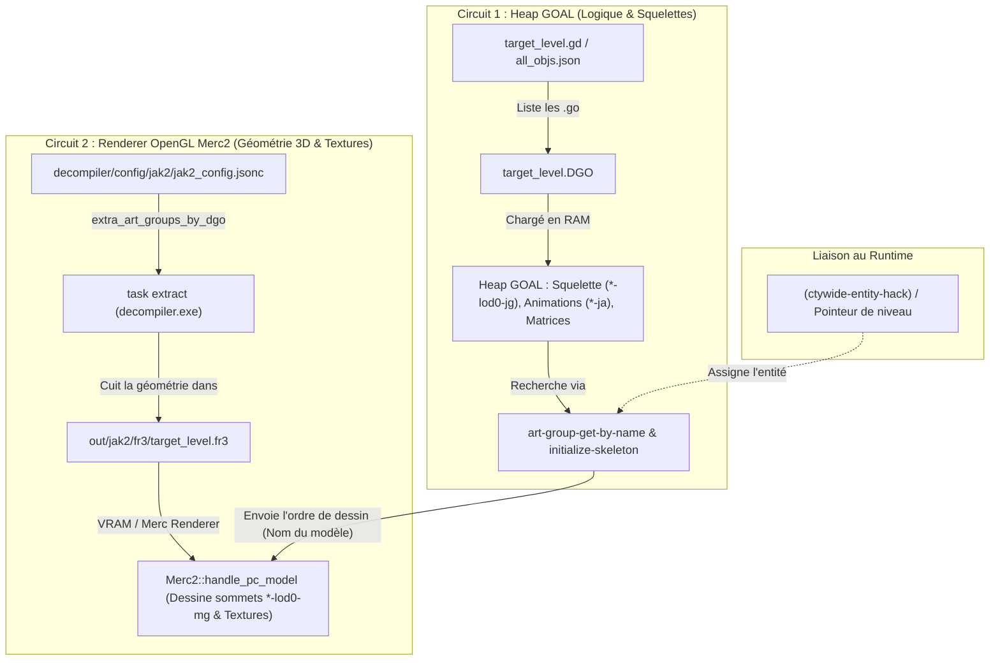

# OpenGOAL — Model & Entity Level Injection Guide (No-Borrow Merc .FR3 Baking)
# Guide d'Injection de Modèles et Entités dans N'importe Quel Niveau (Sans Borrow)

> **Bilingual OpenGOAL Reference Manual / Manuel de Référence Bilingue**
>
> - **Applies to / Concerne :** Jak 2 / Jak 3 (OpenGOAL PC Port)
> - **Architecture :** Offline Merc Geometry Baking (`extra_art_groups_by_dgo`) + GOAL Heap Art-Group Link
> - [🇬🇧 English Version](#-english-version)
> - [🇫🇷 Version Française](#-version-française)

---

# 🇬🇧 English Version

## 1. Overview & Core Philosophy

In original retail Jak 2 and Jak 3, skeletal 3D models (actors, vehicles, enemies, interactive props) were strictly budgeted per level. An entity could only be rendered if its asset data was loaded either directly by the resident level DGO or via a runtime **level borrow** (such as borrowing `lmeetbrt` or `lprotect` into Haven City's `ctywide` borrow slots).

In OpenGOAL on PC, dynamic level borrowing has major constraints:
1. **Limited Borrow Slots**: `ctywide` only has 2 borrow slots (slot 0 and slot 1). Adding a borrow easily conflicts with existing story missions, cutscenes, or regional traffic art.
2. **Pop-in and Latency**: Borrowed levels take frames or seconds to stream in from disk.
3. **Renderer Invisibility**: Adding a model to a `.gd` file loads its skeleton into the GOAL heap (Circuit 1), but the PC OpenGL renderer (`Merc2`) looks for vertex/texture geometry inside the resident **`.fr3`** file (Circuit 2). If the geometry is not in the active `.fr3`, the model remains **completely invisible**.

OpenGOAL solves this natively via **Merc `.fr3` Injection** using the decompiler configuration parameter:
```jsonc
"extra_art_groups_by_dgo": {
  "<TARGET_DGO>": ["<art-group-name>:<HOME.DGO>"]
}
```

This guide explains how to inject **any** native retail model or entity into **any** level permanently, with full textures, skeletons, animations, and collision, without relying on runtime level borrows.

---

## 2. The 2-Circuit Architecture

Every rendered skeletal actor in OpenGOAL relies on two separate, independent data pipelines:


| Pipeline Component | Data | Where Stored | Read By | Manifestation if Missing |
|---|---|---|---|---|
| **Circuit 1: Art Group** | Bones, joints (`*-jg`), anims (`*-ja`), LOD ranges | `<model>-ag.go` in level `.gd` | GOAL heap & CPU | Crash with `process-drawable-art-error` |
| **Circuit 2: Merc Geometry** | 3D mesh vertices (`*-mg`), texture coordinates | `<level>.fr3` baked by decompiler | OpenGL / GPU (`Merc2`) | Model is **invisible** (silent skip, no crash) |
| **Texture Remap Table** | Maps texture IDs to level texture pages | Source level `<HOME.DGO>` | Decompiler extractor | Model is **white/shiny (untextured)** |
| **Process Entity Hook** | Entity BSP pointer / Draw control level | Process `entity` / `level` fields | `skeleton-group->draw-control` | Crash or failure to link draw control |

---

## 3. Step-by-Step Injection Workflow

### Step 1: Identify the Asset Pieces

Before editing configs, locate the exact names for your target model:

1. **Art Group Name**: Search `goal_src/jak2/build/all_objs.json` for the model's `-ag` name (e.g. `"transport-ag"`, `"crimson-guard-ag"`).
2. **MERC Mesh Names**: Check the model's `defskelgroup` in its `.gc` source file (e.g. `transport-lod0-mg`, `transport-lod1-mg`).
3. **Home DGO & Texture Page**: Find which retail level originally contained this `-ag.go` and its `tpage-*.go` in `goal_src/jak2/dgos/` (e.g., `LPROTECT.DGO` contains `transport-ag.go` and `tpage-2869.go`).
4. **Target DGO**: Choose where the model must reside (e.g., `LWIDEA.DGO`, `LWIDEB.DGO`, `LWIDEC.DGO` for Haven City, or `STRIP.DGO` for the Strip Mine).

---

### Step 2: Configure Decompiler Baking (Circuit 2)

Open [`decompiler/config/jak2/jak2_config.jsonc`](file:///d:/Developpement/OpenGoal%20Dev/jak-project/decompiler/config/jak2/jak2_config.jsonc) and declare your injection under `extra_art_groups_by_dgo`:

```jsonc
"extra_art_groups_by_dgo": {
  "LWIDEA.DGO": [
    "transport-ag:LPROTECT.DGO"
  ],
  "LWIDEB.DGO": [
    "transport-ag:LPROTECT.DGO"
  ],
  "LWIDEC.DGO": [
    "transport-ag:LPROTECT.DGO"
  ]
}
```

> [!TIP]
> **Syntax:** `"<art-group-name>:<HOME.DGO>"`
> Specifying `:<HOME.DGO>` tells the extractor to resolve texture references using `<HOME.DGO>`'s texture remap table. If omitted, the decompiler picks the first level containing the art group, which may lack the required `tpage`.

Run the asset extractor:
```bash
task extract
```
Verify the extraction log outputs:
```text
extra_art_groups_by_dgo: 'transport-ag' textures remapped via LPROTECT.DGO
extra_art_groups_by_dgo: baking 'transport-ag' into LWIDEA.DGO (.fr3)
```

---

### Step 3: Configure Target Level DGO (Circuit 1)

Add the Art Group `.go` and its associated `tpage-*.go` to the target level's `.gd` file (e.g. `goal_src/jak2/dgos/lwidea.gd`).

> [!IMPORTANT]
> Always place art groups and texture pages **before** the final level `.go` (the BSP file must remain the last entry in the `.gd` file):

```lisp
  "tpage-2869.go"
  "transport-ag.go"
  "lwidea.go"
 ))
```

---

### Step 4: Hook Runtime Entity & Level Binding

Dynamically spawned actors lack a pre-placed BSP entity. If `skeleton-group->draw-control` cannot resolve an entity, it defaults to the loading level or throws an art error.

In your entity's `init-by-other` function, bind the process to a resident entity before calling `initialize-skeleton`:

#### In Haven City:
```lisp
(defbehavior custom-actor-init-by-other custom-actor ((arg0 custom-actor-params))
  ;; Re-home onto resident city entity so art lookup and draw control bind correctly
  (ctywide-entity-hack)
  (initialize-skeleton
    self
    (the-as skeleton-group (art-group-get-by-name *level* "skel-custom-actor" (the-as (pointer uint32) #f)))
    (the-as pair 0)
    )
  ;; ... continue initialization
  )
```

#### In Non-City Levels (e.g. Strip Mine, Sewers):
```lisp
(with-pp
  (let ((lvl (level-get *level* 'strip)))
    (when (and lvl (> (-> lvl entity length) 0))
      (process-entity-set! self (-> lvl entity data 0 entity))
      (set! (-> self level) lvl)
      (set! (-> pp level) lvl)
      )
    )
  (initialize-skeleton self (the-as skeleton-group (art-group-get-by-name *level* "skel-custom-actor" (the-as (pointer uint32) #f))) (the-as pair 0))
  )
```

---

## 4. Target DGO Selection Matrix for Haven City

Haven City is divided into multiple overlapping levels. Use this table to decide where to bake and load your assets:

| Target DGO | Target `.fr3` | Residency Scope | Best Used For |
|---|---|---|---|
| `GAME.CGO` | `GAME.fr3` | **Every single level globally** | Global weapons, player skins, universal UI effects |
| `CWI.DGO` | `ctywide.fr3` | **Permanent anywhere in Haven City** | Core city systems, global city vehicles, persistent actors |
| `LWIDEA.DGO` / `LWIDEB.DGO` / `LWIDEC.DGO` | `lwidea.fr3` / `lwideb.fr3` / `lwidec.fr3` | **Zone-swapped via traffic manager (ctywide slot 1)** | Ambient traffic vehicles, zone-specific pedestrian actors |

---

## 5. Troubleshooting & Diagnostics

| Symptom | Root Cause | Solution |
|---|---|---|
| **Model is completely invisible** (process runs, sounds play, child actors show) | Circuit 2 missing: Mesh geometry `*-lod*-mg` is not in the resident `.fr3`. | Add the model to `extra_art_groups_by_dgo` in `jak2_config.jsonc` and run `task extract`. |
| **Crash with `process-drawable-art-error`** | Circuit 1 missing: `<model>-ag.go` not in active DGO, or entity level binding missing. | Add `<model>-ag.go` to `.gd` file and call `(ctywide-entity-hack)` / `process-entity-set!` before `initialize-skeleton`. |
| **Model is visible but white / shiny / untextured** | Incorrect texture remap table during decompiler extraction. | Append `:<HOME.DGO>` to the entry in `extra_art_groups_by_dgo` (e.g. `"transport-ag:LPROTECT.DGO"`). |
| **Model is only visible in certain zones of the city** | Geometry was baked into `LWIDEA.DGO` but player moved to a zone resident in `LWIDEB.DGO`. | Add the injection to all three city traffic DGOs (`LWIDEA.DGO`, `LWIDEB.DGO`, `LWIDEC.DGO`). |
| **`task extract` runs but `.fr3` files don't change** | Outdated `decomp.dll` or `decompiler.exe` in build path. | Rebuild compiler with `task build-release` (Ninja preset) or copy updated DLLs to `out/build/Release/bin/`. |

---

# 🇫🇷 Version Française

## 1. Vue d'Ensemble & Philosophie

Dans les jeux Jak 2 et Jak 3 originaux sur PS2, les modèles 3D squelettiques (acteurs, véhicules, ennemis, objets interactifs) étaient strictement cloisonnés par niveau pour respecter les contraintes de mémoire. Un modèle ne pouvait être affiché que s'il appartenait au DGO du niveau actif, ou via un **emprunt dynamique de niveau (*level borrow*)**.

Dans OpenGoal sur PC, l'emprunt de niveau présente des limites majeures :
1. **Nombre limité de slots d'emprunt** : Haven City (`ctywide`) ne dispose que de 2 slots d'emprunt (0 et 1). Y charger un niveau entre souvent en conflit avec les cinématiques, les missions ou le trafic.
2. **Latence de chargement** : L'emprunt nécessite quelques secondes pour streamer le niveau depuis le disque.
3. **Invisibilité dans le renderer PC** : Ajouter un modèle dans un fichier `.gd` charge son squelette en RAM GOAL (Circuit 1), mais le moteur graphique OpenGL d'OpenGOAL (`Merc2`) lit la géométrie 3D directement dans le fichier **`.fr3`** du niveau résident (Circuit 2). Si la géométrie n'y est pas présente, le modèle reste **totalement invisible**.

OpenGOAL résout ce problème de manière native et définitive grâce à l'**Injection MERC `.fr3`** via le décompilateur :
```jsonc
"extra_art_groups_by_dgo": {
  "<DGO_CIBLE>": ["<nom-art-group>:<HOME.DGO>"]
}
```

Ce guide détaille la procédure complète pour intégrer **n'importe quel** modèle ou entité dans **n'importe quel** niveau, avec textures intégrales, animations et collisions, sans aucun borrow runtime.

---

## 2. L'Architecture des 2 Circuits

Tout acteur animé affiché dans OpenGOAL repose sur deux circuits de données indépendants :



| Composant | Données | Emplacement | Exploité par | Symptôme si manquant |
|---|---|---|---|---|
| **Circuit 1 : Art Group** | Os, joints (`*-jg`), animations (`*-ja`), LODs | `<modele>-ag.go` dans le `.gd` du niveau | Heap GOAL & CPU | Crash avec `process-drawable-art-error` |
| **Circuit 2 : Géométrie MERC** | Sommets 3D (`*-mg`), coordonnées UV textures | `<niveau>.fr3` cuit par le décompilateur | OpenGL / GPU (`Merc2`) | Modèle **totalement invisible** (sans crash) |
| **Table de Remap Textures** | Correspondance IDs textures vers tpages | Niveau d'origine `<HOME.DGO>` | Extracteur décompilateur | Modèle **blanc / brillant (sans texture)** |
| **Liaison Entité Process** | Pointeur entité BSP / draw control | Champs `entity` et `level` du process | `skeleton-group->draw-control` | Crash ou échec d'initialisation draw control |

---

## 3. Guide Pratique Pas-à-Pas

### Étape 1 : Identifier les Éléments du Modèle

Avant toute modification, identifiez les identifiants clés du modèle :

1. **Nom du groupe d'art (*Art Group*)** : Recherchez dans `goal_src/jak2/build/all_objs.json` le nom en `-ag` (ex: `"transport-ag"`, `"crimson-guard-ag"`).
2. **Noms des modèles MERC** : Vérifiez le `defskelgroup` dans le code GOAL (ex: `transport-lod0-mg`, `transport-lod1-mg`).
3. **DGO d'origine & Texture Page** : Repérez quel DGO retail contient ce `-ag.go` et son `tpage-*.go` dans `goal_src/jak2/dgos/` (ex: `LPROTECT.DGO` contient `transport-ag.go` et `tpage-2869.go`).
4. **DGO Cible** : Déterminez le niveau où le modèle doit apparaître (ex: `LWIDEA.DGO`, `LWIDEB.DGO`, `LWIDEC.DGO` pour Haven City, ou `STRIP.DGO` pour la Mine).

---

### Étape 2 : Configurer la Cuisson Décompilateur (Circuit 2)

Ouvrez [`decompiler/config/jak2/jak2_config.jsonc`](file:///d:/Developpement/OpenGoal%20Dev/jak-project/decompiler/config/jak2/jak2_config.jsonc) et ajoutez votre entrée sous `extra_art_groups_by_dgo` :

```jsonc
"extra_art_groups_by_dgo": {
  "LWIDEA.DGO": [
    "transport-ag:LPROTECT.DGO"
  ],
  "LWIDEB.DGO": [
    "transport-ag:LPROTECT.DGO"
  ],
  "LWIDEC.DGO": [
    "transport-ag:LPROTECT.DGO"
  ]
}
```

> [!TIP]
> **Syntaxe :** `"<nom-art-group>:<HOME.DGO>"`
> L'ajout de `:<HOME.DGO>` permet au décompilateur d'extraire la table de remappage de textures propre au niveau d'origine du modèle. Sans cela, le modèle s'afficherait sans textures.

Lancez l'extraction :
```bash
task extract
```
Vérifiez dans la console :
```text
extra_art_groups_by_dgo: 'transport-ag' textures remapped via LPROTECT.DGO
extra_art_groups_by_dgo: baking 'transport-ag' into LWIDEA.DGO (.fr3)
```

---

### Étape 3 : Configurer le DGO du Niveau Cible (Circuit 1)

Ajoutez le fichier `-ag.go` et la `tpage-*.go` associée dans le fichier `.gd` du niveau cible (ex: `goal_src/jak2/dgos/lwidea.gd`).

> [!IMPORTANT]
> Placez toujours les art-groups et tpages **avant** le fichier `.go` principal du niveau (le BSP doit obligatoirement être la dernière ligne du fichier `.gd`) :

```lisp
  "tpage-2869.go"
  "transport-ag.go"
  "lwidea.go"
 ))
```

---

### Étape 4 : Lier l'Entité et le Niveau au Runtime

Les entités créées dynamiquement par du code GOAL n'ont pas d'acteur BSP pré-placé. `skeleton-group->draw-control` a besoin d'une entité valide pour associer le modèle à un niveau de rendu.

Dans la fonction `init-by-other` de votre entité, liez le process avant d'appeler `initialize-skeleton` :

#### À Haven City :
```lisp
(defbehavior mon-entite-init-by-other mon-entite ((arg0 mon-entite-params))
  ;; Raccroche le process à l'entité résidente de Haven City
  (ctywide-entity-hack)
  (initialize-skeleton
    self
    (the-as skeleton-group (art-group-get-by-name *level* "skel-mon-entite" (the-as (pointer uint32) #f)))
    (the-as pair 0)
    )
  ;; Suite de l'initialisation...
  )
```

#### Dans les Autres Niveaux (ex: Mine, Égouts) :
```lisp
(with-pp
  (let ((lvl (level-get *level* 'strip)))
    (when (and lvl (> (-> lvl entity length) 0))
      (process-entity-set! self (-> lvl entity data 0 entity))
      (set! (-> self level) lvl)
      (set! (-> pp level) lvl)
      )
    )
  (initialize-skeleton self (the-as skeleton-group (art-group-get-by-name *level* "skel-mon-entite" (the-as (pointer uint32) #f))) (the-as pair 0))
  )
```

---

## 4. Matrice de Choix DGO pour Haven City

| DGO Cible | Fichier `.fr3` | Portée de Résidence | Cas d'Usage Idéal |
|---|---|---|---|
| `GAME.CGO` | `GAME.fr3` | **Permanent partout dans tout le jeu** | Armes globales, skins de Jak, effets d'interface universels |
| `CWI.DGO` | `ctywide.fr3` | **Permanent partout dans Haven City** | Systèmes centraux de la ville, véhicules principaux, acteurs permanents |
| `LWIDEA.DGO` / `LWIDEB.DGO` / `LWIDEC.DGO` | `lwidea.fr3` / `lwideb.fr3` / `lwidec.fr3` | **Résident par zone de circulation (slot borrow 1)** | Véhicules de trafic ambiant, piétons régionaux |

---

## 5. Guide de Dépannage & Diagnostics

| Problème Constaté | Cause Racine | Solution |
|---|---|---|
| **Le modèle est totalement invisible** (le code s'exécute, sons et enfants OK) | Circuit 2 manquant : La géométrie `*-lod*-mg` n'est pas dans le `.fr3` résident. | Ajouter le modèle à `extra_art_groups_by_dgo` dans `jak2_config.jsonc` et relancer `task extract`. |
| **Crash avec `process-drawable-art-error`** | Circuit 1 manquant : `<modele>-ag.go` absent du DGO ou entité non liée. | Ajouter `<modele>-ag.go` au fichier `.gd` et appeler `(ctywide-entity-hack)` avant `initialize-skeleton`. |
| **Le modèle est blanc / brillant / sans texture** | Table de remappage de textures absente lors de l'extraction. | Ajouter `:<HOME.DGO>` à l'entrée dans `extra_art_groups_by_dgo` (ex: `"transport-ag:LPROTECT.DGO"`). |
| **Le modèle n'est visible que dans certains quartiers** | La géométrie n'a été cuite que dans `LWIDEA.DGO` et le joueur est dans une zone `LWIDEB.DGO`. | Ajouter la cuisson dans les 3 DGOs de trafic (`LWIDEA.DGO`, `LWIDEB.DGO`, `LWIDEC.DGO`). |
| **`task extract` s'exécute mais le `.fr3` reste inchangé** | Version obsolète de `decomp.dll` ou `decompiler.exe` utilisée par Task. | Recompiler avec `task build-release` (générateur Ninja) ou copier les DLLs récentes dans `out/build/Release/bin/`. |
